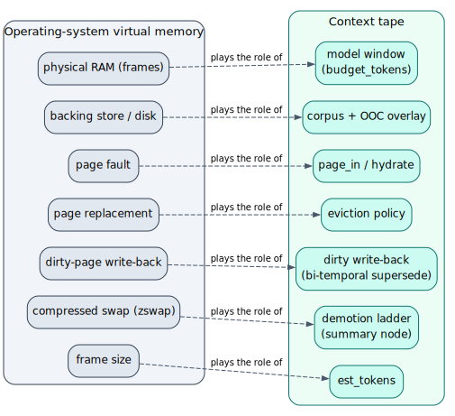

# 01 — Overview & theory

> **Thesis.** An *infinite session* is a finite context window over an **unbounded
> paged address space**, with an **exactly reproducible** working set at every trace
> position. The mechanism is classical demand paging — page faults, replacement,
> dirty write-back, compressed swap — re-cast over an LLM's token budget. *The window
> is a cache; the corpus is the address space.*

This document builds the intuition and the theory the rest of the set rests on. It
defines every term it uses (the consolidated index is the [README glossary](README.md#5-master-glossary)).

---

## 1. The problem: the window is far smaller than the work

A language model exposes a **fixed context window** `W` — a hard token budget. Real
software-engineering tasks routinely have evidence, and demand answers, far larger
than `W`:

- *"Audit this 200-file crate for unsafe aliasing"* — the evidence is the whole crate.
- *"Summarise the last 18 months of commits"* — the evidence is thousands of diffs.
- *"Answer this question against a 1 000 000-token corpus"* — `W` might be 8 K–128 K.

You cannot inline the evidence. The **Recursive Language Model** (`RLM`) paradigm of
Zhang, Kraska & Khattab [1] answers such a query *without* inlining: it treats the
corpus as an **external environment**, `peek`s into it, **decomposes** the query,
**recursively sub-calls** a peer model over each small snippet (each sub-call runs in
a *small* window), then **stitches** the partial answers. No single prompt ever holds
the full context.

The RLM paradigm needs a substrate underneath it that provides three things:

1. **Random access** — a sub-call must be able to *address* and *fetch* any slice of
   the corpus on demand, not just what a top-`k` retrieval happened to surface.
2. **Shared, writable working memory** — the recursion needs a place to *accumulate*
   partial results so its **output** can grow beyond any one window.
3. **Determinism** — the whole thing must replay identically, so a paused run resumes
   exactly and a measurement is reproducible.

The **context tape** is that substrate.

---

## 2. The virtual-memory analogy (the spine)

The context tape is **demand-paged virtual memory**, concept for concept. If you know
how an operating system runs programs whose address space exceeds physical RAM, you
already know how the tape runs a model whose evidence exceeds its window.



| Operating-system virtual memory | Context tape | Where |
|---|---|---|
| Physical RAM (a fixed set of frames) | The model **window** (`budget_tokens`) | [06](06-control-plane-paging-engine.md) |
| Backing store / disk | The **corpus** + the **out-of-core overlay** | [04](04-data-plane-store-and-ooc.md) |
| Virtual address | A **`PageAddress`** | [03](03-addressing-and-pages.md) |
| Page (the unit of paging) | A **`Page`** (one situated chunk / observation / summary) | [03](03-addressing-and-pages.md) |
| Page fault → page-in | `page_in` → **hydrate** a `Page` from the corpus | [06](06-control-plane-paging-engine.md) |
| Page replacement (LRU, CLOCK, …) | The **eviction policy** (`importance_weighted`, …) | [06](06-control-plane-paging-engine.md) |
| Dirty-page write-back | **Bi-temporal supersession** of a dirty page | [08](08-persistence-schema.md) |
| Compressed swap (zswap) | The **demotion ladder** (page in a compact `SummaryNode`) | [06](06-control-plane-paging-engine.md) |
| Frame size | `est_tokens` (a page's cost against the budget) | [03](03-addressing-and-pages.md) |
| The page table | `working_set_pages` (resident set at a `state_cursor`) | [08](08-persistence-schema.md) |

The one place the analogy is deliberately *stronger* than a real OS: the OS clock is
wall-time, but the tape's clock is **logical** (§4), which is what makes a resumed
session bit-identical rather than merely equivalent.

### The tiered memory hierarchy

Just as an OS has registers → cache → RAM → disk, the tape has four tiers, each
larger and slower than the one above it:


- **Window** — the resident working set the model sees; smallest, governed by `budget_tokens`.
- **Hot tier** — the `TapeStore` (`PathMap<Page>` in RAM); nanosecond access, no DB.
- **Out-of-core overlay** — cold *clean* pages spilled to mmap'd segment files; served
  from the OS page cache with no DB round-trip. Dirty pages are **never** spilled
  (they are the only copy of an unsaved write).
- **Durable corpus** — PostgreSQL (`file_chunks`, `memory_observations`); read by the
  strictly READ-ONLY **hydrate** path; effectively unbounded.

A read cascades **hot → overlay → corpus**; a write lands in the hot tier as **dirty**
and is written back only on eviction (and only into `memory_observations`, gated off
by default — see [10](10-trust-boundary-and-security.md)).

---

## 3. What "infinite" precisely means

"Infinite session" is a deliberately strong phrase; here is its exact content.

- **The address space is unbounded.** `PageAddress` ranges over every chunk, file
  region, file, and observation in the corpus, plus an unbounded tree-local `Scratch`
  namespace. The corpus can be millions of tokens; the tape addresses all of it.
- **The resident set is finite.** At any trace position the working set obeys a hard
  budget invariant (`§5`): the sum of resident pages' token costs never exceeds
  `budget_tokens`. The window stays finite no matter how large the corpus.
- **The output is unbounded.** The RLM `Store` environment is a shared, *accumulating*
  scratch space across the whole recursion tree; the stitch folds sub-answers into it,
  so the produced answer is not bounded by any single window. See [11](11-rlm-integration-and-experiment.md).
- **The residency is a deterministic function of the trace.** Which pages are resident
  at a given position is a *pure function* `R(trace, cursor)` of the token budget, the
  eviction policy, and the **logical clock** — never of wall-time and never of agent
  judgment. So a paused run resumes to a **bit-identical** working set (§4, [07](07-determinism-and-resume.md)).

Putting it together: the *effective* context and the *output* are both unbounded,
while the *resident* set stays inside a fixed window, and every state in between is
exactly reproducible. That is the "infinite session."

---

## 4. Why determinism is the keystone

The single most important design constraint in the whole subsystem is stated
identically in `pgmcp/src/tape/mod.rs`, `working_set.rs`, and the `v51` migration:

> **`last_access_ord` is a *logical* clock value, never wall-clock time.**

Every page records, as its recency signal, the value of a per-session monotonic
counter (`working_set_config.logical_clock`) at its last access — not a timestamp.
Residency decisions (recency, frequency, TTL, the eviction score) are therefore pure
functions of the *replayed trace*: re-running the same sequence of page-ins and
evictions advances the logical clock identically and reconstructs the same working
set. Were the clock wall-time, residency would depend on *how fast* the trace
replayed — two replays would diverge, breaking both resume and any pre-registered
measurement. This mirrors the deliberate absence of an `Agent` arm into `verified`
elsewhere in pgmcp: residency, like a verification verdict, is never something an
agent can assert by fiat. The full argument and the determinism theorem are in
[07 — Determinism & resume](07-determinism-and-resume.md).

---

## 5. The theory, formally

Define the quantities the controller budgets and ranks on (all in backticks, unicode
glyphs):

- **Token estimate.** For a page `p` with situated content of byte length `|content(p)|`,
  ``` t(p) = ⌊ |content(p)| / 4 ⌋ ``` (`Page::estimate_tokens` — integer floor; a
  deterministic, replay-safe heuristic shared with `rlm.rs`).
- **Budget invariant.** Let `B = budget_tokens` and let `Resident(c)` be the resident
  set at cursor `c`. The engine maintains, as a loop invariant (property-tested over
  400 random op sequences in `engine.rs`):
  ``` Σ_{p ∈ Resident(c)} t(p)  ≤  B ```
- **Logical age.** With `clock` the current logical-clock value and `last_access_ord(p)`
  the page's recency stamp, ``` age(p) = clock ⊖ last_access_ord(p) ``` (saturating
  subtraction — a page "touched in the future" relative to a stale clock reads as `0`).
- **Residency as a function.** Residency is the deterministic map
  ``` R : (trace, cursor) → 𝒫(PageAddress) ``` induced by replaying the trace under a
  fixed `(B, policy)`; `R` is single-valued (proved in [07](07-determinism-and-resume.md)).

This realises, over a *logical* clock, Denning's **working-set model** [2]: the set of
pages a program needs resident over a window of its execution. Denning's `W(t, τ)` is
"the pages referenced in the last `τ` time units"; the tape's resident set is the
budget-and-policy-bounded analogue, with the eviction policy choosing what leaves when
the budget is exceeded (cf. Belády's replacement study [4] and the one-level store of
the Atlas machine [5], the ancestors of every paging system since).

---

## 6. The three planes in one breath

The subsystem is split into three planes (full treatment in [02](02-architecture-three-planes.md)):

- **Data plane** — the `context-tape` crate. The tape *itself*: `PageAddress`, `Page`,
  the `TapeStore` hot tier, the OOC overlay, checkpoint/restore. CPU-only; it moves
  and stores bytes and never decides residency.
- **Control plane** — `pgmcp/src/tape/`. The *mechanical residency decision*: the
  `PagingEngine`, the `WorkingSet` + logical clock, the read-only hydration bridge,
  the per-tree registry, and durable persistence.
- **Verb surface** — `pgmcp/src/mcp/.../tape`. The agent-facing tools: nine
  black-box-legal verbs, the white-box `tape_repl`, and the experiment pre-registration.

The orchestrator (`pi`) owns the prompt; pgmcp owns the residency mechanism; the data
plane owns the bytes. This separation (Parnas's information-hiding criterion [22]) is
what lets the same engine run against a `MockTapeDataPlane` in tests and the real
corpus in production with no change to the residency logic.

---

## 7. A session in one sketch

To anchor the intuition before the mechanism, here is the shape of one RLM step over
the tape, in literate pseudocode (the real verbs are catalogued in [09](09-mcp-verb-surface.md)):

```text
procedure rlm_step(tree, question):
    # 1. peek into the environment without paying to materialise it
    hits ← tape_semantic(tree, question, k = 8)        # top-k corpus refs
    # 2. decompose: address the slices worth reading
    for ref in hits:
        page ← tape_get(tree, ref.address)             # page_in: hydrate + admit
        # (the engine evicts under budget pressure, deterministically)
        partial ← sub_call(model, page.content)        # recurse in a small window
        # 3. accumulate into the shared Store so output is unbounded
        tape_put(tree, address = "scratch/<tree>/accum", content = partial)
    # 4. stitch: fold the accumulator into the answer
    answer ← fold(tape_slice(tree, "scratch/<tree>/accum..", …))
    return answer
```

Every `tape_get` may silently evict a colder page to stay within budget; every
eviction is a deterministic function of the logical clock; every `tape_put` is a
dirty scratch write that survives a pause/resume because its bytes persist to
`working_set_pages.content`. The next documents make each of those mechanisms precise.

---

## 8. References

\[1] Zhang, Kraska & Khattab, *Recursive Language Models*, arXiv:2512.24601, 2025.
\[2] Denning, *The working set model for program behavior*, CACM 1968, [doi:10.1145/363095.363141](https://doi.org/10.1145/363095.363141).
\[3] Denning, *Virtual memory*, ACM Computing Surveys 1970, [doi:10.1145/356571.356573](https://doi.org/10.1145/356571.356573).
\[4] Belády, *A study of replacement algorithms for a virtual-storage computer*, IBM Systems Journal 1966, [doi:10.1147/sj.52.0078](https://doi.org/10.1147/sj.52.0078).
\[5] Kilburn, Edwards, Lanigan & Sumner, *One-level storage system*, IRE Trans. Electronic Computers 1962, [doi:10.1109/TEC.1962.5219356](https://doi.org/10.1109/TEC.1962.5219356).
\[22] Parnas, *On the criteria to be used in decomposing systems into modules*, CACM 1972, [doi:10.1145/361598.361623](https://doi.org/10.1145/361598.361623).

*Next:* [02 — Architecture: three planes](02-architecture-three-planes.md).
