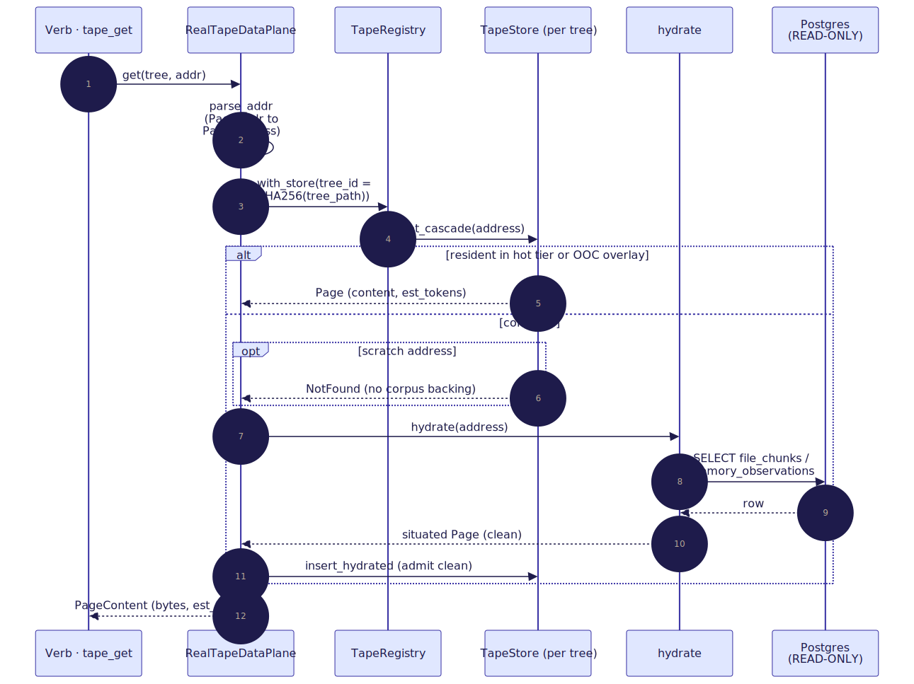
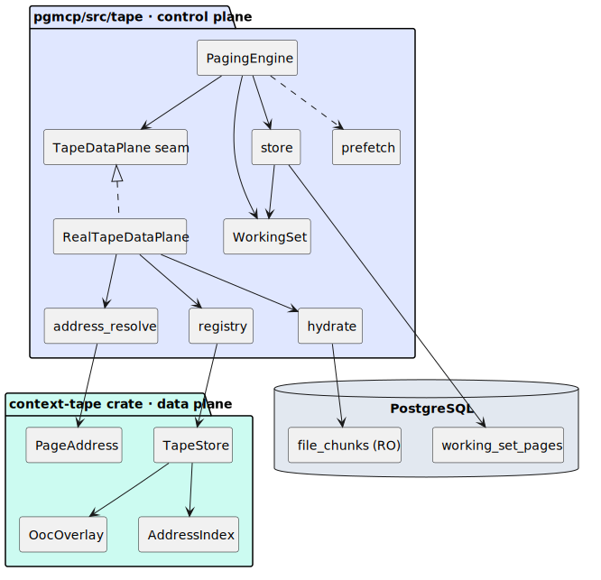

# 02 — Architecture: three planes

> **Thesis.** The subsystem is split so that **residency is decided in one place,
> bytes are moved in another, and the corpus is read in a third** — and the
> residency logic is identical whether it runs against the real corpus or an
> in-memory mock. The seam that makes that possible is a single async trait,
> `TapeDataPlane`.

This document is the structural map: the three planes, their modules, the seam
between the control plane and the data plane, the address bridge, and the per-tree
store registry. Terms are defined in the [README glossary](README.md#5-master-glossary).

---

## 1. The three planes


| Plane | Crate / path | Decides residency? | Touches bytes? | Reads corpus? |
|-------|--------------|:--:|:--:|:--:|
| **Data plane** | the `context-tape` crate | no | **yes** (stores & spills `Page`s) | no |
| **Control plane** | `pgmcp/src/tape/` | **yes** | only via the seam | only via `hydrate` (READ-ONLY) |
| **Verb surface** | `pgmcp/src/mcp/.../tape` | no | no | no (delegates to the control plane) |

The orchestrator (`pi`) owns the prompt; the control plane owns the *mechanical
residency decision* (which pages are resident at each trace position, under a token
budget and an eviction policy); the data plane owns the bytes (the hot tier, the
out-of-core overlay, checkpoint/restore). This is Parnas's information-hiding
criterion [22] applied to paging: the residency policy is hidden behind the data
plane's interface, so the same engine runs unchanged against `MockTapeDataPlane` in
tests and `RealTapeDataPlane` in production.

---

## 2. Plane 1 — the `context-tape` crate (data plane)

CPU-only, no pgmcp dependency, embeddings supplied by the host as `&[f32]` (never
computed here). It is the tape *itself*.

| Module | Role |
|--------|------|
| `address` | `PageAddress` — the uniform random-access handle (key / path / `node_id`). See [03](03-addressing-and-pages.md). |
| `page` | `Page` / `PageMeta` / `PageKind` — the unit of paging and its metadata. See [03](03-addressing-and-pages.md). |
| `store` | `TapeStore` — the hot tier (`PathMap<Page>`), the dirty model, `slice`, parallel disjoint writes, checkpoint/restore. See [04](04-data-plane-store-and-ooc.md). |
| `ooc` | `OocOverlay` — the mmap'd out-of-core spill tier. See [04](04-data-plane-store-and-ooc.md). |
| `index/` | `AddressIndex` — the path / substring / fuzzy / semantic axes + the scoring & legal-address layer. See [05](05-index-portfolio.md) and the weighted-automata deep-dive [12](12-weighted-automata-constrained-addressing.md). |
| `repl/` | the sandboxed white-box REPL (`ReplEngine`, `TapeApi`) + the `TapeDslMask` grammar. See [10](10-trust-boundary-and-security.md), [12](12-weighted-automata-constrained-addressing.md). |
| `error` | `TapeError` (the data-plane crate's own error type). |

The crate exposes `PageAddress`, `TreeId`, `Page`, `PageKind`, `PageMeta`,
`TapeStore`, `OocOverlay`, and the index types at its root (`lib.rs`).

---

## 3. Plane 2 — `pgmcp/src/tape/` (control plane)

The residency decision plus persistence and the read-only hydration bridge. From
`mod.rs`:

| Module | Role |
|--------|------|
| `vocab` | The four closed ADR-003 vocabularies (`PageState`, `EvictionPolicy`, `EvictReason`, `PageKind`). See [08](08-persistence-schema.md). |
| `working_set` | `WorkingSet` (the in-memory resident set) + `ResidentPage` + the logical clock + the `OrderedPages` insertion-ordered map. See [06](06-control-plane-paging-engine.md). |
| `store` | Pure persistence of the working set to `working_set_pages` / `working_set_config`; the `bump_clock` clock authority; `rehydrate_store_from_pages`. See [07](07-determinism-and-resume.md), [08](08-persistence-schema.md). |
| `data_plane` | The `TapeDataPlane` seam (the trait) + `MockTapeDataPlane`. (§5 below.) |
| `engine` | `PagingEngine` — `page_in`, `evict_to_fit`, the six policies, the demotion ladder, `admit_scratch`. See [06](06-control-plane-paging-engine.md). |
| `real_data_plane` | `RealTapeDataPlane` — the production seam over the registry + corpus + the embedding `resolve` path. (§5, §7.) |
| `registry` | `TapeRegistry` — one `TapeStore` per recursion tree. (§7.) |
| `hydrate` | The **only** corpus reader, strictly READ-ONLY: a `PageAddress` → situated `Page` from `file_chunks` / `memory_observations`. See [04](04-data-plane-store-and-ooc.md). |
| `prefetch` | Speculative page-ins with budget headroom only — never evicts a demand page. See [06](06-control-plane-paging-engine.md). |
| `address_resolve` | The `PageAddr(String)` ↔ `PageAddress` bridge + the `node_id` axis. (§6.) |
| `repl_host` | The host-side REPL admission gate (white-box caller × open experiment). See [10](10-trust-boundary-and-security.md). |

---

## 4. Plane 3 — the verb surface

The agent-facing MCP tools live in `pgmcp/src/mcp/`:
`params/tape.rs` (the parameter structs), `tools/tool_tape_*.rs` (the nine
black-box-legal verbs + `tape_repl`), `tools/tape_support.rs` (the shared address
bridge + boundary helpers), and `server/handlers/tape.rs` (the dispatch). The full
per-verb catalogue — parameters, return shapes, and semantics — is [09 — MCP verb
surface](09-mcp-verb-surface.md); the security model is [10](10-trust-boundary-and-security.md).

---

## 5. The `TapeDataPlane` seam

The control plane never names the data-plane crate's `PageAddress` directly. It
speaks in opaque `PageAddr(String)` handles and calls through one async trait. This
is the decoupling that lets the engine be tested end-to-end against an in-memory
mock that satisfies the *same* contract (the mock is a full implementation, **not** a
stub).

```rust
// pgmcp/src/tape/data_plane.rs — the seam every residency mutation flows through.
#[async_trait]
pub trait TapeDataPlane: Send + Sync {
    // Fetch one page's situated content (resident hot/OOC cascade, else hydrate).
    async fn get(&self, tree: &TreePath, addr: &PageAddr) -> Result<PageContent, TapeError>;

    // Fetch many pages in one round-trip; result order is NOT guaranteed —
    // the controller indexes the returned Vec by `addr`.
    async fn get_many(&self, tree: &TreePath, addrs: &[PageAddr])
        -> Result<Vec<PageContent>, TapeError>;

    // Write back a dirty page's bytes. MUST supersede bi-temporally (close the
    // prior version's `valid_to`, open a fresh `valid_from`) — never an in-place
    // mutation, so older trace positions still read the older bytes.
    async fn put(&self, tree: &TreePath, addr: &PageAddr, bytes: &str)
        -> Result<(), TapeError>;

    // Resolve a query into candidate PageRefs — METADATA ONLY, no bytes — so the
    // controller can rank + budget candidates before paying to fetch them.
    async fn resolve(&self, tree: &TreePath, query: &PageQuery)
        -> Result<Vec<PageRef>, TapeError>;

    // Locate the compact summary that stands in for a leaf set (the demotion
    // ladder); None ⇒ no stand-in available.
    async fn summary_of(&self, tree: &TreePath, leaf_addrs: &[PageAddr])
        -> Result<Option<PageRef>, TapeError>;
}
```

The supporting types are deliberately narrow:

- `PageQuery` — a closed strategy set mirroring the RLM decomposition vocabulary:
  `Chunk { path, lo, hi }` (a chunk-index sub-region of one file), `Semantic { query, k }`
  (top-`k` retrieval), `Grep { pattern }` (a keyword filter).
- `PageRef` — `{ addr, kind, est_tokens, importance }` — metadata only.
- `PageContent` — `{ addr, bytes, est_tokens }` — the situated bytes.
- `TapeError` — `NotFound(_)` (a benign coverage gap the controller reports) vs
  `Backend(_)` (a real DB/IO fault, ADR-021 `error!`-grade).

### Mock vs Real

| | `MockTapeDataPlane` | `RealTapeDataPlane` |
|---|---|---|
| Backing | in-memory `HashMap<(tree,addr), entry>` | the per-tree `TapeStore` registry + the READ-ONLY corpus |
| `put` | records a versioned supersession in a log (asserts "exactly once", "never clobbered") | stages dirty into the store; write-back supersedes `memory_observations` **only if** `[tape] allow_promotion` |
| `resolve` | filters/ranks the registered corpus deterministically | `Chunk`/`Grep`/`Semantic` over `file_chunks` (the `Semantic` path embeds the query host-side) |
| `summary_of` | a pre-registered summary for the exact leaf set | the covering `memory_summary_tree` / `code_summary_tree` node |
| Purpose | exercise the engine end-to-end without a DB | production |

`RealTapeDataPlane::from_context` returns `None` in CLI / mock-DB mode (the hydrate
and supersede paths need real Postgres); callers there fall back to the mock.

---

## 6. The `PageAddr ↔ PageAddress` bridge

The load-bearing invariant of the whole control plane (property-tested in
`address_resolve.rs`):

> **The opaque control-plane `PageAddr` string *is* `PageAddress::to_path()`.**

So the bridge is just `parse_path` / `to_path` wrapped in the newtype — a total
round-trip for every legal address. A malformed string maps to `None`, which the
caller treats as a benign `NotFound`, never a crash.

| `PageAddress` variant | path string (= the `PageAddr` value) |
|---|---|
| `Chunk { chunk_id }` | `corpus/chunk/{chunk_id}` |
| `FileRegion { file_id, lo, hi }` | `corpus/file/{file_id}/region/{lo}..{hi}` |
| `File { file_id }` | `corpus/file/{file_id}` |
| `Observation { obs_id }` | `memory/obs/{obs_id}` |
| `Scratch { tree, slot }` | `scratch/{tree}/{hex(slot)}` |

For corpus pages the bridge also exposes the unified-graph `node_id` axis
(`address_to_node_id` / `node_id_to_address`), reusing pgmcp's canonical
`resolve_graph_node_id` so a human key (a file path, an entity slug) and a numeric pk
both resolve to the same address. The full addressing algebra — and *why* the encoding
is order-preserving — is [03 — Addressing & pages](03-addressing-and-pages.md).

---

## 7. The per-tree store registry

`Scratch` pages are tree-local and two concurrent runs must never collide, so the hot
tier is **sharded by recursion tree**: one `TapeStore` per `TreeId`, held in the
`TapeRegistry` on `SystemContext`.

- **Keying.** `TreeId == RlmFrame.root_task_id`. The control plane reaches a store
  from a `TreePath` string (`"rlm:{root_task_id}"`) via
  `tree_id = SHA-256(tree_path)[..16] → Uuid` (`RealTapeDataPlane::tree_id`). The hash
  is deterministic and **total** — it works for non-UUID test ids too — and is the
  *sole* `TreePath → TreeId` authority, so a tree's store and its `Scratch` namespace
  reconstruct identically across calls and process restarts (the resume bridge of
  [07](07-determinism-and-resume.md) relies on this).
- **Concurrency.** A `TapeStore` owns a `PathMap` and an `AddressIndex`; it is `Send`
  but **not** `Sync`. The registry therefore keys `DashMap<TreeId, TreeEntry>` (the map
  is sharded, so two trees never contend on a global lock) and wraps each store in a
  `Mutex` (serialising mutation of a *single* tree's tape — the common case is one
  orchestration thread touching its own tree). The `DashMap` shard write-guard is held
  only for the brief lazy-insert, never across the user closure.
- **Lifecycle.** Stores are created lazily on first touch (`with_store` / `with_store_mut`).
  `drop_tree` finalises a tree at run completion (freeing its hot-tier RAM and the
  handles to any spill mmaps). `reap_idle(idle_for)` is the documented TTL-reaper seam
  for a future cron that evicts whole idle trees under memory pressure.
- **Determinism boundary.** The registry's `last_touched` stamp is deliberately
  *wall-time* — but it governs **resource reclamation only**, never residency.
  Reaping a tree frees RAM; it never changes the logically-determined working set a
  resumed session reconstructs (that lives in `working_set_pages`, untouched here).

### A read end-to-end

The cross-plane descent of a single `tape_get` ties the planes together — verb →
control plane → registry/store → (on a miss) the READ-ONLY corpus:



---

## 8. Ownership rules (who owns the bytes)

- **Corpus / observation / summary pages are re-fetchable**, so the control plane
  keeps only their *metadata* (`ResidentPage.bytes = None`); their bytes live in the
  data-plane store (or are re-hydrated from the read-only corpus on demand).
- **`Scratch` pages have no corpus source**, so their bytes ride on the resident row
  (`ResidentPage.bytes = Some(..)`) and persist to `working_set_pages.content` — the
  only way they survive a pause/resume. This is why a scratch page, and only a scratch
  page, is byte-rehydrated on resume ([07](07-determinism-and-resume.md)).
- **The corpus is read-only.** The sole corpus reader is `hydrate` (SELECT only); the
  sole writer is the gated, default-off promotion path into `memory_observations`
  ([10](10-trust-boundary-and-security.md)). pgmcp never runs a shell and never writes
  the user's files.

### Module dependencies



---

## References

\[22] Parnas, *On the criteria to be used in decomposing systems into modules*, CACM 1972, [doi:10.1145/361598.361623](https://doi.org/10.1145/361598.361623).

*Next:* [03 — Addressing & pages](03-addressing-and-pages.md).
