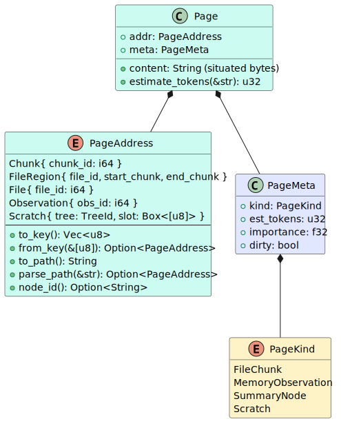
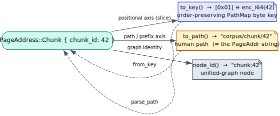
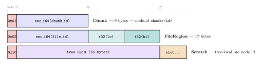
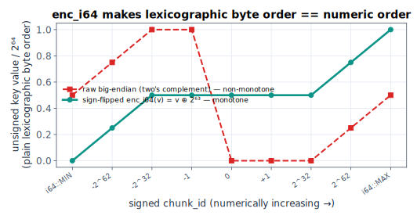

# 03 — Addressing & pages

> **Thesis.** Every page is named by a `PageAddress` that serialises **three ways at
> once** — an order-preserving byte key (so a range scan reads pages in numeric
> order), a human path (the string the verbs carry), and a unified-graph `node_id` —
> and the key encoding is chosen so that *lexicographic byte order equals numeric
> order for all integers, including negatives.*

This is the reconstruct-from-scratch core of the data plane. Source of record:
`context-tape/src/address.rs` and `context-tape/src/page.rs`.

---

## 1. `PageAddress` — the uniform handle

A `PageAddress` is the random-access handle into the tape. Five variants:

| Variant | Means | `node_id` |
|---|---|:--:|
| `Chunk { chunk_id: i64 }` | one durable corpus chunk (`file_chunks.id`) | `chunk:<id>` |
| `FileRegion { file_id, start_chunk, end_chunk }` | a contiguous chunk-index span of one file (the RLM `FileRegion` analogue) | — (a span) |
| `File { file_id: i64 }` | a whole indexed file | `file:<id>` |
| `Observation { obs_id: i64 }` | one memory observation (`memory_observations`) | `observation:<id>` |
| `Scratch { tree: TreeId, slot: Box<[u8]> }` | an agent-written page with **no corpus backing** — REPL output, accumulators, intermediate variables; tree-local | — (never in the graph) |

`Scratch` is the variant that makes the tape *writable*: it lives only in the
per-tree store (§[02 §7](02-architecture-three-planes.md)), is keyed by the recursion
tree, and never enters the durable graph.



---

## 2. Three coordinated representations



1. **The order-preserving key** — `to_key()` / `from_key()`. A canonical `Vec<u8>`
   PathMap key whose **lexicographic order is meaningful**: within an address kind,
   keys sort by their numeric fields, so a depth-first walk of the trie visits pages
   *in address order*. This is the positional axis (`TapeStore::slice`, [04](04-data-plane-store-and-ooc.md)); it needs no separate index.
2. **The human path** — `to_path()` / `parse_path()`. The ASCII string the agent uses
   by path or prefix, and — the load-bearing control-plane invariant — *exactly* the
   `PageAddr` string the verbs carry ([02 §6](02-architecture-three-planes.md)).
3. **The graph `node_id`** — `node_id()`. For corpus pages, 1:1 with a pgmcp
   unified-graph node `"<type>:<pk>"`. `FileRegion` (a span) and `Scratch` (tree-local)
   have none.

---

## 3. The order-preserving encoding

A key is a one-byte **tag** followed by sign-flipped big-endian integer fields:

| Variant | Key layout | Bytes |
|---|---|--:|
| `Chunk` | `[0x01] ⧺ enc_i64(chunk_id)` | 9 |
| `FileRegion` | `[0x02] ⧺ enc_i64(file_id) ⧺ enc_i32(start) ⧺ enc_i32(end)` | 17 |
| `File` | `[0x03] ⧺ enc_i64(file_id)` | 9 |
| `Observation` | `[0x04] ⧺ enc_i64(obs_id)` | 9 |
| `Scratch` | `[0x10] ⧺ tree_uuid(16) ⧺ slot(n)` | 17 + n |



**Two ordering properties make the positional axis correct:**

- **Tag bytes order the kinds.** Corpus tags `0x01..0x04` sort *before* `scratch`
  `0x10`, so a positional scan visits durable pages before tree-local ones
  (`corpus_tags_sort_before_scratch`).
- **Sign-flip makes integers sort numerically.** `enc_i64(v) = (v as u64) ⊕ 2⁶³`,
  big-endian (`enc_i32` flips bit 31). Interpreting raw two's-complement bytes as
  unsigned would put every *negative* value above every positive one (its sign bit is
  `1`); XOR-ing the top bit maps the whole signed range monotonically onto `[0, 2⁶⁴)`:

  ``` a < b  ⟺  key(a) <ₗₑₓ key(b)   for all a, b ∈ i64 ```

  

  This is proved exhaustively by the proptest `chunk_key_is_monotonic`
  (`prop_assert_eq!(ka.cmp(&kb), a.cmp(&b))`) over the full `i64` range, and
  spot-checked across `[i64::MIN, -100, -1, 0, 1, 100, i64::MAX]`.

---

## 4. The `..` region separator and the path-totality caveat

`FileRegion` renders as `corpus/file/{file_id}/region/{start}..{end}` — the separator
is `..`, **not** `-`. The reason is parsing totality: `parse_path` splits the span on
`..`, so a leading `-` on a negative bound is unambiguous. There is a deliberate,
documented asymmetry between the two axes:

- The **positional key axis** (`to_key`/`from_key`) is **total over all `i64`/`i32`**
  via the sign-flip encoding.
- The **human-path axis** (`to_path`/`parse_path`) is a total round-trip only over the
  *realizable* domain — non-negative chunk indices and positive ids — because the
  region path is parsed with `split_once("..")`, which a negative start could still
  confuse in pathological inputs. This cannot arise from real corpus rows (a
  `file_chunks.chunk_index` is a non-negative `INTEGER`; a `BIGSERIAL` id is ≥ 1), so
  the bridge is correct over the realizable domain — and the property test
  `corpus_addresses_round_trip` fuzzes exactly that domain (`address_resolve.rs`).

This caveat is recorded honestly rather than hidden: the key axis carries the strong
totality guarantee; the human-path axis carries the weaker one, sufficient for every
address the corpus can produce.

---

## 5. `Page`, `PageMeta`, `PageKind`

A resident page is `Page { addr, content, meta }`:

- **`content`** is the *situated* bytes the model sees. For a corpus page it is the
  deterministic `build_context_prefix` header (`[File: … | Lang: … | <symbol> | Imported by: N]`)
  concatenated with the raw chunk, so a paged-in chunk reads identically to its
  embedding-time form ([04](04-data-plane-store-and-ooc.md), `hydrate`). For a scratch
  page it is the raw text.
- **`meta: PageMeta { kind, est_tokens, importance, dirty }`** — `est_tokens` is the
  page's cost against the window; `importance` snapshots the corpus row's salience
  (e.g. module centrality); `dirty` flips once an agent writes through the page,
  forcing a write-back before eviction.
- **`PageKind`** — `FileChunk`, `MemoryObservation`, `SummaryNode`, **`Scratch`**.
  Note the data-plane crate has *four* kinds; the control-plane `vocab::PageKind` has
  only the first three (a scratch page is recorded as `file_chunk` with `content IS NOT
  NULL` as the discriminator — see [08](08-persistence-schema.md)).

---

## 6. The token estimate

A page's budget cost is a cheap, deterministic heuristic:

``` Page::estimate_tokens(content) = ⌊ |content| / 4 ⌋ ```

(integer floor division of the byte length by 4). It is deliberately **not** a real
tokenizer call: budget accounting must be a pure function of the content so that
replaying a trace reproduces identical residency decisions ([07](07-determinism-and-resume.md)).
The same `len/4` estimate is shared with `rlm.rs::est_tokens`, so the RLM substrate
and the tape budget pages identically. (`estimate_tokens("") = 0`, `("abcd") = 1`,
`("abcdefgh") = 2`.)

---

## 7. The round-trip invariants *are* the spec

The address algebra is pinned by property tests, which double as the formal
specification:

- `key_round_trips_for_all_corpus_variants` — `from_key(to_key(a)) = a` for every
  corpus variant over arbitrary `i64`/`i32`.
- `scratch_key_round_trips` — including the hex-encoded slot path.
- `chunk_key_is_monotonic` — `to_key` is order-preserving over all `i64`.
- `file_region_path_round_trips` / `corpus_addresses_round_trip` — the human-path axis
  over the realizable domain.
- `node_id_formats_match_unified_graph` — `chunk:7`, `file:9`, `observation:3`; `None`
  for `FileRegion`/`Scratch`.

Any change to the encoding that broke an ordering or a round-trip would fail these,
so the guarantees this document states are continuously enforced, not aspirational.

---

*Next:* [04 — Data plane: store & OOC](04-data-plane-store-and-ooc.md). The addressing
axes that are *not* positional (path / substring / fuzzy / semantic) are the index
portfolio, [05](05-index-portfolio.md); their weighted-automata theory is [12](12-weighted-automata-constrained-addressing.md).
