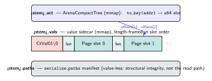
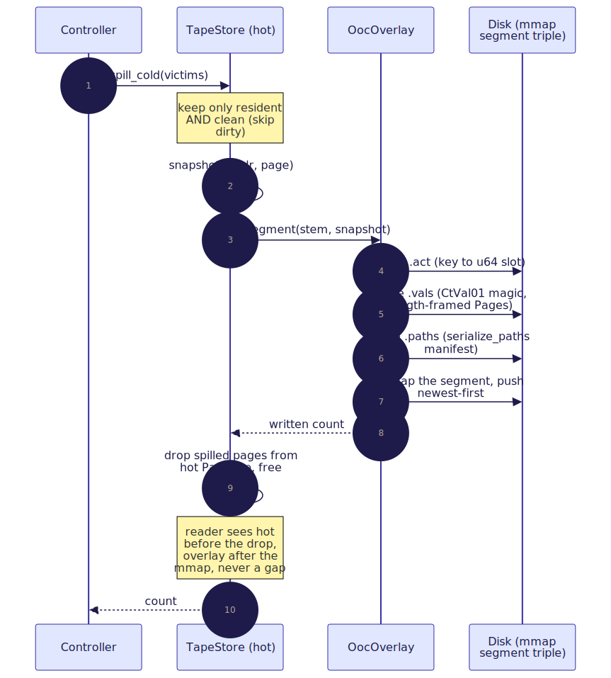
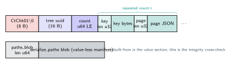

# 04 — Data plane: the store and the out-of-core overlay

> **Thesis.** The hot tier is an order-preserving trie of situated pages with a
> **dirty model** that decides what owes a write-back; when it outgrows RAM, *cold,
> clean* pages **spill** to mmap'd segment files and are served back with no DB
> round-trip; and the whole tape can be **checkpointed** to a single self-describing
> stream. Dirty pages are never spilled — they are the only copy of an unsaved write.

Source of record: `context-tape/src/store.rs` and `context-tape/src/ooc.rs`.

---

## 1. `TapeStore`: the hot tier

One `TapeStore` per recursion tree holds:

| Field | Purpose |
|---|---|
| `pages: PathMap<Page>` | the resident pages, keyed by `PageAddress::to_key()` |
| `dirty: HashSet<PageAddress>` | addresses written-through and awaiting write-back |
| `resident_bytes: usize` | the running `Σ |content|` over resident pages |
| `index: AddressIndex` | the path / substring / fuzzy / semantic portfolio ([05](05-index-portfolio.md)) |
| `overlay: OocOverlay` | the out-of-core spill tier (§6) |
| `spill_dir`, `spill_generation` | where segments spill, and a monotonic stem counter |

**Why a `PathMap`** (an order-preserving radix trie, the lineage of Fredkin's trie
memory [11] and Morrison's PATRICIA [12]): the keys are the order-preserving
`PageAddress` byte keys ([03](03-addressing-and-pages.md)), so a depth-first walk
visits pages *in address order* — that *is* the positional `slice` axis (§4), needing
no separate index. The trie's prefix compression and structural sharing keep the
resident set compact, and its `ZipperHead` lets disjoint regions be written by
multiple threads with no aliasing (§5).

---

## 2. The dirty model

A page's residency *within the store* has a small lifecycle (distinct from the
control-plane `PageState` of [08](08-persistence-schema.md), which is about the durable
row):



The three write paths encode the dirty semantics:

- **`put(addr, page)`** — the agent *wrote through* the page (a `Scratch` page, or a
  corpus page it edited). The resident copy now diverges from any backing and **must
  be written back before eviction**, so `put` sets the dirty bit.
- **`insert_hydrated(addr, page)`** — a *clean* page paged in from the corpus (or
  re-hydrated from the overlay). It matches its backing, so it carries no write-back
  obligation; any prior dirty mark for the address is cleared.
- **`remove(addr)`** — drop a page (with `prune = true` so empty trie branches
  collapse), clearing its dirty mark and retracting it from every index axis.

`dirty_iter()` enumerates the write-back queue; `clear_dirty(addr)` clears a mark once
flushed. The shared write core, `write_page`, is where the byte total and index stay
in sync (§3).

---

## 3. Budget accounting

`resident_bytes` is maintained **incrementally** on every mutation, so the controller
never needs a full scan to decide when to evict. The delta law (`write_page`):

``` resident_bytes' = resident_bytes − |old.content| + |new.content|   (replace) ```
``` resident_bytes' = resident_bytes + |new.content|                    (insert)  ```

On replace, the index re-indexes the text (old substrings retracted, new ones added);
on insert it upserts. (Note: this byte total is the data plane's RAM accounting; the
*token* budget the engine enforces is `Σ est_tokens`, a different quantity —
[06](06-control-plane-paging-engine.md).)

---

## 4. The positional `slice`

`slice(lo, hi)` yields every resident `(addr, &page)` whose key is in the inclusive
range `[lo, hi]`, **in address order**. It is a root read-zipper over the trie:
because iteration is sorted (depth-first == lexicographic == address order), it
`skip_while` keys `< lo` and `take_while` keys `≤ hi`, stopping as soon as a key passes
`hi`. No separate positional index exists — the trie *is* the index. This backs the
`tape_slice` verb ([09](09-mcp-verb-surface.md)).

---

## 5. Parallel disjoint writes

`par_put_disjoint(entries)` writes a batch of **pairwise key-prefix-disjoint**
`Scratch` pages through a PathMap `ZipperHead`, one OS thread per page, with no
locking. PathMap guarantees that two write-zippers obtained from the same `ZipperHead`
at non-overlapping exclusive paths never touch the same nodes, so the writes are
data-race-free. The method validates two preconditions before spawning — every address
is `Scratch` (only tree-local pages may be written this way), and no key is a prefix of
another — then creates every exclusive write-zipper up front (the head is `Send` but
not `Sync`), moves each into a scoped thread, and applies the byte/index/dirty
bookkeeping after the borrow is released. This is the substrate for the RLM
accumulator's concurrent sub-call writes ([11](11-rlm-integration-and-experiment.md)).

---

## 6. The out-of-core overlay

When the resident set outgrows the byte budget, *cold clean* pages **spill** to disk
and leave RAM. The read path then cascades **hot → overlay → miss**:


A spilled page resolves straight from its mmap (the OS page cache makes a re-read
essentially free — Denning's virtual memory [3]); a true miss returns `None` so the
host hydrates from PostgreSQL.

### One segment = a triple of files

PathMap's two serialisation surfaces impose the design: an `ArenaCompactTree` mmap
stores **one `u64` per path** (not an arbitrary value), and `serialize_paths` writes a
**value-less** blob. Neither alone can store a `Page`, so a spill segment is a triple
sharing a stem, with the `Page` bytes in a sidecar:



- `<stem>.act` — the `ArenaCompactTree` mmap: `to_key(addr) → u64 slot`.
- `<stem>.vals` — the value sidecar (magic `CtVal01\0`, then one length-framed `Page`
  per slot, in slot order). A lookup reads the slot from `.act`, indexes the in-RAM
  `offsets` table (built once at open from the framing), and seeks the bytes. Slot `i`
  spans `offsets[i] .. offsets[i+1]`, so slot `i` is valid iff `i + 1 < |offsets|`.
- `<stem>.paths` — the `serialize_paths` value-less manifest: the canonical structural
  artifact, exercised by the round-trip test; **not** consulted on the read path.

Segments are **append-only and immutable** (stable mmaps, cheap spills). A page can be
re-hydrated and later re-spilled into a *newer* segment; `OocOverlay::get` therefore
scans segments **newest-first** and returns the first hit, so the most recent spilled
copy wins and older copies are simply shadowed.

---

## 7. `spill_cold` and its safety ordering



The spillability predicate is the heart of the safety argument:

``` spillable(p)  ⟺  resident(p) ∧ ¬dirty(p) ```

A dirty victim is *skipped*, never spilled (it is the sole copy of an unsaved write). A
non-resident victim is skipped (nothing to spill). The ordering — **snapshot, build &
mmap the segment, *then* drop from hot** — is what makes a concurrent reader safe:

```text
procedure spill_cold(victims):                       # → number spilled
    require spill_dir configured  else Io error       # spilling is explicit opt-in
    snapshot ← [ (addr, page) for addr in victims      # clean + resident only…
                 if not dirty(addr) and resident(addr) ]
    if snapshot empty: return 0
    stem ← spill_dir / "spill-<generation>"; generation += 1
    written ← overlay.spill_segment(stem, snapshot)    # build .act/.vals/.paths, mmap, push newest-first
    for (addr, _) in snapshot:                          # NOW drop from hot (RAM freed)
        remove addr from pages (prune)                  # resident_bytes -=, index retract
    return written
```

Because the segment is durably mmap'd *before* any page leaves the hot map, a reader
either sees the page hot (before the drop) or via the overlay (after the segment is
live) — there is no window in which a clean victim is unresolvable.

---

## 8. Checkpoint and restore

Orthogonal to the live overlay, `checkpoint(out)` serialises the **whole hot tape**
(keys *and* `Page` values, plus the structural blob) to one self-describing, versioned
stream for a durable snapshot or process migration (cf. process checkpoint/migration in
Condor — Litzkow et al., 1997):



```text
procedure checkpoint(out):
    write CHECKPOINT_MAGIC "CtChk01\0"; write tree uuid; write page_count (u64 LE)
    for (key, page) in pages in key order:              # the value-carrying section
        write key_len (u32 LE); write key
        write page_len (u32 LE); write serde_json(page)
    blob ← serialize_paths(pages)                        # value-less structural manifest
    write blob_len (u64 LE); write blob; flush

procedure restore(src, budget_bytes):                   # → a fresh, all-clean TapeStore
    require read magic == "CtChk01\0"  else Io error
    tree ← read uuid; count ← read u64
    store ← TapeStore::with_capacity(tree, budget_bytes)
    repeat count times:
        key ← read framed; page ← serde_json(read framed)
        addr ← PageAddress::from_key(key)  else BadKey
        store.insert_hydrated(addr, page)               # CLEAN: a snapshot is the durable copy
    read past the trailing paths blob (integrity check)
    return store
```

The overlay is **not** included (checkpoint snapshots the in-RAM tape; drain the
overlay first if a complete snapshot is wanted), and the dirty set is not serialised —
**a restored tape is entirely clean**, because the snapshot *is* the durable copy. The
magic prefix means a foreign or truncated stream is rejected rather than mis-decoded.

---

## References

\[3] Denning, *Virtual memory*, ACM Computing Surveys 1970, [doi:10.1145/356571.356573](https://doi.org/10.1145/356571.356573).
\[11] Fredkin, *Trie memory*, CACM 1960, [doi:10.1145/367390.367400](https://doi.org/10.1145/367390.367400).
\[12] Morrison, *PATRICIA — Practical Algorithm To Retrieve Information Coded In Alphanumeric*, JACM 1968, [doi:10.1145/321479.321481](https://doi.org/10.1145/321479.321481).
- M. Litzkow, T. Tannenbaum, J. Basney, M. Livny, *Checkpoint and migration of UNIX processes in the Condor distributed processing system*, University of Wisconsin–Madison CS Tech. Report 1346, 1997. (No DOI.)

*Next:* [05 — Index portfolio](05-index-portfolio.md).
