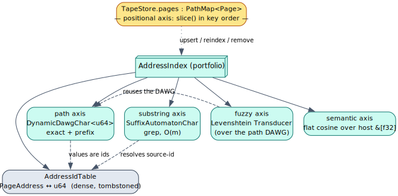
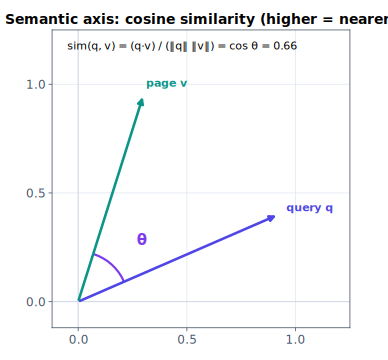

# 05 — The index portfolio

> **Thesis.** Five addressing axes resolve a query to a `PageAddress`. Four are an
> index *portfolio* of specialized automata (path, substring, fuzzy, semantic) over a
> shared address-id table; the fifth — positional — *is* the store's own
> order-preserving trie and needs no index at all.

Source of record: `context-tape/src/index/{mod,path,substring,fuzzy,semantic,idtable,score}.rs`.
The **weighted-automata theory** of the fuzzy axis and the scoring/legal-address layer
is the deep-dive [12 — Weighted automata](12-weighted-automata-constrained-addressing.md);
this document is the operational portfolio.

---

## 1. The five axes



| Axis | Backed by | Query | Verb |
|---|---|---|---|
| **positional** | the store's own trie (no index here) | `slice(lo, hi)` in key order | `tape_slice` |
| **path** | `DynamicDawgChar<u64>` over `to_path()` | exact + prefix | `tape_list` |
| **substring** | `SuffixAutomatonChar` over content | grep, `O(m)` | `tape_grep` |
| **fuzzy** | `Transducer` over the path DAWG | within `k` edits | `tape_fuzzy` |
| **semantic** | flat cosine over host `&[f32]` | top-`k` nearest | `tape_semantic` |

Every dictionary value is a `u64` **address-id**; the index resolves ids back to
`PageAddress`es so callers always receive addresses, never ids. The positional axis is
intentionally absent from the portfolio — it is the trie ([04 §4](04-data-plane-store-and-ooc.md)).

---

## 2. The `AddressIdTable` — why `u64`

The automaton dictionaries (path, fuzzy) store a `u64` rather than the `PageAddress`
itself, because libdictenstein's `DictionaryValue` bound requires `Default` (and, under
the persistent feature, `serde`) — which the `PageAddress` enum does not satisfy, but a
`u64` does. `AddressIdTable` is the single source of truth that turns those `u64` hits
back into addresses: a forward `HashMap<PageAddress, u64>` plus a reverse
`Vec<Option<PageAddress>>`. Ids are **dense and append-only**; a removed address leaves
a tombstone `None` so later ids keep their slots (a handed-out id stays valid until the
table is rebuilt). `intern` is idempotent; `resolve(id)` returns `None` for a
tombstoned id.

---

## 3. Path axis — exact & prefix

`PathIndex` is a `DynamicDawgChar<u64>` (a thread-safe, insert+remove DAWG over Unicode
terms) keyed by page paths with address-ids as values:

- **exact** lookup in `O(k)` (`k` = path length) via `get_value` (`tape_get` by path);
- **prefix** enumeration via the DAWG's valued-prefix zipper — e.g. `corpus/file/5/`
  returns every region and whole-file page under file 5 (`tape_list` by prefix).

Crucially, *a page's path is a pure function of its address*, so this axis changes only
when a page is **added or removed** — never when its content is edited
([§7](#7-the-mutation-contract)). The path DAWG is also the substrate the fuzzy axis
builds its transducer over (§5).

---

## 4. Substring axis — grep

`SubstringIndex` is a generalized `SuffixAutomatonChar` (the smallest automaton
recognizing all substrings of all indexed texts — Blumer et al. [13]), matching any
substring of any page in `O(m)` for a query of length `m`. The automaton is set-like
(no values), so two side tables bridge to addresses: `by_source` (a stable, never-
renumbered `source_id → PageAddress`, tombstoned on removal) and `by_addr`
(`PageAddress → (source_id, text)` so a page can be retracted or replaced). A query
runs `match_positions`, collects the distinct source-ids, and resolves them to
addresses (`tape_grep` with `scope = tree`). Empty text is not indexed (a suffix
automaton has no empty substring), and editing a page's text retracts the old
substrings before indexing the new.

---

## 5. Fuzzy axis — typo-tolerant addressing

`fuzzy.rs` answers "I think the page was around `corpus/file/5/regon/0-3`" by
approximate path lookup within an edit-distance bound. It **reuses the path DAWG**
(no second term set to keep in sync) and offers two surfaces:

- **`query_paths`** — the read-out path: a Levenshtein `Transducer` (liblevenshtein,
  the Schulz–Mihov automaton [14]) over the DAWG, queried with `query_with_distance`,
  yielding `(term, distance)` for every path within `k` edits; each term resolves back
  to its `(address-id, distance)`. The `Algorithm` selects the edit model
  (`Standard`, `Transposition`, or `MergeAndSplit`). This backs `AddressIndex::fuzzy_path`
  and the `tape_fuzzy` verb (results ordered by ascending distance, ties by key).
- **`build_wfst`** — the *composition* surface: duallity's `UniversalLevenshteinWfst`
  presents the (Universal Levenshtein automaton × dictionary) product as an
  `lling_llang::Wfst<char, TropicalWeight>`, for callers that want to **compose** fuzzy
  addressing with another transducer (e.g. a language model) rather than enumerate
  matches.

The edit distance feeds level 1 of the `ChunkScorer` cascade. The automata theory — the
Levenshtein recurrence, the universal automaton, the tropical weight, and the
composition algebra — is [12](12-weighted-automata-constrained-addressing.md).

---

## 6. Semantic axis — nearest-neighbour

The crate is CPU-only and **never computes embeddings**: the host supplies an `&[f32]`
per page and a query vector. `SemanticIndex` is an exact flat (brute-force) cosine
index — `O(n·d)` per query, the right tradeoff for the hot tier's modest resident set;
a graph/IVF ANN can replace it behind the same interface later. Vectors are stored
**L2-normalized**, so cosine reduces to a dot product at query time:

``` ‖v‖₂ = √ Σᵢ vᵢ²       sim(q, v) = (q · v) / (‖q‖ ‖v‖) = q̂ · v̂ ```



Rejection rules keep the index honest: an empty, zero (no direction to normalize), or
mis-dimensioned vector is rejected (`upsert` returns `false`, stores nothing) rather
than silently mis-scored; the dimensionality is fixed by the first inserted vector.
`nearest(query, k)` returns the top-`k` by descending similarity, ties broken by
address key for determinism. This backs `tape_semantic` over the per-tree store; the
verb's corpus-scope variant embeds host-side and runs pgmcp's `semantic_search`
([09](09-mcp-verb-surface.md)).

---

## 7. The mutation contract

The index is **derived state** — it can always be rebuilt from the pages of record
(`rebuild_from`, mirroring the `sync` posture of liblevenshtein and pgmcp). `TapeStore`
drives four mutations:

| Call | When | Which axes move |
|---|---|---|
| `upsert(addr, content)` | a page is added | path (+ fuzzy, shared DAWG), substring; id interned |
| `reindex(addr, old, new)` | a resident page's **content** changes | substring only (the path is content-independent) |
| `remove(addr, content)` | a page leaves residency | all axes; id tombstoned |
| `set_vector(addr, &[f32])` | the host supplies/updates an embedding | semantic only (kept separate — vectors are host-driven, not derived from text) |

`rebuild_from(pages)` reconstructs the path/substring axes from the resident pages;
**semantic vectors are not reconstructed** (they are host-supplied, not carried on the
page), so a rebuilt index has an empty semantic axis until the host re-supplies
vectors — a property the resume path ([07](07-determinism-and-resume.md)) accounts for.

---

## 8. The scoring & legal-address layer

Above the four query axes sits the `score` module — `ChunkScorer` (rank candidates
into a strict total order via a lexicographic semiring), `AddressMask` (a
grammar-constrained-decoding automaton over the flat address syntax), and `TapeDslMask`
(its pushdown counterpart for the nested REPL DSL). These are the weighted-automata
heart of the addressing layer and the structural-safety mechanism behind the white-box
REPL; they have their own dedicated document:
**[12 — Weighted automata: constrained addressing & scoring](12-weighted-automata-constrained-addressing.md)**.

---

## References

\[13] Blumer, Blumer, Haussler, Ehrenfeucht, Chen, Seiferas, *The smallest automaton recognizing the subwords of a text*, TCS 1985, [doi:10.1016/0304-3975(85)90157-4](https://doi.org/10.1016/0304-3975(85)90157-4).
\[14] Schulz & Mihov, *Fast string correction with Levenshtein automata*, IJDAR 2002, [doi:10.1007/s10032-002-0082-8](https://doi.org/10.1007/s10032-002-0082-8).

*Next:* [06 — Control plane: the paging engine](06-control-plane-paging-engine.md).
