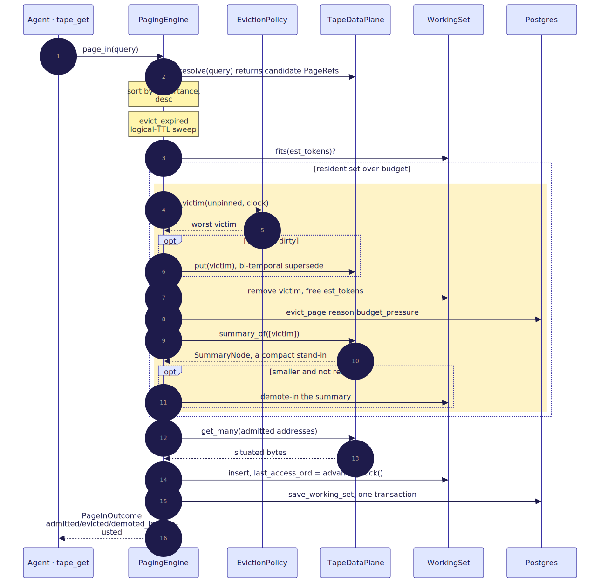
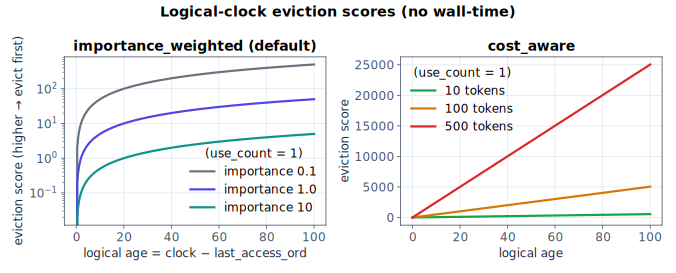
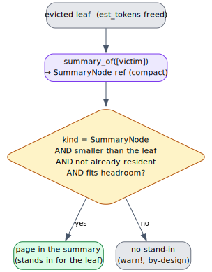

# 06 — Control plane: the paging engine

> **Thesis.** The `PagingEngine` is the mechanical heart of the control plane. Every
> residency decision — admit, evict, demote, re-stamp — is a deterministic function of
> the token budget, the eviction policy, and the **logical clock**. Never agent
> judgment; never wall-time.

Source of record: `pgmcp/src/tape/engine.rs` and `pgmcp/src/tape/working_set.rs`.

---

## 1. The working set

`WorkingSet` is the in-memory resident set for one `(session_key, state_cursor)`:

```text
WorkingSet { session_key, state_cursor, budget_tokens, resident_tokens,
             policy, clock, ttl, pages: OrderedPages }
```

Each `ResidentPage` carries its mechanical metadata: `kind`, `importance` (caller
salience in `[0, ∞)`), `est_tokens` (its budget cost), `use_count` (frequency),
`last_access_ord` (recency, a **logical**-clock snapshot), `dirty`, `pinned`, and
`bytes` (the situated content carried **only** for scratch pages — `None` for
re-fetchable corpus pages; it does not enter token accounting).

**`OrderedPages` — insertion order without a new dependency.** FIFO eviction needs
insertion order and lookups need `O(1)`; the natural fit is `IndexMap`, but `indexmap`
is only a *transitive* pgmcp dependency and this phase adds no new crate. So
`OrderedPages` is a `HashMap` + a `Vec` order index + a tombstone count: `O(1)`
get/insert/remove and a stable insertion-order iterator, compacted lazily when
tombstones dominate. Re-inserting an existing address keeps its original position (FIFO
age survives a re-write).

---

## 2. The logical clock — one authority

Recency, frequency, and TTL are all measured on a per-session monotonic counter, never
wall-time (the determinism keystone — [07](07-determinism-and-resume.md)). There are
two clock surfaces, and production uses exactly one:

- `WorkingSet::tick()` — the in-memory increment, used only by the DB-free proptest
  model.
- `PagingEngine::advance_clock()` → `store::bump_clock()` — the **durable** authority:
  an atomic relative increment `logical_clock = logical_clock + 1 RETURNING` the new
  value, which is then mirrored onto `ws.clock`. Every *persisted* residency path
  (demand-hit, admit, demote-in, scratch admit) stamps `last_access_ord` from this. The
  atomic relative increment is what prevents two writers on the same `(session, cursor)`
  from losing a tick — a determinism hazard that an absolute `save_config` overwrite of
  `logical_clock` would reintroduce, which is exactly why `save_config` is forbidden
  from moving the clock ([08](08-persistence-schema.md)).

---

## 3. `page_in` — the five steps



```text
procedure page_in(ws, tree, query) -> PageInOutcome:
    candidates ← data_plane.resolve(tree, query)          # 1. metadata-only refs
    sort candidates by importance DESC, tiebreak addr ASC  #    deterministic order
    evict_expired(ws, tree, outcome)                       # 1b. logical-TTL sweep (sole Ttl source)

    for cand in candidates:                                # 2. decide admissions
        if ws.pages.contains(cand.addr):                   #    demand-hit: no fetch
            ord ← advance_clock(ws)
            cand.use_count += 1;  cand.last_access_ord ← ord
            outcome.already_resident.push(cand);  continue
        if cand.est_tokens > ws.budget_tokens:             #    bigger than the whole budget
            outcome.budget_exhausted.push(cand);  continue
        if not ws.fits(cand.est_tokens):                   #    make room
            if not evict_to_fit(ws, tree, cand.est_tokens, outcome):
                outcome.budget_exhausted.push(cand);  continue   # only pinned remain
        ws.resident_tokens += cand.est_tokens              #    reserve now (later cands see headroom)
        to_admit.push(cand)

    contents ← data_plane.get_many(tree, to_admit.addrs)   # 3. bulk fetch
    for r in to_admit:                                     # 4. situate + insert
        build_context_prefix(...)                          #    deterministic situating (no LLM call)
        ord ← advance_clock(ws)
        ws.pages.insert(ResidentPage{ r…, use_count: 1, last_access_ord: ord,
                                      dirty: false, pinned: false, bytes: None })
        outcome.admitted.push(r)
    save_working_set(ws, tree)                             # 5. persist
    return outcome
```

A **demand-hit** on a resident page bumps `use_count` and restamps `last_access_ord`
(so recency/frequency policies see the access) without re-fetching. The full outcome is
`PageInOutcome { admitted, already_resident, evicted, demoted_in, budget_exhausted }`.
The headline interaction — a `tape_get` that must evict and demote — is:



---

## 4. `evict_to_fit` — the eviction loop

```text
procedure evict_to_fit(ws, tree, needed, outcome) -> bool:
    loop:
        if ws.resident_tokens + needed ≤ ws.budget_tokens:  return true   # fits
        candidates ← ws.pages.iter_in_order().filter(not pinned)          # FIFO sees arrival order
        victim ← policy_engine(ws.policy).select_victim(candidates, ws.clock)
        if victim is None:  return false                                   # only pinned remain
        warn!("evicting page under budget pressure", …)                    # ADR-021, non-trigger wording
        evict_one(ws, tree, victim, BudgetPressure, outcome)
```

The loop maintains the **budget invariant** at every step:

``` Σ_{p ∈ resident} t(p) = resident_tokens ≤ budget_tokens = B ```

`fits(x) ⟺ resident_tokens + x ≤ B`. This invariant, plus pinned-safety (a pinned page
is never selected) and exact token accounting, is property-tested over 400 random
op-sequences under **every** policy (`token_invariant_and_budget_and_pinned_hold`).

---

## 5. The six eviction policies

The policy is the pluggable victim-selection strategy: given the unpinned resident pages
and the logical clock, return the single worst victim. All are deterministic functions
of *logical* metadata (`last_access_ord`, `use_count`, `est_tokens`, `importance`) — never
wall-time — so the choice replays identically.

| Policy | Victim rule |
|---|---|
| `Lru` | minimum `last_access_ord` (ties → smallest address) |
| `Lfu` | minimum `use_count` (via liblevenshtein's `Lfu` wrapper, primed `use_count` times; ties → oldest then address) |
| `Ttl` | maximum logical age (ties → smallest address) |
| `Fifo` | front of insertion order (the one policy independent of `last_access_ord`) |
| `CostAware` | maximum `cost_aware_score` |
| `ImportanceWeighted` | maximum `importance_weighted_score` (**the default**) |

The two pgmcp-native scorers (evaluated on the logical clock; **higher → evict first**):

``` age(p) = clock ⊖ last_access_ord(p)              (saturating) ```
``` score_iw(p) = age(p) / ( max(importance(p), ε) · (use_count(p) + 1) )      ε = 10⁻³ ```
``` score_ca(p) = ( age(p) · (max(est_tokens(p), 0) + 1) ) / (use_count(p) + 1) ```



The `ε = 10⁻³` importance floor keeps a zero-importance page from dividing by zero while
still ranking it far below any positively-weighted page. A subtle determinism note: the
`Lru`, `Ttl`, and `Fifo` policies were **de-wrappered** from liblevenshtein — those
wrappers record recency from a wall-clock `Instant`, which is host-timer-dependent and
non-deterministic, so their pick was always discarded in favour of the canonical
logical-clock selection; only `Lfu` still routes through a wrapper (over the logical
`use_count`, not time). This is the determinism keystone applied at the policy layer.

---

## 6. `evict_one` — the eviction chokepoint

Every eviction (budget-pressure or TTL) flows through one method:

```text
procedure evict_one(ws, tree, addr, reason, outcome):
    page ← ws.pages.get(addr);  if page.pinned: return        # safety belt
    if page.dirty:                                            # write-back EXACTLY once, BEFORE removal
        write_back ← page.bytes ?? ""                          #   scratch carries real bytes; corpus "" = re-stage signal
        data_plane.put(tree, addr, write_back)                #   bi-temporal supersession (never in-place)
    ws.pages.remove(addr);  ws.resident_tokens −= page.est_tokens   # free tokens FIRST
    store::evict_page(addr, reason)                           # state='evicted', row RETAINED for audit/replay
    outcome.evicted.push(addr)
    match data_plane.summary_of(tree, [addr]):                # the demotion ladder
        Some(summary) → try_demote_in(ws, tree, page, summary, outcome)
        None          → warn!("no summary available", …)      # by-design, ADR-021
```

Removing the victim **first** (freeing its tokens) and only then paging in a demotion
summary keeps `resident_tokens` monotonically within budget at every step — the summary
is admitted into headroom the eviction just created, never transiently over budget.



`try_demote_in` pages in the summary **only if** it is a `SummaryNode`, is strictly
smaller than the leaf, fits the (post-eviction) headroom, and is not already resident —
the "compressed swap" analogue, bounded so it can never make things worse.

---

## 7. `evict_expired` — the logical TTL sweep

Called at the top of `page_in`, before any budget-pressure admission, this drops every
resident, **non-pinned** page whose logical age *strictly exceeds* `ws.ttl`, recording
each with `EvictReason::Ttl`. It is the **sole** producer of the `Ttl` reason. Expiry is
measured on the logical clock (`age > ttl`), so it is replay-deterministic; the victim
set is snapshotted against the current clock before any mutation (a TTL expiry is *not*
an access and does not advance the clock), then each victim flows through the shared
`evict_one`. A `None`/`0` TTL disables it (a benign no-op).

---

## 8. `admit_scratch` — the write path

A `Scratch` page (an RLM accumulator fold, a REPL output, the `tape_put` tool) has bytes
the control plane *owns*, so it cannot be re-fetched — it must be admitted specially:

```text
procedure admit_scratch(ws, tree, addr, bytes, importance) -> PageInOutcome:
    data_plane.put(tree, addr, bytes)                         # 1. stage into the per-tree store, DIRTY
    new_tokens ← Page::estimate_tokens(bytes)
    if ws.pages.contains(addr):                               #    update-in-place (a re-write)
        evict_to_fit for the positive token delta if needed
        update est_tokens/importance/bytes; dirty ← true; restamp clock
        persist;  return outcome(already_resident)
    if new_tokens > ws.budget_tokens:  budget_exhausted; persist; return
    if not ws.fits(new_tokens):  evict_to_fit … (else budget_exhausted)
    ws.pages.insert(ResidentPage{ kind: FileChunk, bytes: Some(bytes),  # bytes.is_some() = the scratch flag
                                  est_tokens: new_tokens, dirty: true, last_access_ord: advance_clock() })
    persist (writes working_set_pages.content)                # 5. the only way scratch bytes survive resume
    return outcome(admitted)
```

The control plane has no `Scratch` `PageKind`; a scratch page is bucketed as
`FileChunk` with `bytes.is_some()` as the discriminator, which is exactly what the
resume reconstruction keys on ([07](07-determinism-and-resume.md), [08](08-persistence-schema.md)).
This is the path the live `tape_put` verb drives (`tape_put → admit_scratch → page_in/evict_to_fit`),
the wiring that gave the engine its first production callers.

---

## 9. `prefetch` — demand-subordinate speculation

`prefetch` pages in pages *likely* to be demanded next — co-change-coupled files and
memory-graph neighbours, ranked by `signal × importance` — but **only into the headroom
that remains after demand**, so a prefetch can never trigger an eviction (it is
structurally bounded by `rank_and_budget`, which admits at most what fits). Ranking is a
deterministic function of the signal values, importances, and headroom, so a replayed
trace prefetches identically. It is the speculative complement to demand paging, never a
competitor to it.

---

## 10. Logging discipline (ADR-021)

A caught DB/IO failure or a failed `data_plane.get`/`put` logs `error!`. A *by-design*
budget-pressure eviction or a no-summary demotion logs `warn!` with deliberately
non-trigger wording ("evicting…", "no summary available") so pgmcp's
`no_swallowed_error_warn` guard does not flag a normal reclamation as a swallowed error.

---

## References

\[2] Denning, *The working set model for program behavior*, CACM 1968, [doi:10.1145/363095.363141](https://doi.org/10.1145/363095.363141).
\[4] Belády, *A study of replacement algorithms for a virtual-storage computer*, IBM Systems Journal 1966, [doi:10.1147/sj.52.0078](https://doi.org/10.1147/sj.52.0078).
\[6] Sleator & Tarjan, *Amortized efficiency of list update and paging rules*, CACM 1985, [doi:10.1145/2786.2793](https://doi.org/10.1145/2786.2793).
\[24] Megiddo & Modha, *ARC: A self-tuning, low overhead replacement cache*, USENIX FAST 2003. (No DOI.)

*Next:* [07 — Determinism & resume](07-determinism-and-resume.md).
