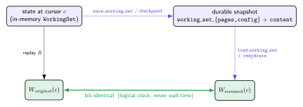
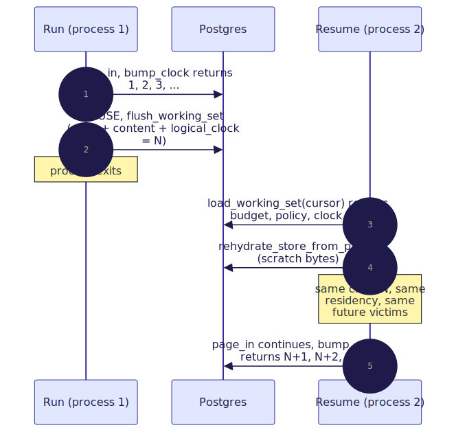

# 07 — Determinism & resume

> **Thesis.** Residency is a *pure function of the replayed trace*. Because every
> recency, frequency, and TTL decision reads a **logical** clock — never wall-time — a
> paused session, reloaded into a fresh process, reconstructs a **bit-identical**
> working set and continues as if it had never stopped.

Source of record: `pgmcp/src/tape/store.rs` (`rehydrate_store_from_pages`, `bump_clock`,
`save_config`, `load_working_set`) and `pgmcp/src/tape/engine.rs` (`advance_clock`).

---

## 1. The claim

Let a *trace* `T` be the sequence of paging operations a run performs (page-ins,
evictions, scratch admits), and let `c` be a *cursor* (a `state_cursor`, i.e. an
orchestration step). Define the **residency map**

``` R : (T, c) → 𝒫(PageAddress) ```

as the resident set produced by replaying `T` up to `c` under a fixed
`(budget_tokens, policy)`. The claim of this document is:

> **`R(T, c)` is single-valued, and `Resume(Checkpoint(state_c)) = state_c`** (modulo
> the dirty set, which is empty by design after a restore — [04 §8](04-data-plane-store-and-ooc.md)).

This is the *content*-plane analogue of pgmcp's "the trace **is** the position" model
(ADR-009): that ADR makes the protocol *position* durable; this document makes *what is
resident in the window at that position* durable too. Together a resumed run recovers
both *where* it was and *what it had loaded*.

---

## 2. Why wall-time would break it

Suppose `last_access_ord` held a wall-clock timestamp. Then two replays of the same `T`
— one fast, one slow — would stamp different recencies, so a recency- or TTL-based
policy would pick different victims, and `R(T, c)` would be multi-valued: residency
would depend on *how fast the trace replayed*, not on the trace itself. Resume would
recover an *equivalent* working set at best, never a bit-identical one, and any
pre-registered measurement of the tape ([11](11-rlm-integration-and-experiment.md))
would be irreproducible. The whole subsystem therefore forbids wall-time in any
residency decision (the keystone stated in `mod.rs`, `working_set.rs`, and the `v51`
migration). The one wall-time stamp that exists — the registry's `last_touched`
([02 §7](02-architecture-three-planes.md)) — governs only RAM reclamation, never
residency.

---

## 3. The determinism theorem

> **Theorem (residency determinism).** For a fixed `(budget_tokens, policy)`, the
> residency map `R(T, c)` is a single-valued function of the trace `T` and cursor `c`.

**Proof sketch (induction on the trace prefix).** The state after step `i` is
`(WorkingSet_i, clock_i)`. *Base:* the empty working set and `clock_0` (the seeded
`logical_clock`) are fixed. *Step:* each operation is a deterministic function of the
current `(WorkingSet, query, policy, clock)`:

1. **Clock advance.** `advance_clock` is `bump_clock`, an *atomic relative* increment
   `logical_clock = logical_clock + 1 RETURNING` — monotone and total (`clock_{i+1} =
   clock_i + 1`), with no read-modify-write race (§4).
2. **Candidate order.** `resolve` returns metadata-only refs sorted by importance
   descending with a **total** tie-break on `addr` — a deterministic permutation.
3. **Victim choice.** Every policy's `select_victim` is a deterministic function of the
   pages' logical metadata; ties resolve by the lexically-smallest address key, a
   **total order** (no two distinct addresses compare equal), so the victim is unique:

   

4. **Token accounting.** `resident_tokens` is updated by exact integer deltas; the
   budget invariant `Σ t(p) ≤ B` is maintained at every step.

Each step is therefore a function, and a composition of functions is a function; so
`R(T, c)` is single-valued. ∎

The theorem's load-bearing corollary is the resume equality:

``` W_resumed(c) = W_original(c) ```



The diagram is the theorem read as a commuting square: replaying the trace (left edge)
and checkpoint-then-resume (top then right edge) reach the *same* `W(c)`.

---

## 4. The atomicity hazard, and its fix

The clock is the one piece of shared mutable durable state, so it is the one place a
race could reintroduce nondeterminism. Two design choices close it:

- **`bump_clock` is an atomic relative increment** (`logical_clock = logical_clock + delta
  RETURNING`), so two concurrent writers on the same session both land — the returned
  set is exactly `{1..N}` for `N` bumps and the final clock is `N` (property-tested in
  `bump_clock_is_atomic_and_save_config_does_not_regress_it`).
- **`save_config` never moves the clock.** `logical_clock` is seeded only on the initial
  `INSERT` and is deliberately *not* in the `DO UPDATE SET` list. Were `save_config` to
  overwrite it with the in-memory snapshot, a flush racing a bump could regress the
  durable clock (a lost tick). So `bump_clock` is the *sole* clock authority and
  `save_config` is forbidden from touching it ([08 §7](08-persistence-schema.md)).

---

## 5. Resume reconstruction — two planes

A paused session has state in **two** planes that must both come back:

- **The DB plane** — `working_set_pages` / `working_set_config`, keyed by `(session_key,
  state_cursor)`. `load_working_set` reconstructs the `WorkingSet` (budget, policy,
  clock, ttl, and every non-evicted page in `last_access_ord, page_addr` order — so the
  in-memory insertion order is itself a deterministic function of the persisted logical
  metadata, giving FIFO stability across resume).
- **The RAM plane** — the per-tree `TapeStore` (`TreeId`). `rehydrate_store_from_pages`
  rebuilds it from the durable scratch pages.



The two planes reach each other from a single value: for an RLM run the `session_key`
**is** the tree path (`"rlm:{root_task_id}"`), and the store's `TreeId` is its SHA-256
derivation ([02 §7](02-architecture-three-planes.md)). The reconstruction:

```text
procedure rehydrate_store_from_pages(registry, session_key, cursor) -> count:
    ws ← load_working_set(session_key, cursor)
    tree_id ← SHA-256(TreePath(session_key))
    for page in ws.pages in order:
        if page.bytes is None:         continue        # corpus pages re-fetch lazily — skip
        addr ← parse(page.addr)
        if addr is not Scratch:        continue        # defensive: only scratch lacks corpus backing
        reconstructed ← Page::new(addr, page.bytes, meta{ kind: Scratch, est_tokens, importance, dirty:false })
        registry.with_store_mut(tree_id, insert_hydrated(addr, reconstructed))   # byte-identical, CLEAN
        count += 1
    return count
```

Only **scratch** pages with durable bytes are reconstructed — they have no corpus
source, so they survive only because they were persisted to `working_set_pages.content`.
Corpus / observation / summary pages are deliberately *not* eagerly rehydrated: they
re-fetch lazily from the read-only corpus on the next demand, so re-materialising them
here would be wasted work. The reconstructed page is inserted via `insert_hydrated`
(preserving the persisted `est_tokens` and importance), so the RAM copy matches the
durable record byte- and metadata-identically. The full round-trip is proved by
`scratch_bytes_round_trip_through_persist_and_rehydrate` (persist → `content` column →
load → rehydrate → byte-identical page in the store; corpus pages confirmed *not*
rehydrated).

Across two processes, the logical clock makes the seam invisible:



The MPST/session-type machinery that makes the *protocol* resume sound (Honda, Yoshida &
Carbone [8], [9]) is the position plane this content plane rides alongside; they share
`session_key` but are distinct subsystems.

---

## 6. Two durability mechanisms, when each applies

| Mechanism | Plane | What it captures | When |
|---|---|---|---|
| `working_set_pages` / `_config` persistence | control (DB) | residency metadata + scratch `content` | every `page_in` / `admit_scratch`; the pause/resume path |
| `TapeStore::checkpoint` / `restore` | data (RAM) | the *whole* hot tape (keys + `Page` values) | durable snapshot / process migration ([04 §8](04-data-plane-store-and-ooc.md)) |

They are orthogonal: the DB persistence is the *normal* resume path (it is what `PAUSE`
flushes and `RESUME` reloads); checkpoint/restore is a heavier, complete-tape snapshot
for migration. Both reconstruct an all-clean tape — a snapshot *is* the durable copy.

---

## 7. What is deliberately *not* persisted

- **The dirty set.** A restored tape is entirely clean (the snapshot is the durable
  copy); a dirty victim's bytes were already written back on eviction.
- **Semantic vectors.** They are host-supplied, not carried on the page, so a rebuilt
  index has an empty semantic axis until the host re-supplies them
  ([05 §7](05-index-portfolio.md)).
- **The out-of-core overlay.** `checkpoint` snapshots the in-RAM tape only; drain the
  overlay back into the hot tier first if a complete snapshot is wanted.

Each omission is safe precisely because the omitted state is either re-derivable (vectors,
corpus pages) or already durable elsewhere (dirty bytes via write-back).

---

## References

\[7] Lamport, *Time, clocks, and the ordering of events in a distributed system*, CACM 1978, [doi:10.1145/359545.359563](https://doi.org/10.1145/359545.359563).
\[8] Honda, Yoshida & Carbone, *Multiparty asynchronous session types*, POPL 2008, [doi:10.1145/1328438.1328472](https://doi.org/10.1145/1328438.1328472).
\[9] Honda, Yoshida & Carbone, *Multiparty Asynchronous Session Types*, JACM 2016, [doi:10.1145/2827695](https://doi.org/10.1145/2827695).

*Next:* [08 — Persistence schema](08-persistence-schema.md).
