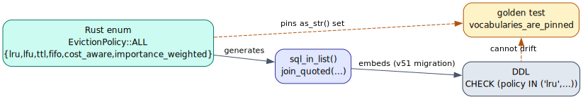
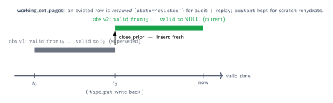

# 08 — Persistence schema

> **Thesis.** Two tables hold the durable working set. Their closed vocabularies are
> generated from the Rust enums so the DB constraint and the source cannot drift; the
> `last_access_ord` column is the **logical clock**, not a timestamp; and a `v53`
> migration relaxes one foreign key so the same tables serve both the CSM checkpoint
> path and the RLM path.

Source of record: `pgmcp/src/db/migrations/v51_working_set.rs`,
`v53_working_set_bytes.rs`, `pgmcp/src/tape/vocab.rs`, and `pgmcp/src/tape/store.rs`.

---

## 1. What is persisted, and why

A *working set* is the multiset of pages resident for one orchestration session at one
trace position (`state_cursor`). Two tables persist it so a paused + resumed session
reconstructs it ([07](07-determinism-and-resume.md)):



- `working_set_pages` — one row per `(session, cursor, page address)`.
- `working_set_config` — one row per session.

These are pgmcp's **own** coordination/memory tables; the controller decides residency
mechanically and writes it here. pgmcp never runs a shell or writes the user's files.

---

## 2. `working_set_pages`

```sql
CREATE TABLE IF NOT EXISTS working_set_pages (
    id                BIGSERIAL PRIMARY KEY,
    session_key       TEXT NOT NULL,                 -- v51: hard FK; v53: relaxed (see §6)
    state_cursor      INT  NOT NULL DEFAULT 0,        -- the trace position
    page_kind         TEXT NOT NULL DEFAULT 'file_chunk' CHECK (page_kind IN (...)),
    page_addr         TEXT NOT NULL,                  -- == PageAddress::to_path()
    tree_path         TEXT NOT NULL DEFAULT '',       -- the per-tree key; v53-indexed
    state             TEXT NOT NULL DEFAULT 'resident' CHECK (state IN (...)),
    importance        REAL NOT NULL DEFAULT 0,
    est_tokens        INT  NOT NULL DEFAULT 0,        -- the budget cost
    use_count         INT  NOT NULL DEFAULT 0,        -- frequency signal
    last_access_ord   BIGINT NOT NULL DEFAULT 0,      -- the LOGICAL clock (NOT wall-time)
    dirty             BOOL NOT NULL DEFAULT false,    -- write-back owed
    evict_reason      TEXT CHECK (evict_reason IS NULL OR evict_reason IN (...)),
    content           TEXT,                           -- v53: scratch bytes (NULL if re-fetchable)
    valid_from        TIMESTAMPTZ NOT NULL DEFAULT NOW(),  -- bitemporal lower bound
    created_at        TIMESTAMPTZ NOT NULL DEFAULT NOW(),
    UNIQUE (session_key, state_cursor, page_addr)
);
```

The `UNIQUE (session_key, state_cursor, page_addr)` is what makes a page row
idempotent under UPSERT (one row per page per cursor). The `state` column is **derived**
on write from the in-memory flags: `pinned` ⇒ `pinned`, else `dirty` ⇒ `dirty`, else
`resident` (`save_resident_page`).

The `state` column's lifecycle (the closed `PageState` vocabulary, §5):



---

## 3. `working_set_config`

```sql
CREATE TABLE IF NOT EXISTS working_set_config (
    session_key          TEXT PRIMARY KEY,            -- v51: hard FK; v53: relaxed
    model_window_tokens  INT NOT NULL DEFAULT 0,
    budget_tokens        INT NOT NULL DEFAULT 0,      -- the budget B the resident set must not exceed
    policy               TEXT NOT NULL DEFAULT 'importance_weighted' CHECK (policy IN (...)),
    ttl_secs             INT,                          -- interpreted as LOGICAL ticks, not seconds
    logical_clock        BIGINT NOT NULL DEFAULT 0,    -- monotonic; the bump_clock authority (§7)
    updated_at           TIMESTAMPTZ NOT NULL DEFAULT NOW()
);
```

`ttl_secs` is, despite the name, a count of **logical ticks** — the control plane's TTL
is measured on the logical clock, never seconds (`WorkingSet::from_config_defaults`).

---

## 4. Indexes

- `idx_working_set_pages_session_cursor (session_key, state_cursor)` — the hot lookup
  (`load_working_set` reads every page of a working set at a cursor).
- `idx_working_set_pages_dirty (session_key, state_cursor) WHERE dirty` — a **partial**
  index keeping the write-back queue scan (`list_dirty`) cheap.
- `idx_working_set_pages_tree (tree_path)` (v53) — RLM-tree cleanup and lookups by tree.

---

## 5. Closed vocabularies (the ADR-003 idiom)

`page_kind`, `state`, `policy`, and `evict_reason` are `TEXT` columns with `CHECK`
constraints whose value lists are generated from the Rust enums' `sql_in_list()` — so
the DB constraint and the Rust source-of-truth **cannot drift**, and a golden test
(`vocabularies_are_pinned`) pins each set:



| Vocabulary | Column | Values |
|---|---|---|
| `PageState` | `working_set_pages.state` | `resident`, `pinned`, `dirty`, `evicted` |
| `EvictionPolicy` | `working_set_config.policy` | `lru`, `lfu`, `ttl`, `fifo`, `cost_aware`, `importance_weighted` |
| `EvictReason` | `working_set_pages.evict_reason` | `budget_pressure`, `ttl`, `explicit`, `superseded` |
| `PageKind` | `working_set_pages.page_kind` | `file_chunk`, `memory_observation`, `summary_node` |

**The scratch discriminator.** The data-plane crate's `PageKind` has a *fourth* value,
`scratch`, that the control-plane vocabulary deliberately omits: a scratch page is
stored as `page_kind = 'file_chunk'` with `content IS NOT NULL` as the discriminator.
This is exactly what the resume reconstruction keys on ([07 §5](07-determinism-and-resume.md)),
and it keeps the control-plane vocabulary minimal (residency, not provenance).

---

## 6. The `v53` keystone

`v51` created both tables with a **hard** FK `session_key → orchestration_sessions(session_key)
ON DELETE CASCADE`. But the live RLM path (`run_rlm`) has *no* orchestration session — it
is keyed by a `root_task_id` UUID — so any `PagingEngine` page-in from RLM would fail the
FK insert. *That is precisely why the engine had zero production callers* before `v53`.
The migration:

1. **Relaxes the FK** on both tables, so `session_key` may hold *either* a real
   `orchestration_sessions.session_key` (CSM checkpoint path) *or* the synthetic tree key
   `"rlm:{root_task_id}"` (RLM path).
2. **Adds `content TEXT`** for scratch byte carriage: corpus/observation/summary pages
   re-fetch from the read-only corpus on resume, so they persist *metadata only* (NULL
   content); `Scratch` pages have no corpus source, so their bytes must persist here to
   survive a pause/resume — and it is also what lets a dirty page's eviction write back
   *real* bytes instead of the empty string.
3. **Restores cascade** for the CSM path with a `BEFORE DELETE` trigger
   (`trg_working_set_cascade`), since the dropped FK took its `ON DELETE CASCADE` with it:



RLM rows (no matching `orchestration_sessions` row) are untouched by the trigger; they
are reclaimed by `drop_tree` at run completion and the tape-store reaper
([02 §7](02-architecture-three-planes.md)).

---

## 7. Determinism at the DB layer

`last_access_ord` is persisted *verbatim* as the logical-clock value the engine stamped
— nothing reads wall-time into it — so a `load_working_set` after a `save_working_set`
round-trips the exact logical metadata. The clock has a **single authority**:

- **`bump_clock`** advances it atomically: `INSERT … ON CONFLICT DO UPDATE SET
  logical_clock = logical_clock + delta RETURNING logical_clock`. The relative increment
  means concurrent bumps never lose a tick.
- **`save_config`** seeds `logical_clock` only on the initial `INSERT` and deliberately
  omits it from the `DO UPDATE SET` list, so a config flush can never regress the durable
  clock. (Were it to overwrite the clock with a stale in-memory snapshot, a flush racing
  a bump would lose ticks — a determinism hazard.)

This pairing is proved by `bump_clock_is_atomic_and_save_config_does_not_regress_it`
(32 concurrent `+1` bumps return exactly `{1..32}`, final clock `32`; a subsequent
`save_config` with a stale in-memory `clock = 0` leaves the durable clock at `32`). The
full theorem is [07](07-determinism-and-resume.md).

---

## 8. Bitemporal / SCD-2 posture

The schema is **append-and-retain**, never destructive:



- `valid_from` is the bi-temporal lower bound of a residency record.
- **Eviction retains the row.** `evict_page` sets `state = 'evicted'`, clears `dirty`,
  and records the `EvictReason`, but **keeps the row** (audit + replay determinism) and
  leaves `content` intact (so a scratch page evicted mid-run is still byte-rehydratable).
- **Write-back is a supersession.** A dirty page's write-back into `memory_observations`
  closes the prior version's `valid_to` and inserts a fresh `valid_from` row — never an
  in-place mutation — so older trace positions still read the older bytes (`EvictReason::Superseded`;
  the implementation is `RealTapeDataPlane::supersede_observation`, [10](10-trust-boundary-and-security.md)).

This is Snodgrass's bitemporal model [15], [16] applied to residency: the table is a
history, not a snapshot.

---

## 9. The atomic flush

`save_working_set` persists the config row **plus every resident page** in one
transaction:

```text
procedure save_working_set(ws, tree_path):
    tx ← pool.begin()
    save_config_on(tx, ws)                              # logical_clock untouched on conflict (§7)
    for page in ws.pages in insertion order:
        save_resident_page_on(tx, page)                 # UPSERT; state derived; content = page.bytes
    tx.commit()                                         # a mid-loop fault rolls back the WHOLE flush
```

A fault mid-loop drops the transaction guard, rolling back every row written in this
flush — the durable state is never a partial snapshot of the working set (proved by
`save_working_set_flush_is_all_or_nothing`: an illegal `state` mid-flush leaves *zero*
rows).

---

## References

\[15] Snodgrass, *The temporal query language TQuel*, ACM TODS 1987, [doi:10.1145/22952.22956](https://doi.org/10.1145/22952.22956).
\[16] Jensen & Snodgrass, *Temporal data management*, IEEE TKDE 1999, [doi:10.1109/69.755613](https://doi.org/10.1109/69.755613).

*Next:* [09 — MCP verb surface](09-mcp-verb-surface.md).
