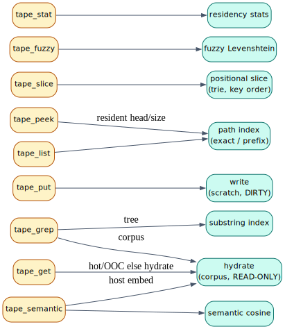

# 09 — The MCP verb surface

> **Thesis.** Nine **black-box-legal** verbs are the safe addressable surface any
> agent may call against a recursion tree's tape — analytical, no shell, no code
> execution, never writing the user's files, corpus read-only. A tenth, the white-box
> `tape_repl`, scripts the same nine behind an admission gate. An eleventh,
> `experiment_preregister_context_tape`, freezes the evaluation.

Source of record: `pgmcp/src/mcp/params/tape.rs`, `tools/tool_tape_*.rs`,
`tools/tape_support.rs`, `server/handlers/tape.rs`. The security model is
[10](10-trust-boundary-and-security.md); the experiment is [11](11-rlm-integration-and-experiment.md).

---

## 1. Common ground

- **`tree`** (required, every verb) — the recursion-tree scope, the per-tree
  `TapeStore` namespace `== RlmFrame.root_task_id`. Pass a fresh UUID for standalone
  use. The verb derives the store's `TreeId` via the sole authority
  `RealTapeDataPlane::tree_id` (SHA-256 of the tree path), so a verb addresses the
  *same* store the paging engine populates.
- **`address`** — a data-plane path string, *exactly* `PageAddress::to_path()`:
  `corpus/chunk/<id>`, `corpus/file/<id>`, `corpus/file/<id>/region/<lo>..<hi>`,
  `memory/obs/<id>`, or `scratch/<tree-uuid>/<hex-slot>`. A malformed address is an
  `invalid_params` error, never a panic.
- **The boundary (every verb).** Analytical: **no shell, no code execution**, never
  writes the user's source files; reads may hydrate the **READ-ONLY** corpus; writes
  target only the per-tree `TapeStore`.

---

## 2. The nine black-box-legal verbs

### `tape_get` — fetch one page's situated bytes
Params `{ tree, address }`. Resolution cascade: resident hot tier → OOC overlay →
hydrate the read-only corpus and admit clean.

Returns `{ tree, address, content, est_tokens, dirty }`, or `{ tree, address, found:
false, reason }` for a non-resident `Scratch` page (no corpus backing — benign). The
`dirty` flag reports whether the resident copy has an un-written-back edit.

### `tape_put` — stage bytes as DIRTY
Params `{ tree, address?, content, promote? }`. Omitting `address` mints a fresh
tree-local `Scratch` slot (a collision-free v4 UUID). The write lands in the per-tree
store **dirty**; with a live pool it routes through `admit_scratch` so it is
**residency-tracked** in `working_set_pages` and its bytes persist to the `content`
column (pause/resume-safe). Write-back **promotion** into durable memory is doubly
gated:

Returns `{ tree, address, dirty: true, resident_pages, resident_tokens,
promotion_requested, promoted }` (the engine path) — `promoted` is `true` only when the
daemon's `[tape] allow_promotion` actually permits it.

### `tape_peek` — head/size probe
Params `{ tree, address, bytes? }` (default 256). Resident-only (never hydrates).
Returns `{ resident, head, head_truncated, size_bytes, est_tokens, dirty, kind, n_pages }`
— `n_pages` is the count of resident pages whose path shares this address's path as a
prefix (so peeking `corpus/file/5` reports how many `corpus/file/5/…` pages are
resident). The head is truncated on a UTF-8 char boundary.

### `tape_slice` — positional range scan
Params `{ tree, lo, hi, max_pages? }` (default 64). Yields resident pages with key in
`[lo, hi]` **in address order** (the trie's depth-first order). Returns `{ lo, hi,
pages: [{ address, content, est_tokens, dirty }], truncated }`. If `lo > hi` the range
is empty.

### `tape_grep` — substring search
Params `{ tree, pattern, scope?, project?, limit? }` (default scope `tree`, limit 64).
`scope = tree` uses the per-tree substring index over resident content (exact, in-RAM,
no DB); `scope = corpus` resolves candidate chunks from the read-only corpus
(metadata refs); `scope = both` unions them, tree hits first. Returns `{ pattern, scope,
hits: [...] }`.

### `tape_fuzzy` — Levenshtein fuzzy-path search
Params `{ tree, query, max_distance?, filter? }` (default distance 2). Returns resident
addresses whose path is within `max_distance` edits of the query, ascending by distance:
`{ query, max_distance, hits: [{ address, distance }] }`. The `filter` keeps only matches
whose path begins with that prefix. (Theory: [12](12-weighted-automata-constrained-addressing.md).)

### `tape_semantic` — top-`k` semantic retrieval
Params `{ tree, query, k?, project? }` (default `k` 8). Embeds the natural-language
query host-side and runs the k-NN over the read-only corpus. Returns `{ query, k, hits:
[{ address, similarity, kind, est_tokens }], available }`. **Requires a live database**;
in CLI/mock-DB mode it returns `{ hits: [], available: false }` (a by-design no-op).

### `tape_list` — enumerate resident addresses
Params `{ tree, prefix?, limit? }` (default limit 256). Walks the path index for
resident addresses under `prefix` (empty lists all), in address order. Returns `{
prefix, addresses, returned, total_matching, truncated, dirty_count }`.

### `tape_stat` — residency statistics
Params `{ tree }`. Returns `{ tree_path, tree_id, resident_bytes, n_pages, n_dirty,
n_ooc_segments }` (querying an untouched tree lazily creates an empty store and reports
zeros).

---

## 3. `tape_repl` — the white-box / latent tier (gated)

Params `{ tree, script, experiment_slug, limits? }`. Scripts the tape through
context-tape's deny-by-default `rhai` engine — **only** the nine verbs, no
filesystem/network/process, `eval` disabled — under hard, deterministic `ReplLimits`
(defaults: 100 000 ops, 256 pages, 1 MiB bytes, 64 KiB string, 16 call levels).
**Admission requires both** a white-box caller *and* an Open experiment (full model:
[10](10-trust-boundary-and-security.md)). On refusal it returns `{ admitted: false,
reason }`; on admission `{ admitted: true, value, value_type, pages_touched,
bytes_touched, ops, over_limit, limit, error }` — a budget abort is a structured
`over_limit: true`, never a transport error. Example script:
`put(slice(get("corpus/chunk/5"), 0, 80))`.

---

## 4. `experiment_preregister_context_tape` — freeze the evaluation

Not a tape verb but the tool that opens/records/decides the frozen
`crucible-context-tape-3×3×5` pre-registration (the arms, task families, metrics, and
the locked composite acceptance criterion). It is dataset-gated and fabricates no
measurement; full treatment in [11](11-rlm-integration-and-experiment.md).

---

## 5. Mock vs real degradation

Every verb is wired so that a missing live database **degrades gracefully** rather than
erroring, because the control plane is a DB concern and the data plane is not:

| Verb | With a live pool | CLI / mock-DB mode |
|---|---|---|
| `tape_get` | hot/OOC → hydrate | resident-only (no hydrate) |
| `tape_put` | `admit_scratch`, residency-tracked + durable | direct in-RAM stage (no residency tracking) |
| `tape_grep` (corpus) / `tape_semantic` | corpus retrieval | tree-scope only / empty hits (`available: false`) |
| `tape_peek` / `tape_slice` / `tape_list` / `tape_stat` / `tape_fuzzy` | resident store | identical (no DB needed) |
| `tape_repl` | gate consults the DB experiment status | **fails closed** (an unverifiable experiment is not Open) |

This is why the verbs are usable in a CLI without Postgres: the resident-store paths
need no database, and the corpus paths announce their unavailability instead of failing.

---

*Next:* [10 — Trust boundary & security](10-trust-boundary-and-security.md).
