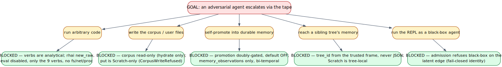
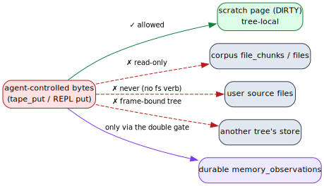

# 10 — Trust boundary & security

> **Thesis.** The tape assumes its callers may be adversarial. Nine verbs are
> **black-box-legal** (analytical, no shell, no code execution, corpus read-only,
> never write the user's files); the one verb that *can* run code, `tape_repl`, is
> admitted only for a white-box caller and an open experiment, runs in a
> deny-by-default `rhai` sandbox, and can write only tree-local scratch.

Source of record: `pgmcp/src/tape/repl_host.rs`, `pgmcp/src/mcp/tools/tool_tape_repl.rs`,
`pgmcp/src/mcp/tools/tape_support.rs`, `pgmcp/src/tape/real_data_plane.rs`, and the
`context-tape` crate's `repl/` (`rhai_engine.rs`, `tape_api.rs`).

---

## 1. Threat model

An agent calling the tape may be hostile or compromised, and — mirroring pgmcp's
posture elsewhere — an agent may *report* but never *self-certify* (there is no
agent-supplied verdict the system trusts). The tape must therefore make five
escalations **structurally impossible**, not merely discouraged:



Each leaf is a control, treated in turn below. The defenses follow Saltzer &
Schroeder's least-privilege and fail-safe-defaults principles [17]: a caller gets
exactly the capability it can be *positively shown* to deserve, and the default is
denial.

---

## 2. The nine black-box-legal verbs

The nine verbs ([09](09-mcp-verb-surface.md)) are *analytical*: they run **no shell and
no code execution**, they **never write the user's source files**, and the durable
corpus is **READ-ONLY** (reads may hydrate from it; writes target only the per-tree
`TapeStore`). This is asserted in the shared `tape_support.rs` boundary docstring and
holds for every verb body. "Black-box-legal" means safe to expose to any agent (Claude,
Codex, …) — there is nothing an analytical verb can do that escalates privilege.

---

## 3. `tape_repl` — the white-box admission gate

The REPL is the one verb that executes a script, so it is the one verb behind an
admission gate. Admission requires **both** arms to pass — neither of which a caller can
fabricate from its request payload:

``` admit  ⟺  whiteBox(caller)  ∧  status(experiment) = Open ```



### Arm 1 — white-box medium (structural)

The REPL is the *white-box / latent tier* — the counterpart of the latent RecursiveMAS
edge, not the all-`Text` black-box verbs. The medium of its protocol edge is fixed by
the capability as the constant `Latent` (never caller-supplied), and admission runs the
*same* projection-time media discipline (`check_media_discipline`) the CSM projector
uses: a **black-box** caller on a `Latent` edge is a discipline violation — "you cannot
put Claude in the latent loop" — and is refused. Three properties make this unforgeable:

- **The caller role is the host-extracted transport identity.** It is the lowercased
  MCP `initialize`-handshake `clientInfo.name` (via `extract_caller`), threaded from the
  wire handler — **never** read from the request payload.
- **Fail-closed.** `caller_role` maps an unidentified caller — `None`, empty,
  `"unknown"` (the peer never completed `initialize`), or the `"cli"` dispatch path — onto
  a canonical black-box role, so it is refused exactly as a known black-box agent
  (`claude`/`codex`) is. Only a *positively identified* white-box backbone survives.
  (The casing is load-bearing: the canonical black-box set is lowercase to match
  `extract_caller`'s output — a TitleCase set would silently fail *open*.)
- **A self-reported white-box claim cannot pass.** The body reads no "I am white-box"
  field; the only role-trust input is membership in a host-side structural registry, and
  the edge medium is a constant. An agent can self-report but never self-certify.

### Arm 2 — open experiment (DB-backed)

The named `experiment_slug` must resolve to a row whose status is `Open` (resolved from
Postgres by the async caller and passed to the pure, synchronous gate). This couples a
live REPL to a *declared, open* scientific experiment. In CLI/mock-DB mode the status
cannot be confirmed `Open`, so admission **fails closed** (an unverifiable experiment is
not an open one).

A refusal returns `{ admitted: false, reason }` and is logged at `warn!` (the ADR-021
trust-boundary-*refused* category — an expected, by-design denial, not a swallowed
error). The gate is a pure function of its inputs, so it is exhaustively unit-tested
(black-box refused even with an open experiment; white-box + open admitted; every closed
status and every unidentified-caller shape refused).

---

## 4. The deny-by-default `rhai` sandbox

When admitted, the script runs in context-tape's `ReplEngine`. pgmcp itself **never
executes agent code** — the engine, the verb surface, and every bound live in
context-tape; pgmcp only admits/refuses and lends the per-tree store for the
synchronous run. The sandbox is deny-by-default:

| Control | Mechanism |
|---|---|
| No packages by default | `rhai::Engine::new_raw()` registers **nothing** (no time/fs/net/print/module-resolver) |
| Only the safe core added back | `CorePackage` (language + integer arithmetic + iterators) + `LogicPackage` (comparisons) — both pure, no I/O, **no `BasicTimePackage`** |
| No dynamic code | `disable_symbol("eval")` |
| No host I/O | the **only** host functions registered are the nine `TapeApi` verbs; no `print`/`debug` sink, no module resolver (so `import` cannot reach the filesystem), no timestamp/random source |
| Hard resource limits | rhai `max_operations` / `max_call_levels` / `max_string_size` / `max_array_size` / `max_map_size` (`unchecked` is *not* set) **plus** host `max_pages` / `max_bytes` counters in `TapeApi` |
| Safe store lending | the `&mut TapeStore` is borrowed only inside the synchronous `with_store_mut` closure (no `.await` within); a monotonic generation token invalidates any stale pointer |

A budget exhaustion is a **structured** `over_limit: true` outcome (with the `LimitKind`
that tripped — `operations`/`pages-touched`/`bytes-touched`/`call-levels`/`string-size`),
never a panic or a 500. The host page/byte budgets are **monotonic** and charged
*before* the side effect: a verb that would exceed a ceiling performs no work and
returns `LimitExceeded`. (A source-grep test, `repl_trust_boundary`, structurally
asserts that `repl/*.rs` registers no I/O host function and exactly the nine verb names.)

### Determinism as a security property

The sandbox reads no wall-clock time and no randomness (no time package, no random
function, and the external-reference guard uses a *logical* generation counter). So
`ReplEngine::run` is a pure function of `(store state, script)` — the same script
against the same state always yields the same outcome (`determinism_same_script_same_result`).
This is the tape's logical-clock determinism extended into the REPL, and it is a
security property: a deterministic sandbox has no covert timing or entropy channel.

---

## 5. The corpus read-only invariant

The corpus is never written by any tape path:

- **Reads** hydrate through exactly one reader, `hydrate` (SELECT only — [04](04-data-plane-store-and-ooc.md)).
- **Writes** target only the per-tree `TapeStore`. The REPL `put` verb is **Scratch-only**:
  a `put` to any non-`Scratch` (corpus) address returns the typed `CorpusWriteRefused`
  and performs no write — the store has no corpus-write path at all
  (`tape_api_put_is_scratch_only` asserts a refused put creates no page).



---

## 6. The doubly-gated promotion

The *only* path from the tape into durable storage is a dirty page's write-back into
`memory_observations`, and it is gated twice and off by default:

``` promote_ok  ⟺  promote = true  ∧  [tape] allow_promotion  ∧  addr ∈ memory_observations ```

With promotion off (the default), a dirty page's bytes live only in the tree store and
are discarded on eviction. When all three conditions hold, the write is a **bi-temporal
supersession** (`RealTapeDataPlane::supersede_observation`): it closes the prior
version's `valid_to` and inserts a fresh `valid_from` row — never an in-place mutation,
and **never** `file_chunks` / `indexed_files` (those are read-only; only
`memory_observations` is writable, only via this gated path). See [08 §8](08-persistence-schema.md).

---

## 7. The frame-bound `Store` environment

The RLM `Store` environment (the shared accumulating memory, [11](11-rlm-integration-and-experiment.md))
binds its `root_task_id` from the **trusted `RlmFrame`**, never from caller JSON. Because
the per-tree `TreeId` is `SHA-256(tree_path)` and `Scratch` pages are tree-local, a
crafted frame can only ever address *its own* tree's memory — it cannot reach a sibling
recursion's store. Cross-tree memory access is therefore structurally impossible, not
merely access-controlled.

---

## 8. Generation-time vs execution-time defense

The controls above are *execution-time* (the gate, the sandbox, the read-only valve, the
frame binding). They are complemented by a **generation-time** layer documented
separately: the `AddressMask` and `TapeDslMask` constrained-decoding masks make it
*unsamplable* for a model to even emit a non-existent page address or an out-of-grammar
verb call — the bad token is removed from the sampling distribution, so there is no bad
request to refuse. That structural-impossibility argument, and its symbolic-automata /
FV linkage, is [12 — Weighted automata](12-weighted-automata-constrained-addressing.md).

---

## References

\[17] Saltzer & Schroeder, *The protection of information in computer systems*, Proc. IEEE 1975, [doi:10.1109/PROC.1975.9939](https://doi.org/10.1109/PROC.1975.9939).

*Next:* [11 — RLM integration & experiment](11-rlm-integration-and-experiment.md).
