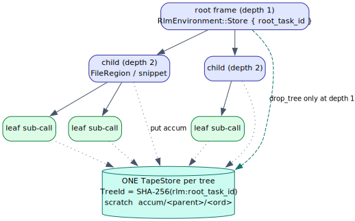
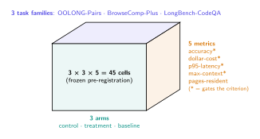
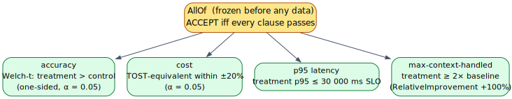
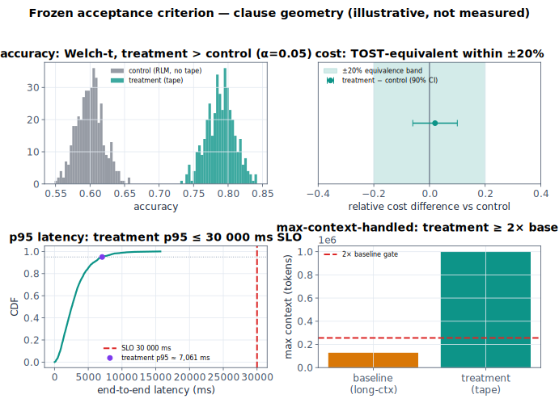

# 11 — RLM integration & the frozen experiment

> **Thesis.** The context tape is the working memory of a **Recursive Language Model**:
> one tape per recursion tree, a shared *accumulating* `Store` that makes output
> unbounded, and a tree id bound from the trusted frame so a recursion can never reach a
> sibling's memory. Whether the tape actually *wins* is decided by a **frozen,
> pre-registered** 3×3×5 experiment whose accept/reject rule predates any data.

Source of record: `pgmcp/src/a2a/rlm.rs` and `pgmcp/src/experiment/context_tape.rs`.

---

## 1. The RLM paradigm

A **Recursive Language Model** (`RLM`; Zhang, Kraska & Khattab [1]) answers a
long-context query by treating the corpus as an *external environment* (Postgres
`file_chunks`): **peek** into it, **decompose** the query, **recursively sub-call** a
peer model over each small snippet, optionally **verify**, then **stitch** the partial
answers — never inlining the full context into any single prompt. The environment a
sub-call narrows to is a closed set (`rlm.rs`):

| `RlmEnvironment` | Decomposed by | Notes |
|---|---|---|
| `File { path }` | its chunks | a single indexed file |
| `FileRegion { path, start_chunk, end_chunk }` | re-read from `file_chunks` | the child environment a depth>1 recursion narrows to (never inlines content) |
| `Corpus { project }` | semantic retrieval / grep | a project corpus |
| `Store { root_task_id }` | listing its pages | **Phase 7** — the live read/WRITE shared working memory (the paper's root-LM `Store`) |

---

## 2. One tape per recursion tree

The tape is keyed by the recursion tree, not the sub-call: one `TapeStore` per
`root_task_id`, shared by a recursion's parent, children, and siblings, so partial
results accumulate in one place.



- **Keying & isolation.** `TreeId = SHA-256("rlm:{root_task_id}")`. `Scratch` pages are
  tree-local, so two concurrent runs never collide ([02 §7](02-architecture-three-planes.md)).
- **Lifecycle.** Only the **root** (`frame.depth == 1`) drops the store
  (`drop_tree_if_root`): a child (`depth > 1`) must **not** drop it, because the parent
  and siblings are still folding into the same tree; dropping it early would lose their
  working set. The orphan-tree TTL reaper ([02 §7](02-architecture-three-planes.md)) is
  the backstop for a run that never reaches its root drop.

### The security property: the `Store` is frame-bound

For the `Store` environment, `root_task_id` is **deliberately not** read from the
caller's JSON — `RlmEnvironment::from_frame` binds it from the *trusted* `RlmFrame`
(`frame.root_task_id`); the JSON carries only a placeholder (`Uuid::nil()`). A
JSON-supplied id would let a crafted environment address a *sibling* tree's memory; the
frame binding makes that structurally impossible ([10 §7](10-trust-boundary-and-security.md)).

---

## 3. The accumulating `Store` → unbounded output

The `Store` environment is what lifts the RLM's *output* past any single window. The
stitch does not concatenate every partial into one reduce prompt; instead each sub-call
answer is `put` into the tree store as an `accum/…` scratch page and folded
**iteratively in bounded windows**:



```text
procedure accumulate_in_store_stitch(tree, partials):
    for (ord, answer) in partials:
        tape_put(tree, "accum/<parent_task_id>/<ord>", answer)     # a Scratch page
    summary ← ""
    for window in chunks(accum pages, RLM_STITCH_WINDOW):          # bounded fold
        summary ← reduce(summary, window)                          # one peer sub-call per window
        tape_put(tree, "accum/<parent_task_id>/summary", summary)  # rolling running summary
    return summary
```

Because each reduce sub-call sees only `RLM_STITCH_WINDOW` pages plus the running
summary, **no single prompt ever holds the whole partial set** — the answer can grow
without bound. The accumulator slot is namespaced per parent
(`accum/<parent_task_id>/<sub_key>`, rendered as `scratch/<tree>/<hex(…)>`) so concurrent
siblings at depth>1 fold into *private* slots and never clobber each other's rolling
summary (the "C1" namespacing fix). The store is keyed by `root_task_id`, but the
*accumulator pages* are keyed by `parent_task_id` — the tree is shared, the folds are
private.

---

## 4. The frozen 3×3×5 pre-registration

Whether the treatment (tape + paging) beats the controls is **not** asserted — it is
decided by a pre-registered experiment whose rule is frozen *before* any data
(Nosek et al. [21]; the slug is `crucible-context-tape-3x3x5`). The design is `3 arms ×
3 task families × 5 metrics = 45 cells`:



- **3 arms** (the existing `ExperimentArmKind`): `control` = read-only RLM, no tape (the
  recursion-only reference); `treatment` = tape + paging (under test); `baseline` =
  long-context model, no recursion (the context-length reference the `max-context` clause
  measures 2× against).
- **3 task families** (a closed ADR-003 vocabulary): OOLONG-Pairs, BrowseComp-Plus,
  LongBench-CodeQA. The families are the *stratum* — the design pools them into one
  per-arm sample per metric, so the criterion decides over their union.
- **5 metrics**: `accuracy`, `dollar_cost`, `p95_latency_ms`, `max_context_handled`
  (the four **gated** metrics), and `pages_resident_vs_window` (diagnostic, **not** gated
  — the paging-efficiency story).

### The frozen composite acceptance criterion

The accept/reject rule is a single `AllOf` of four clauses, serialized and locked onto
the hypothesis at `experiment_open` (the anti-p-hacking guard rejects a criterion locked
*after* the first sample):



It accepts **iff every** clause passes. The clause math (all reused from
`stats::inference`, none re-implemented), with the geometry illustrated below:

- **accuracy** — Welch's *t* [18], one-sided, `treatment > control`, at `α = 0.05`:
  ``` t = (x̄_t − x̄_c) / √( s_t²/n_t + s_c²/n_c ) ```
  with the Welch–Satterthwaite df
  ``` ν = (s_t²/n_t + s_c²/n_c)² / [ (s_t²/n_t)²/(n_t−1) + (s_c²/n_c)²/(n_c−1) ] ```
- **cost** — TOST equivalence [19], [20]: the treatment's dollar-cost is equivalent to
  the control's within `±20%` (`reject non-equivalence iff both one-sided tests pass
  within δ = 0.20·control`).
- **p95 latency** — an absolute-threshold SLO: `treatment p95 ≤ 30 000 ms`.
- **max-context-handled** — a relative-improvement clause: `treatment ≥ 2 × baseline`,
  encoded as `+100%` over the baseline median (`(v − b)/|b| ≥ 1.0`).



(The figure is **illustrative geometry**, not a measured run — the data is synthetic.)
NHST clauses are corrected for multiple comparisons (Benjamini–Hochberg by default). A
clause with too few samples is **inconclusive** (treated as not-passed), an expected
scientific outcome, not a runtime fault.

---

## 5. Verified-gated, default-OFF promotion

A positive result may be written into pgmcp memory, but only through two gates that no
agent can forge:

``` promote  ⟺  [experiments] allow_promotion  ∧  decision.accepted ```

- **`allow_promotion`** is `false` by default, so a stock install never promotes.
- **`decision.accepted`** can be produced *only* by the server running the frozen
  criterion over real samples (`evaluate_frozen` / `ContextTapeRunner::decide`) — there
  is no constructor a caller could use to forge `accepted = true`. This mirrors the
  tracker's "no `Agent` arm into `verified`" rule: a verdict the system trusts is one the
  *system* computed, never one an agent asserted.

When both hold, the write is a bi-temporal supersession of a `memory_observations` row
(close prior `valid_to`, insert fresh `valid_from`) — never the corpus
([08 §8](08-persistence-schema.md)). Every outcome (`Disabled`, `NotAccepted`,
`Promoted`, `NoActiveTarget`) is recorded, never silent.

---

## 6. Dataset-gated honesty, and why determinism matters

The module is the **complete, tested infrastructure** — the frozen vocabularies and
criterion, the per-clause routing, the recording + evaluation harness, and the
promotion seam — but **not** a live benchmark run. The 3×3×5 *execution* is
dataset-gated: it needs the external datasets (Oolong [25], BrowseComp-Plus [27],
LongBench v2 [29]) and live local models for the three arms, which are not available
in-build. The harness records exactly what a `DatasetSource` yields and **fabricates no
measurement and fakes no decision** (`DATASET_GATED_NOTE`).

This is where the determinism keystone ([07](07-determinism-and-resume.md)) pays off as
*science*: because residency — and the whole REPL sandbox ([10](10-trust-boundary-and-security.md))
— is a deterministic function of the replayed trace, a measured run is **reproducible**.
A treatment cell rerun on the same inputs produces the same residency decisions and the
same outputs, so the samples that feed the frozen criterion are not polluted by
nondeterministic timing or eviction. A pre-registered experiment over a nondeterministic
system would not be trustworthy; the logical clock is what makes the tape measurable.

---

## References

\[1] Zhang, Kraska & Khattab, *Recursive Language Models*, arXiv:2512.24601, 2025.
\[18] Welch, *The generalization of 'Student's' problem…*, Biometrika 1947, [doi:10.1093/biomet/34.1-2.28](https://doi.org/10.1093/biomet/34.1-2.28).
\[19] Schuirmann, *A comparison of the two one-sided tests procedure…* (TOST), J. Pharmacokinet. Biopharm. 1987, [doi:10.1007/BF01068419](https://doi.org/10.1007/BF01068419).
\[20] Lakens, *Equivalence tests: A practical primer…*, Soc. Psych. & Pers. Sci. 2017, [doi:10.1177/1948550617697177](https://doi.org/10.1177/1948550617697177).
\[21] Nosek, Ebersole, DeHaven & Mellor, *The preregistration revolution*, PNAS 2018, [doi:10.1073/pnas.1708274114](https://doi.org/10.1073/pnas.1708274114).
\[25] Bertsch et al., *Oolong: Evaluating long context reasoning and aggregation capabilities*, arXiv:2511.02817, 2025.
\[27] Chen et al., *BrowseComp-Plus*, arXiv:2508.06600, 2025.
\[29] Bai et al., *LongBench v2*, arXiv:2412.15204, 2024.

*Next:* [12 — Weighted automata: constrained addressing & scoring](12-weighted-automata-constrained-addressing.md).
