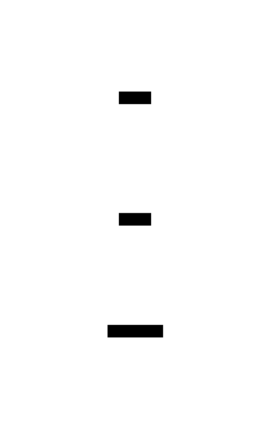
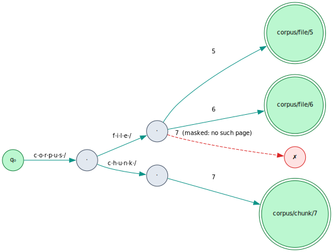
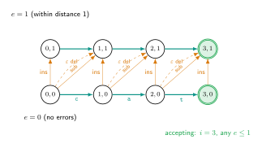
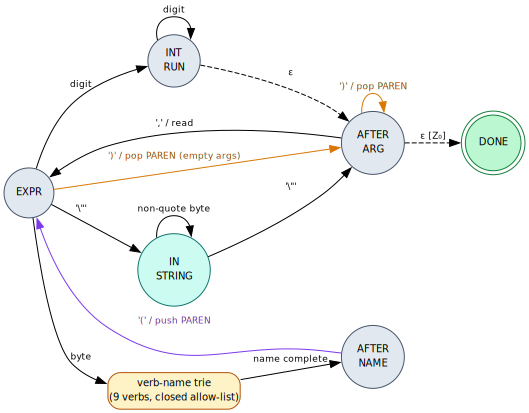
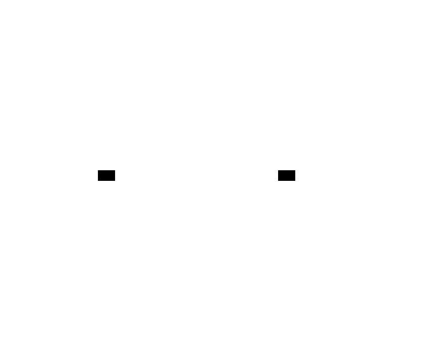

# 12 — Weighted automata: constrained addressing & scoring

> **Thesis.** The addressing layer is a weighted-automata pipeline. A
> **lexicographic-semiring scorer** decides *which* page to fetch, and a stack of
> **automata** constrain *what* a model may even emit — so naming a non-existent page
> or writing an out-of-grammar call is not "rejected after the fact" but is *unreachable
> in the decode*. The window is a cache; the address space is a **language**, recognized
> by a WFST ∩ a WPDA.

This is the deep-dive behind [05 — Index portfolio](05-index-portfolio.md)'s fuzzy and
scoring axes, and the *generation-time* defense layer behind [10 — Trust boundary](10-trust-boundary-and-security.md).
Source of record: `context-tape/src/index/score.rs`, `index/fuzzy.rs`, `repl/grammar.rs`,
`index/mod.rs`, over the `lling-llang` substrate.


---

## 1. Scope (and what this is *not*)

This document covers two roles played by automata over the address space: **ranking**
(the `ChunkScorer`) and **constraining** (the `AddressMask` / `TapeDslMask` masks). It is
*not* the paging engine ([06](06-control-plane-paging-engine.md)) or persistence
([08](08-persistence-schema.md)). The four modules of record are `score.rs` (the scorer +
flat mask), `fuzzy.rs` (the Levenshtein surface), `grammar.rs` (the pushdown mask), and
`index/mod.rs` (how they plug into the portfolio).

---

## 2. The constrained-decoding problem

A model emitting a tape address or a tape-DSL script, byte by byte, must never emit one
that cannot exist. **Validating after generation** is the wrong shape — it wastes
samples, needs backtracking, and the model can still *propose* an impossible page. The
right discipline is **masking**: at each decode step, compute `legal_next(prefix) →
TokenMask`, and let the model sample only a token the mask marks valid. There are two
languages to constrain:

- the **flat** address language (`PageAddress::to_path()` strings) — a finite ASCII set,
  hence **regular**;
- the **nested** REPL DSL (verb calls with parenthesized, nestable arguments) — matched
  parentheses, hence **context-free** (not regular).

The first wants a finite-state machine; the second wants a pushdown machine. Both are
weighted automata over the `lling-llang` substrate.

---

## 3. The `lling-llang` substrate

The masks and scorer are built on `lling-llang`'s weighted-automata and
constrained-decoding primitives:

- **Semirings.** A `Semiring` has `⊕`, `⊗`, `0̄`, `1̄`. The **tropical** weight is
  ``` K_trop = (ℝ ∪ {+∞}, ⊕, ⊗, 0̄, 1̄),  a ⊕ b = min(a, b),  a ⊗ b = a + b,  0̄ = +∞,  1̄ = 0 ``` —
  `⊕ = min` selects the best parallel path, `⊗ = +` accumulates sequential edit costs,
  which is exactly why edit distance lives here. A **`ProductWeight`** has a
  component-wise `⊕` and so induces only a *partial* order (incomparable pairs); a
  **`LexicographicWeight`** is the one member of the family that is a `TotallyOrderedSemiring`
  — usable as a strict rank.
- **WFST.** `VectorWfst<L, W>` is a mutable weighted transducer; a trie is an acyclic WFST
  over byte labels. `WfstConstraint<W>` wraps one for constrained decoding, exposing
  per-state `TokenMask`s, `advance`, and `is_accepting` (the `ConstrainedDecoder` trait).
- **WPDA.** `VectorPda<L, W>` is a weighted pushdown automaton built with `PdaBuilder`;
  `PdaDecoder` drives a `PdaConfiguration { state, stack }` with `advance` and
  `legal_next_mask`.
- **Symbolic core.** `lling-llang::symbolic` is a full D'Antoni–Veanes framework
  (`SymbolicAutomaton`, `SymbolicFiniteTransducer`, the `BooleanAlgebra` trait, char-class
  / interval / SMT algebras) and `llm::SymbolicConstrainedDecoder` — the symbolic
  generalization §9 returns to.

---

## 4. Ranking — the lexicographic-semiring scorer

The `ChunkScorer` folds a candidate's three paging signals — fuzzy `edit_distance`,
`semantic_sim`, and `importance` — into a single rank. A weighted **sum** would be wrong:
the signals are *incommensurable* (one edit is not "worth" so many importance points), so
any exchange rate is arbitrary. What the controller wants is a **priority cascade** —
prefer the closest fuzzy match; among ties, the most semantically similar; among those,
the most important — which is exactly the algebra of the **lexicographic semiring**:



The composed weight is `RankWeight = Lexicographic3<Tropical, Tropical, Tropical>`, each
level a *lower-is-better* tropical cost (so the two "higher is better" signals are
negated):

``` c₁ = edit_distance        (Some d ↦ d;        None ↦ MISSING_DISTANCE = 1e9) ```
``` c₂ = −semantic_sim        (finite s ↦ −s;     else ↦ MISSING_SEMANTIC = 2.0) ```
``` c₃ = −importance          (finite ↦ −imp;     else ↦ 0.0) ```

A *missing* signal is encoded as the **worst finite** cost on its level — never the
tropical `0̄ = +∞`, because `∞` is the `⊕`-absorbing zero and would make two missing-signal
candidates compare equal, destroying strictness. The final tie-break, applied only when
two lexicographic weights are *exactly* equal, is the canonical `PageAddress::to_key` —
making the order **strict, total, and input-order-independent**:

```text
procedure rank(candidates):                          # best first, strict total order
    scored ← [ (weight(in), addr.to_key(), addr) for (addr, in) in candidates ]
    sort scored by (lex weight ASC) then (to_key ASC)   # the key tiebreak makes it strict
    return [ addr for (_, _, addr) in scored ]

procedure weight(in):                                # → Lexicographic3<Trop, Trop, Trop>
    d ← in.edit_distance ? as_f64 : MISSING_DISTANCE
    s ← (in.semantic_sim finite) ? −sim : MISSING_SEMANTIC
    i ← (in.importance   finite) ? −imp : 0.0
    return lexicographic3(Trop(d), Trop(s), Trop(i))
```

(The discriminating tests pin every level: fewer edits outrank more; equal distance →
semantic dominates importance; a present-but-mediocre signal outranks a missing one.)

---

## 5. The flat address language — `AddressMask` (WFST)

At any instant the known address strings are a finite ASCII set `S = { to_path(a) }`, so
their **prefixes** form a trie — a cycle-free WFST over byte tokens:



`AddressMask::from_addresses` inserts each string into a shared byte trie (common prefixes
merge), marking each terminal state accepting. The decode surface is then:

``` Prefix(S) = { p : ∃ w, p·w ∈ S };  legal_next(p) = { b : p·b ∈ Prefix(S) };  is_accepting(p) ⇔ p ∈ S ```

```text
procedure insert_string(fst, start, bytes):          # build the byte trie
    cur ← start
    for b in bytes:
        cur ← existing (cur --b--> ?)  or  add_state(); add_transition(cur --b/b, 1̄--> new)
    set_final(cur, 1̄)                                 # a complete address is accepting

procedure legal_next(prefix):                         # → TokenMask of continuing bytes
    st ← walk the trie through prefix's bytes  (else return the empty mask)
    return constraint.valid_tokens(st)
```

A prefix that has diverged from every address yields an **empty** mask (admits nothing);
an empty address set rejects everything. So a model emitting an address through this mask
**structurally cannot name a non-existent page** — the byte that would diverge is simply
not in the mask. (The trie lineage is Fredkin [4]; the constrained-decoding-by-FSM idea is
the Outlines/regex-mask line [9] and the GCD literature [8].)

---

## 6. The fuzzy axis — Levenshtein transducer & composition

Typo-tolerant addressing ("I think it was `corpus/file/5/regon/0-3`") is the **fuzzy**
axis, which reuses the path DAWG ([05 §5](05-index-portfolio.md)). It rests on the
**Levenshtein automaton** (Schulz & Mihov [5]): the automaton recognizing every term
within distance `k` of a query, via the edit-distance recurrence

``` d(i,j) = min( d(i−1,j)+1,  d(i,j−1)+1,  d(i−1,j−1) + [xᵢ ≠ yⱼ] ),  accept iff d(x,y) ≤ k ```



`fuzzy.rs` offers two surfaces:

- **`query_paths`** — the *read-out* path: a liblevenshtein `Transducer` over the DAWG,
  queried with `query_with_distance`, yields `(term, distance)` (the `tape_fuzzy` verb;
  `Algorithm` selects `Standard` / `Transposition` / `MergeAndSplit`). The distance feeds
  level 1 of the scorer (§4).
- **`build_wfst`** — the *composition* path: duallity's `UniversalLevenshteinWfst`
  presents the (Universal Levenshtein automaton × dictionary) product as an
  `lling_llang::Wfst<char, TropicalWeight>` (input = query char, output = dictionary char,
  weight = edit distance ∈ `K_trop`), for callers that want to **compose** fuzzy addressing
  with another transducer (e.g. a language model) rather than enumerate matches. Direct
  queries use `query_paths` — enumeration over the universal WFST would require composing
  and walking accepting paths, which is the composition surface's job, not its own.

---

## 7. The nested DSL — `TapeDslMask` (WPDA)

The REPL surface language is *verb calls with parenthesized, nestable arguments*, e.g.
`put(slice(get("corpus/chunk/5"), 0, 80))`. Nesting is unbounded, so each `(` must be
matched by a later `)` — a finite-state mask cannot **count** paren depth, so the language
is **context-free**. It is encoded as a weighted pushdown automaton:



The grammar (verbatim EBNF from `grammar.rs`):

```text
script   ::= expr
expr     ::= verbcall | strlit | intlit
verbcall ::= verb '(' args ')'
args     ::= ε | expr (',' expr)*
strlit   ::= '"' addrchar* '"'
intlit   ::= digit+
verb     ::= "peek"|"slice"|"grep"|"get"|"put"|"fuzzy"|"semantic"|"list"|"stat"
```

The PDA `P = (Q, Σ, Γ, q₀, Z₀, F, Δ)` with `Q = {EXPR, AFTER_NAME, AFTER_ARG, IN_STRING,
INT_RUN, DONE}`, `Σ = bytes`, `Γ = {Z₀, PAREN}`, `q₀ = EXPR`, `F = {DONE}`, FinalState
accept:

```text
procedure build_dsl_pda():
    insert_verb_trie(EXPR → AFTER_NAME)        # 9 closed verbs as a shared byte trie
    add_push(AFTER_NAME, '(', → EXPR)          # '(' pushes a PAREN
    add_pop (EXPR,       ')', PAREN → AFTER_ARG)   # empty arg list ()
    add_read(AFTER_ARG,  ',', PAREN → EXPR)    # next argument
    add_pop (AFTER_ARG,  ')', PAREN → AFTER_ARG)   # close a call (itself an argument)
    add_eps (AFTER_ARG,  Z₀  → DONE)           # outermost ')' revealed Z₀ ⇒ accept
    # string literal '"' addrchar* '"'  and  integer literal digit+  …
```

Two structural-safety properties fall out for free:

- **The verb-name set is a closed allow-list.** `system` has no path through the verb-name
  trie, so the moment its bytes diverge from every real verb (`sys` → nothing), the mask
  goes empty — an out-of-grammar verb call **cannot be generated**.
- **The stack is the counter.** A stray `)` (as in `get("a"))`) has no `PAREN` to pop once
  the stack is back to `Z₀`, so it has no legal continuation — **unbalanced parentheses are
  rejected structurally**.

Because `(` and `)` are *visible* call/return symbols (the stack action is fixed by the
input symbol's class), the DSL is a **visibly pushdown language** (Alur & Madhusudan [6])
— exactly the band ADR-030 places `TapePaging`'s pushdown counterpart in, and the reason
the DSL is closed under intersection with the regular `AddressMask` (§8).

---

## 8. Composition — WPDA ∩ WFST inside a string literal

Inside a string literal (`IN_STRING`) the bare DSL admits "any non-quote byte" — too
permissive: an address argument must name a page that can exist. So `legal_next_composed`
intersects the DSL mask with the flat `AddressMask`:



```text
procedure legal_next_composed(cfg, address_mask, addr_prefix):
    M ← DSL.legal_next(cfg)                          # the WPDA mask
    if cfg.state = IN_STRING:                        # in_address_literal(cfg)
        M ← M ∩ address_mask.legal_next(addr_prefix) # TokenMask AND with the WFST mask
        if address_mask.is_accepting(addr_prefix):   # a complete address may be closed
            M ← M ∪ { '"' }                          # re-admit the closing quote (a DSL byte)
    return M
```

The intersection is exact because both masks are bit-vectors over the same `BYTE_VOCAB =
256`. The two masks are **interchangeable to a decoder** — `TapeDslMask` deliberately
mirrors `AddressMask`'s method shape (`legal_next` / `advance` / `is_accepting`) — so this
is a WPDA ∩ WFST product realized lazily, one decode step at a time, via `TokenMask` AND.

---

## 9. The symbolic-transducer (SFT) view, and the FV linkage

The context-tape masks are **ground (non-symbolic) instances** of a symbolic automaton.
The bridge is the *materialize-φ* identity: a per-state `TokenMask` *is* the materialized
minterm of the state's outgoing guard predicates —

``` SFA over algebra A:  Δ ⊆ Q × φ(A) × Q;  mask_q[t] = 1  ⇔  ∃(q,φ,q′) ∈ Δ. evaluate(φ, vocab[t]) ```

— so the masks are already in SFA/SFT form, just with *singleton* character classes
`φ_b(x) ≡ (x = b)`. `lling-llang` already provides the symbolic generalization:
`SymbolicAutomaton<CharClassAlgebra>` would express the address charset as predicate guards
(`[0-9]`, `[a-z]`, `/`, `-`) instead of 256 explicit edges, and `SymbolicConstrainedDecoder`
materializes those guards into per-state masks at build time
(`mask_q[t] ⇔ evaluate(guard, vocab[t])`) — the standard technique when the vocabulary is a
*true* LLM subword vocabulary, where enumerating per-token edges is infeasible (the SFT
machinery of d'Antoni & Veanes [7], and the GCD literature [8]).

**What the code does *not* yet do (no overclaim).** The context-tape masks today are the
concrete `VectorWfst` / `VectorPda` path with `BYTE_VOCAB = 256`; they do **not** route
through `SymbolicConstrainedDecoder` or `SymbolicFiniteTransducer`. The byte vocabulary is
small, so explicit edges are tractable and there is no need to go symbolic *yet*. The
symbolic path is **available in the substrate, not wired into context-tape** — the honest
upgrade path, not a present capability.

**FV linkage (ADR-032 / crucible ADR-017).** The *same* `lling-llang::symbolic` core that
would back a symbolic `AddressMask` is the core that backs the FV gate's `L(impl) ⊆ L(spec)`
language-inclusion checks and `Sat3` witnesses (d'Antoni & Veanes [3], CAV 2017). So "the
address grammar is a safety property the model cannot violate" is, in principle, a
*checkable* language-inclusion — not a hope — with the `language_inclusion` / `presburger_decide`
tools as evidence channels.

---

## 10. The security payoff

This layer is the **generation-time** complement to the *execution-time* controls of
[10](10-trust-boundary-and-security.md). It makes three escalations *unsamplable*, not
merely rejected:

| Attempt | Why it is impossible-by-construction |
|---|---|
| name a **non-existent page** | the `AddressMask` trie has no such path ⇒ the byte is absent from the mask |
| call an **out-of-grammar verb** | the closed verb-name trie ⇒ `system` is unreachable after `sys` |
| write a **malformed / unbalanced script** | the WPDA stack discipline ⇒ no continuation for a stray `)` |

"Impossible-by-construction" beats "rejected-after-the-fact": the mask removes the bad
token from the sampling distribution, so there is no bad sample to refuse. And because the
scorer is a strict total order with a deterministic tie-break, ranking is **replay-identical**
— consistent with the determinism keystone ([07](07-determinism-and-resume.md)).

---

## References

\[1] M. Mohri, F. Pereira, M. Riley. *Weighted finite-state transducers in speech recognition.* Computer Speech & Language 16(1):69–88, 2002. [doi:10.1006/csla.2001.0184](https://doi.org/10.1006/csla.2001.0184)
\[2] M. Mohri. *Semiring frameworks and algorithms for shortest-distance problems.* Journal of Automata, Languages and Combinatorics 7(3):321–350, 2002.
\[3] L. d'Antoni, M. Veanes. *The Power of Symbolic Automata and Transducers.* CAV 2017. [doi:10.1007/978-3-319-63387-9_3](https://doi.org/10.1007/978-3-319-63387-9_3)
\[4] E. Fredkin. *Trie memory.* CACM 1960. [doi:10.1145/367390.367400](https://doi.org/10.1145/367390.367400)
\[5] K. U. Schulz, S. Mihov. *Fast string correction with Levenshtein automata.* IJDAR 5(1):67–85, 2002. [doi:10.1007/s10032-002-0082-8](https://doi.org/10.1007/s10032-002-0082-8)
\[6] R. Alur, P. Madhusudan. *Visibly pushdown languages.* STOC 2004. [doi:10.1145/1007352.1007390](https://doi.org/10.1145/1007352.1007390)
\[7] M. Veanes, P. Hooimeijer, B. Livshits, D. Molnar, N. Bjørner. *Symbolic finite state transducers: algorithms and applications.* POPL 2012. [doi:10.1145/2103656.2103674](https://doi.org/10.1145/2103656.2103674)
\[8] S. Geng, M. Josifoski, M. Peyrard, R. West. *Grammar-constrained decoding for structured NLP tasks without finetuning.* EMNLP 2023. [doi:10.18653/v1/2023.emnlp-main.674](https://doi.org/10.18653/v1/2023.emnlp-main.674)
\[9] B. T. Willard, R. Louf. *Efficient guided generation for large language models.* arXiv:2307.09702, 2023.

*Back to the [README](README.md).*
