# The context tape — a tape-based infinite session for Recursive Language Models

> **One sentence.** The *context tape* turns a model's fixed context window into a
> **paged virtual-memory address space over the indexed corpus**, so a Recursive
> Language Model (`RLM`) can answer a query whose evidence — and whose output —
> vastly exceeds any single prompt, while a paused run resumes to a **bit-identical**
> working set. *The window is a cache; the corpus is the address space.*

This directory is the authoritative, reconstruct-from-scratch design record for the
subsystem. The **code is the source of truth** (the sibling `context-tape` crate +
`pgmcp/src/tape/` + the MCP verb surface + migrations `v51`/`v53`); these documents
explain *what each component is, what it does, how it does it, and why it was built
that way*, with diagrams, formulae, literate pseudocode, and citations. They follow
the pgmcp documentation guidelines (`documentation_guidelines` MCP tool /
`src/docguidelines/`).

---

## 1. What problem this solves

A language model has a **fixed context window** `W` (a token budget). Many software
engineering tasks — *"audit this 200-file crate", "summarise 18 months of commits",
"answer this question against a 1 M-token corpus"* — have evidence far larger than
`W`. The **Recursive Language Model** paradigm (Zhang, Kraska & Khattab [1]) answers
such a query by treating the corpus as an **external environment**: it `peek`s into
the environment, decomposes the query, **recursively sub-calls** a peer model over
each small snippet, then **stitches** the partial answers — the full context is never
inlined into any single prompt.

The RLM needs a substrate that (a) lets a sub-call *address* and *fetch* an arbitrary
slice of the corpus on demand, (b) gives the recursion a **shared, writable working
memory** so its output can grow without bound, and (c) makes the whole thing
**deterministic** so a paused run resumes exactly. That substrate is the **context
tape**.

---

## 2. The three planes at a glance

| Plane | Where | Responsibility |
|-------|-------|----------------|
| **Data plane** | the sibling **`context-tape` crate** (`/home/dylon/Workspace/f1r3fly.io/context-tape/src/`) — CPU-only, no pgmcp dependency | The tape itself: `PageAddress` (the random-access handle), `Page` (the unit of paging), `TapeStore` (a `PathMap`-backed hot tier + dirty model + addressing-index portfolio), the **out-of-core overlay** (`OocOverlay`, mmap spill), and `checkpoint`/`restore`. |
| **Control plane** | **`pgmcp/src/tape/`** | The *mechanical residency decision*: the `PagingEngine` (`page_in` / `evict_to_fit` / the demotion ladder), the in-memory `WorkingSet` + **logical clock**, the read-only corpus **hydration** bridge, the per-tree store **registry**, and durable persistence to `working_set_pages` / `working_set_config`. |
| **Verb surface** | **`pgmcp/src/mcp/{params,tools,server}/…tape…`** | The agent-facing tools: the **nine black-box-legal** verbs `tape_get` · `tape_put` · `tape_peek` · `tape_slice` · `tape_grep` · `tape_fuzzy` · `tape_semantic` · `tape_list` · `tape_stat`; the **white-box** `tape_repl`; and the pre-registration tool `experiment_preregister_context_tape`. |

The control plane **owns the residency decision**; the data plane **only moves
bytes**; the verb surface is **analytical** (no shell, no code execution, never
writes the user's files, corpus is read-only). See [02 — Architecture](02-architecture-three-planes.md).

---

## 3. Reading order

Read top-to-bottom; each document defines its own terms but builds on the ones above
it. The master glossary (§5) is the consolidated index.

| # | Document | What it covers |
|---|----------|----------------|
| — | [ADR-033 — decision](../decisions/033-context-tape-infinite-session.md) | *Why* a logical-clock paging tape, and the alternatives rejected. |
| 01 | [Overview & theory](01-overview-and-theory.md) | The virtual-memory analogy; what "infinite session" precisely means; the residency function. |
| 02 | [Architecture: three planes](02-architecture-three-planes.md) | Module maps, the `TapeDataPlane` seam, the per-tree registry. |
| 03 | [Addressing & pages](03-addressing-and-pages.md) | `PageAddress` algebra (key / path / `node_id`), the order-preserving encoding, `Page`/`PageMeta`. |
| 04 | [Data plane: store & OOC](04-data-plane-store-and-ooc.md) | `TapeStore`, the dirty model, `slice`, parallel disjoint writes, the OOC overlay, checkpoint/restore. |
| 05 | [Index portfolio](05-index-portfolio.md) | The five addressing axes (positional / path / substring / fuzzy / semantic) + the scoring layer. |
| 06 | [Control plane: paging engine](06-control-plane-paging-engine.md) | `page_in`, `evict_to_fit`, the six eviction policies, `evict_one`, the demotion ladder, `admit_scratch`. |
| 07 | [Determinism & resume](07-determinism-and-resume.md) | The logical-clock determinism theorem; pause/resume reconstruction. |
| 08 | [Persistence schema](08-persistence-schema.md) | The two tables, the closed vocabularies, the `v53` FK relaxation + trigger + `content`, bitemporal supersession. |
| 09 | [MCP verb surface](09-mcp-verb-surface.md) | Per-verb cards (params, returns, semantics, boundary). |
| 10 | [Trust boundary & security](10-trust-boundary-and-security.md) | Black-box vs white-box, the REPL admission gate, the doubly-gated promotion, the frame-bound `Store`. |
| 11 | [RLM integration & experiment](11-rlm-integration-and-experiment.md) | The per-tree store, the accumulating `Store`, the frozen 3×3×5 pre-registration. |
| 12 | [Weighted automata: constrained addressing & scoring](12-weighted-automata-constrained-addressing.md) | *(deep dive; read after 05/09.)* The lexicographic-semiring scorer, the flat `AddressMask` (WFST), the fuzzy Levenshtein/duallity surface, the nested `TapeDslMask` (WPDA), the WPDA∩WFST composition, the SFT view + FV linkage, and the structural-safety payoff. |

---

## 4. Status & test coverage

The subsystem is **delivered and tested**. Residency is wired into the live MCP
handler path (`tape_put` → `admit_scratch` → `page_in`/`evict_to_fit`) and the RLM
path (`session_key = "rlm:{root_task_id}"`, enabled by the `v53` FK relaxation).

| Concern | Tests (source-of-truth) |
|---------|--------------------------|
| Addressing round-trips (key / path), order-preserving encoding | `context-tape/src/address.rs` (proptests) |
| Data-plane store, dirty model, OOC spill, checkpoint/restore | `context-tape/src/{store,ooc}.rs`; `pgmcp-testing/tests/tape_*` |
| Engine policies + the token / budget / pinned invariants | `pgmcp/src/tape/engine.rs` (unit + 400-case proptest) |
| Logical-clock atomicity, atomic flush, scratch byte round-trip | `pgmcp/src/tape/store.rs` (DB-backed, skip-without-DB) |
| Address bridge round-trip (`PageAddr` ↔ `PageAddress`) | `pgmcp/src/tape/address_resolve.rs` (proptest) |
| Closed-vocabulary golden pins (ADR-003) | `pgmcp/src/tape/vocab.rs` |
| Verb behaviour, hydration bridge, REPL trust boundary, resume | `pgmcp/pgmcp-testing/tests/{tape_verbs,tape_paging_lifecycle,tape_hydration_bridge,tape_resume_lifecycle,tape_repl_lifecycle,repl_host_trust_boundary,context_tape_preregister}.rs` |

The **3×3×5 evaluation** (§11) is a *frozen, pre-registered* design whose execution is
**dataset-gated** (Oolong, BrowseComp-Plus, LongBench v2 + live local models); no
measurement is fabricated. The promotion path (`tape_put` write-back into durable
memory) is **off by default** (`[tape] allow_promotion = false`).

---

## 5. Master glossary

Every term, acronym, and symbol used across the set, defined once. Each links to the
document that treats it in full.

| Term | Definition |
|------|------------|
| **RLM** (Recursive Language Model) | A paradigm [1] that answers a long-context query by treating the corpus as an external environment, decomposing it, recursively sub-calling a peer model over each snippet, and stitching the partial answers. See [11](11-rlm-integration-and-experiment.md). |
| **context tape** / **tape** | A per-recursion-tree, random-access read/write **paged address space** over the indexed corpus, backed by PostgreSQL, that turns a fixed window into paged virtual memory. |
| **page** | The unit of paging: one `Page = { addr, content, meta }`. Its `content` is the **situated** bytes the model sees. See [03](03-addressing-and-pages.md). |
| **`PageAddress`** | The uniform random-access handle (5 variants: `Chunk`, `FileRegion`, `File`, `Observation`, `Scratch`). Renders to an order-preserving byte **key**, a human **path**, and (for corpus pages) a graph **`node_id`**. See [03](03-addressing-and-pages.md). |
| **situated / situating prefix** | A corpus page's content is the deterministic `build_context_prefix` header (`[File: … | Lang: … | …]`) ++ the raw chunk, so a paged-in chunk reads identically to its embedding-time form. See [04](04-data-plane-store-and-ooc.md). |
| **working set** | The multiset of pages resident for one `(session, cursor)` under the token **budget**. In RAM it is `WorkingSet`; durably it is the `working_set_pages` rows at a `state_cursor`. See [06](06-control-plane-paging-engine.md). |
| **`state_cursor`** | The trace position (the orchestration step). The working set is a function of `(session, state_cursor)`. |
| **logical clock** | A per-session monotonic counter (`working_set_config.logical_clock`); every `last_access_ord` is a snapshot of it. **Never wall-time.** The determinism anchor. See [07](07-determinism-and-resume.md). |
| **`last_access_ord`** | The logical-clock value at a page's last access (its recency signal). |
| **residency** | Whether a page is in the working set. Decided **mechanically** from `(budget, policy, logical-clock)` — never agent judgment. |
| **eviction policy** | How the controller picks a victim under budget pressure. One of `lru`, `lfu`, `ttl`, `fifo`, `cost_aware`, `importance_weighted` (default). See [06](06-control-plane-paging-engine.md). |
| **`PageState`** | A page's residency lifecycle: `resident`, `pinned`, `dirty`, `evicted`. See [08](08-persistence-schema.md). |
| **`PageKind`** | What a page *is*: `file_chunk`, `memory_observation`, `summary_node` (control plane); the data-plane crate adds `scratch`. |
| **`EvictReason`** | Why a page left residency: `budget_pressure`, `ttl`, `explicit`, `superseded`. |
| **dirty** | A page an agent **wrote through** (a `Scratch` page or an edited corpus page); a write-back is owed before eviction. See [04](04-data-plane-store-and-ooc.md). |
| **demotion ladder** | On eviction, the controller may page in a compact `SummaryNode` to stand in for the evicted leaf (the "compressed swap" analogue). See [06](06-control-plane-paging-engine.md). |
| **out-of-core (OOC) overlay** | The middle tier: cold **clean** pages spill to mmap'd segment files and leave RAM, served back from the mmap with no DB round-trip. See [04](04-data-plane-store-and-ooc.md). |
| **`TapeStore`** | The hot (in-RAM) tier for one tree: a `PathMap<Page>` + dirty set + `resident_bytes` + the `AddressIndex` + the OOC overlay. See [04](04-data-plane-store-and-ooc.md). |
| **`PathMap`** | An order-preserving radix trie (the `pathmap` crate); the `TapeStore`'s backing structure, giving prefix compression, structural sharing, and an in-key-order `slice`. |
| **`TreeId` / tree** | The recursion-tree scope (`== RlmFrame.root_task_id`). One `TapeStore` per tree; `Scratch` pages are tree-local. See [02](02-architecture-three-planes.md), [11](11-rlm-integration-and-experiment.md). |
| **`TreePath`** | The control-plane tree key string `"rlm:{root_task_id}"`; its SHA-256 derivation is the `TreeId`. See [02](02-architecture-three-planes.md). |
| **`TapeDataPlane` seam** | The async trait (`get`/`get_many`/`put`/`resolve`/`summary_of`) the engine calls through; `RealTapeDataPlane` (production) and `MockTapeDataPlane` (a full-contract test impl). See [02](02-architecture-three-planes.md). |
| **hydrate** | Turn a corpus `PageAddress` into a situated `Page` from `file_chunks`/`memory_observations`. The **only** corpus reader, strictly READ-ONLY. See [02](02-architecture-three-planes.md), [04](04-data-plane-store-and-ooc.md). |
| **`Store` (RLM env)** | The shared, accumulating working memory across a whole recursion tree (the paper's root-LM `Store`); it makes RLM **output** unbounded. See [11](11-rlm-integration-and-experiment.md). |
| **black-box-legal** | A verb that is analytical (no shell, no code execution), never writes the user's files, and treats the corpus as read-only — safe for any agent (Claude, Codex, …). See [10](10-trust-boundary-and-security.md). |
| **white-box** | A caller whose model internals are accessible (a local backbone); the only kind allowed to run `tape_repl`. White-box status is a host-side fact, never self-reported. See [10](10-trust-boundary-and-security.md). |
| **promotion** | A dirty write-back from the tape into durable `memory_observations` (a bi-temporal supersession). Doubly-gated and **off by default**. See [09](09-mcp-verb-surface.md), [10](10-trust-boundary-and-security.md). |
| **bi-temporal supersession** | A write-back that closes the prior version's `valid_to` and inserts a fresh `valid_from` row — never an in-place mutation, so older trace positions still read older bytes. See [08](08-persistence-schema.md). |
| **token estimate** | `est_tokens = ⌊|content| / 4⌋` — a deterministic (replay-safe) budgeting heuristic, shared between `Page::estimate_tokens` and `rlm.rs`. |
| **WFST / WPDA** | Weighted finite-state transducer / weighted pushdown automaton — the substrate of the flat `AddressMask` (regular) and the nested `TapeDslMask` (context-free). See [12](12-weighted-automata-constrained-addressing.md). |
| **lexicographic semiring** | The totally-ordered weight (`Lexicographic3<Tropical,…>`) the `ChunkScorer` ranks candidates with — a priority cascade, not a weighted sum. See [12](12-weighted-automata-constrained-addressing.md). |
| **constrained decoding / `TokenMask`** | At each decode step, the mask of bytes that legally continue the prefix; the model samples only a valid token, so an impossible address/script is *unsamplable*. See [12](12-weighted-automata-constrained-addressing.md). |
| **SFA / SFT** | Symbolic finite automaton / transducer (`lling-llang::symbolic`): transitions labelled by predicate guards over a (large/symbolic) alphabet. The tape masks are the *ground* instance; the symbolic upgrade path is available but not yet wired. See [12](12-weighted-automata-constrained-addressing.md). |

**Symbols** (used in formulae, always in backticks): `W` = window/budget tokens; `B` =
`budget_tokens`; `t(p)` = a page's `est_tokens`; `clock` = the logical clock; `age(p)`
= `clock − last_access_ord(p)`; `Σ` = sum over the resident set; `ε` = `10⁻³` (the
importance floor); `⌊·⌋` = floor.

---

## 6. Diagrams: toolchain & palette

All diagrams are rendered to committed SVGs by [`diagrams/render.sh`](diagrams/render.sh)
from sources in [`diagrams/src/`](diagrams/src/), using tools from
[`docs/reference/diagramming-tools.md`](../reference/diagramming-tools.md):
**Mermaid** (`mmdc`), **Graphviz** (`dot`), **D2**, **PlantUML**, **Matplotlib**, and
**TikZ** (`pdflatex` → `pdftocairo`). To regenerate: `cd diagrams && ./render.sh`.

The **pinned palette** (intuitive colour per concept) is shared by every diagram:

| Concept | Colour | Hex |
|---------|--------|-----|
| Data plane | teal | `#0d9488` |
| Control plane | indigo | `#4f46e5` |
| Verb surface | amber | `#d97706` |
| Corpus / Postgres | slate | `#475569` |
| Trusted zone | green | `#16a34a` |
| Untrusted zone | red | `#dc2626` |
| Page: resident / clean | green | `#16a34a` |
| Page: dirty | amber | `#d97706` |
| Page: evicted | grey | `#6b7280` |
| Page: spilled (OOC) | blue | `#2563eb` |
| Page: pinned | blue | `#1d4ed8` |
| Page: summary node | purple | `#7c3aed` |

---

## 7. Source-of-truth file manifest

**Data plane (`context-tape` crate, `…/context-tape/src/`):** `lib.rs`, `address.rs`,
`page.rs`, `store.rs`, `ooc.rs`, `error.rs`, `index/{mod,path,substring,fuzzy,semantic,score,idtable}.rs`,
`repl/{mod,rhai_engine,tape_api,grammar}.rs`.

**Control plane (`pgmcp/src/tape/`):** `mod.rs`, `vocab.rs`, `working_set.rs`,
`store.rs`, `engine.rs`, `data_plane.rs`, `real_data_plane.rs`, `registry.rs`,
`hydrate.rs`, `prefetch.rs`, `address_resolve.rs`, `repl_host.rs`.

**Verb surface (`pgmcp/src/mcp/`):** `params/tape.rs`, `tools/tool_tape_{get,put,peek,slice,grep,fuzzy,semantic,list,stat,repl}.rs`,
`tools/tape_support.rs`, `server/handlers/tape.rs`.

**Schema (`pgmcp/src/db/migrations/`):** `v51_working_set.rs`, `v53_working_set_bytes.rs`.

**RLM + experiment (`pgmcp/src/`):** `a2a/rlm.rs`, `experiment/context_tape.rs`.

---

## 8. References

The full bibliography; individual documents cite the subset they use, at the point of
use. DOIs verified against Crossref; arXiv IDs against the live arXiv.

1. A. L. Zhang, T. Kraska, O. Khattab. "Recursive Language Models." arXiv:2512.24601, 2025. <https://arxiv.org/abs/2512.24601>
2. P. J. Denning. "The working set model for program behavior." *Communications of the ACM*, 11(5):323–333, 1968. [doi:10.1145/363095.363141](https://doi.org/10.1145/363095.363141)
3. P. J. Denning. "Virtual memory." *ACM Computing Surveys*, 2(3):153–189, 1970. [doi:10.1145/356571.356573](https://doi.org/10.1145/356571.356573)
4. L. A. Belády. "A study of replacement algorithms for a virtual-storage computer." *IBM Systems Journal*, 5(2):78–101, 1966. [doi:10.1147/sj.52.0078](https://doi.org/10.1147/sj.52.0078)
5. T. Kilburn, D. B. G. Edwards, M. J. Lanigan, F. H. Sumner. "One-level storage system." *IRE Transactions on Electronic Computers*, EC-11(2):223–235, 1962. [doi:10.1109/TEC.1962.5219356](https://doi.org/10.1109/TEC.1962.5219356)
6. D. D. Sleator, R. E. Tarjan. "Amortized efficiency of list update and paging rules." *Communications of the ACM*, 28(2):202–208, 1985. [doi:10.1145/2786.2793](https://doi.org/10.1145/2786.2793)
7. L. Lamport. "Time, clocks, and the ordering of events in a distributed system." *Communications of the ACM*, 21(7):558–565, 1978. [doi:10.1145/359545.359563](https://doi.org/10.1145/359545.359563)
8. K. Honda, N. Yoshida, M. Carbone. "Multiparty asynchronous session types." *POPL '08*, pp. 273–284, 2008. [doi:10.1145/1328438.1328472](https://doi.org/10.1145/1328438.1328472)
9. K. Honda, N. Yoshida, M. Carbone. "Multiparty Asynchronous Session Types." *Journal of the ACM*, 63(1):9, 2016. [doi:10.1145/2827695](https://doi.org/10.1145/2827695)
10. R. Alur, P. Madhusudan. "Visibly pushdown languages." *STOC '04*, pp. 202–211, 2004. [doi:10.1145/1007352.1007390](https://doi.org/10.1145/1007352.1007390)
11. E. Fredkin. "Trie memory." *Communications of the ACM*, 3(9):490–499, 1960. [doi:10.1145/367390.367400](https://doi.org/10.1145/367390.367400)
12. D. R. Morrison. "PATRICIA — Practical Algorithm To Retrieve Information Coded In Alphanumeric." *Journal of the ACM*, 15(4):514–534, 1968. [doi:10.1145/321479.321481](https://doi.org/10.1145/321479.321481)
13. A. Blumer, J. Blumer, D. Haussler, A. Ehrenfeucht, M. T. Chen, J. Seiferas. "The smallest automaton recognizing the subwords of a text." *Theoretical Computer Science*, 40:31–55, 1985. [doi:10.1016/0304-3975(85)90157-4](https://doi.org/10.1016/0304-3975(85)90157-4)
14. K. U. Schulz, S. Mihov. "Fast string correction with Levenshtein automata." *International Journal on Document Analysis and Recognition (IJDAR)*, 5(1):67–85, 2002. [doi:10.1007/s10032-002-0082-8](https://doi.org/10.1007/s10032-002-0082-8)
15. R. T. Snodgrass. "The temporal query language TQuel." *ACM Transactions on Database Systems*, 12(2):247–298, 1987. [doi:10.1145/22952.22956](https://doi.org/10.1145/22952.22956)
16. C. S. Jensen, R. T. Snodgrass. "Temporal data management." *IEEE Transactions on Knowledge and Data Engineering*, 11(1):36–44, 1999. [doi:10.1109/69.755613](https://doi.org/10.1109/69.755613)
17. J. H. Saltzer, M. D. Schroeder. "The protection of information in computer systems." *Proceedings of the IEEE*, 63(9):1278–1308, 1975. [doi:10.1109/PROC.1975.9939](https://doi.org/10.1109/PROC.1975.9939)
18. B. L. Welch. "The generalization of 'Student's' problem when several different population variances are involved." *Biometrika*, 34(1–2):28–35, 1947. [doi:10.1093/biomet/34.1-2.28](https://doi.org/10.1093/biomet/34.1-2.28)
19. D. J. Schuirmann. "A comparison of the two one-sided tests procedure and the power approach for assessing the equivalence of average bioavailability." *Journal of Pharmacokinetics and Biopharmaceutics*, 15(6):657–680, 1987. [doi:10.1007/BF01068419](https://doi.org/10.1007/BF01068419)
20. D. Lakens. "Equivalence tests: A practical primer for *t* tests, correlations, and meta-analyses." *Social Psychological and Personality Science*, 8(4):355–362, 2017. [doi:10.1177/1948550617697177](https://doi.org/10.1177/1948550617697177)
21. B. A. Nosek, C. R. Ebersole, A. C. DeHaven, D. T. Mellor. "The preregistration revolution." *PNAS*, 115(11):2600–2606, 2018. [doi:10.1073/pnas.1708274114](https://doi.org/10.1073/pnas.1708274114)
22. D. L. Parnas. "On the criteria to be used in decomposing systems into modules." *Communications of the ACM*, 15(12):1053–1058, 1972. [doi:10.1145/361598.361623](https://doi.org/10.1145/361598.361623)
23. V. I. Levenshtein. "Binary codes capable of correcting deletions, insertions, and reversals." *Soviet Physics Doklady*, 10(8):707–710, 1966. (No DOI; ADS bibcode `1966SPhD...10..707L`.)
24. N. Megiddo, D. S. Modha. "ARC: A self-tuning, low overhead replacement cache." *USENIX FAST '03*, pp. 115–130, 2003. (No DOI.) <https://www.usenix.org/conference/fast-03/arc-self-tuning-low-overhead-replacement-cache>
25. A. Bertsch, A. Pratapa, T. Mitamura, G. Neubig, M. R. Gormley. "Oolong: Evaluating long context reasoning and aggregation capabilities." arXiv:2511.02817, 2025. <https://arxiv.org/abs/2511.02817>
26. J. Wei et al. "BrowseComp: A simple yet challenging benchmark for browsing agents." arXiv:2504.12516, 2025. <https://arxiv.org/abs/2504.12516>
27. Z. Chen et al. "BrowseComp-Plus: A more fair and transparent evaluation benchmark of deep-research agent." arXiv:2508.06600, 2025. <https://arxiv.org/abs/2508.06600>
28. Y. Bai et al. "LongBench: A bilingual, multitask benchmark for long context understanding." *ACL 2024*; arXiv:2308.14508. <https://arxiv.org/abs/2308.14508>
29. Y. Bai et al. "LongBench v2: Towards deeper understanding and reasoning on realistic long-context multitasks." arXiv:2412.15204, 2024. <https://arxiv.org/abs/2412.15204>
30. M. Mohri, F. Pereira, M. Riley. "Weighted finite-state transducers in speech recognition." *Computer Speech & Language*, 16(1):69–88, 2002. [doi:10.1006/csla.2001.0184](https://doi.org/10.1006/csla.2001.0184)
31. M. Mohri. "Semiring frameworks and algorithms for shortest-distance problems." *Journal of Automata, Languages and Combinatorics*, 7(3):321–350, 2002.
32. L. d'Antoni, M. Veanes. "The Power of Symbolic Automata and Transducers." *CAV 2017*. [doi:10.1007/978-3-319-63387-9_3](https://doi.org/10.1007/978-3-319-63387-9_3)
33. M. Veanes, P. Hooimeijer, B. Livshits, D. Molnar, N. Bjørner. "Symbolic finite state transducers: algorithms and applications." *POPL 2012*. [doi:10.1145/2103656.2103674](https://doi.org/10.1145/2103656.2103674)
34. S. Geng, M. Josifoski, M. Peyrard, R. West. "Grammar-constrained decoding for structured NLP tasks without finetuning." *EMNLP 2023*. [doi:10.18653/v1/2023.emnlp-main.674](https://doi.org/10.18653/v1/2023.emnlp-main.674)
35. B. T. Willard, R. Louf. "Efficient guided generation for large language models." arXiv:2307.09702, 2023. <https://arxiv.org/abs/2307.09702>

*Note on benchmark names:* the experiment's internal labels "OOLONG-Pairs" and
"LongBench-CodeQA" refer to **task subsets** of Oolong [25] and LongBench v2 [29]
respectively — cite the parent benchmarks. "BrowseComp-Plus" [27] is a distinct
published artifact.
