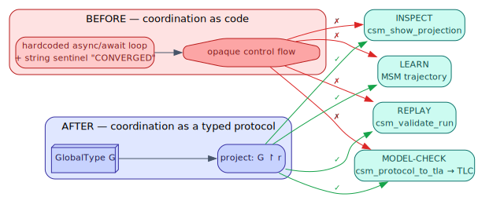

# 00 — Motivation & overview

> **Thesis.** Multi-agent coordination used to be *code* — hardcoded `async`/`await`
> loops and string sentinels — and therefore invisible to inspection, model-checking,
> replay, and learning. The CSM makes coordination a *typed artifact*: a value you can
> project, check, model-check, replay, pause, and learn from.

**Source of record:** [ADR-009](../decisions/009-a2a-coordination-state-machines.md)
(the anchor decision), [ADR-030](../decisions/030-pushdown-hierarchical-csm.md) (the
pushdown lift). Code: `src/csm/`, `src/a2a/`.

---

## 0.1 The problem: coordination was the one state machine pgmcp did not write down

A recurring discovery shaped pgmcp's architecture: *the same five constructs keep
showing up as state machines, and four of them are written down explicitly — but the
fifth, multi-agent coordination, is not.*

| Where | What it is | Form before CSM |
|-------|-----------|-----------------|
| `src/tracker/transition.rs` | the work-item lifecycle | an **explicit guarded transition matrix** — `check_transition()` with actor + evidence guards |
| `src/cron/scheduler/state.rs` | the reactive scheduler | an **FSM with a model-checked TLA⁺ spec** (`CronStateMachine.tla`) |
| `src/a2a/types.rs` `TaskState` | the per-task lifecycle | a 6-state enum — but the dispatcher writes any state, **unguarded** |
| `a2a_pattern_*` (sequential / mixture / …) | **the coordination topology** | **hardcoded `async`/`await` loops + string sentinels (`"CONVERGED"`)** — *not a transition system* |

The coordination topology — *who talks to whom, in what order, and when to stop* — is
exactly the part you most want to inspect, model-check, replay, and learn from. As ad-hoc
control flow it was invisible to all four. The CSM reifies it as an explicit
**Communicating-FSM network specified by Multiparty Session Types**: a checkable,
replayable, learnable value.

What that buys, concretely:

- **Inspectability** — `csm_show_projection` prints each agent's machine; `csm_protocol_plan` prints the orchestrator's schedule.
- **Model-checking** — `csm_protocol_to_tla` emits a TLA⁺ module; TLC checks deadlock-freedom, no-orphan, bounded-rounds.
- **Replay** — `csm_validate_run` lifts a real run to a `Trace` and decides conformance; a divergence is a *finding*, not a guess.
- **Learning** — a run is a trajectory; it already drives pgmcp's Move-Split-Merge learner with no new machinery.
- **Safety by typing** — deadlock-freedom and progress become *theorems* about well-formed protocols, not properties you test for.

---

## 0.2 The naming note: Communicating vs "communicative"

The code and the ADRs name this the **Communicating State Machine (CSM)** — it is, in the
technical sense, a network of **Communicating Finite-State Machines** (CFSM,
Brand–Zafiropulo 1983 [7]), a model in which several finite automata run concurrently and
synchronize by sending and receiving messages over channels. The request that prompted
this treatise used the descriptive phrase *"communicative state machine"*. The two refer
to the same subsystem; this treatise uses the project's established term **CSM =
Communicating State Machine** everywhere, and flags the synonym here so a reader arriving
from either phrase lands in the right place. The acronym is identical, so cross-references,
tool names (`csm_*`), and the module path (`src/csm/`) are unambiguous.

---

## 0.3 The operating rule: pi acts, pgmcp reasons

One rule governs the entire stack and is worth stating before any mechanism
(ADR-009; reinforced in [chapter 11](11-crucible-plan-execution.md)):

> **pi does all file work; pgmcp is purely analytical / communicative / verification —
> it never touches a file.**

`pi` is the agent runtime: it reads, writes, edits, runs tests, runs the formal checkers
(SANY/TLC/`coqc`), and samples models. `pgmcp` is the coordination-and-reasoning daemon:
it **synthesizes** protocols from plans, **projects** them onto roles, **checks**
conformance, **traces** runs, **stores** state, and **recommends** the next move — all as
data, never as an edit. This split is what makes the CSM an *observer* that can be trusted:
it can never silently change the artifact it is judging. Every responsibility below maps to
exactly one side:

| Responsibility | Owner |
|----------------|-------|
| read / write / edit / bash, run tests, run SANY/TLC/`coqc`, sample a model | **pi agents** |
| coordinate agents (A2A); synthesize / project / validate protocols | **pgmcp** |
| verify (record evidence, gate transitions, run frozen statistical tests) | **pgmcp** |
| *recommend* (which agent next, route, severity) — advisory only | **pgmcp** (pi decides) |

---

## 0.4 The shape of the rest of the treatise

The chapters build a single idea in layers (see the [README](README.md) reading order).
The spine is:

1. **A protocol is a type** ([01](01-cfsm-mpst-foundations.md)). Write the whole
   conversation down as a `GlobalType` `G`.
2. **Each agent is a projection** ([02](02-projection-and-wellformedness.md)). `G ↾ r`
   gives role `r` its own `LocalType`; well-formedness is the gate.
3. **Safety is a theorem** ([03](03-safety-metatheorems.md)). A well-formed, projectable
   `G` is deadlock-free and orphan-free by the MPST metatheorem.
4. **The recognizer is a visibly-pushdown automaton** ([04](04-automata-spine.md)). That
   is what lets a *recursive* or *hierarchical* protocol stay decidably checkable.
5. **Compile, then replay** ([05](05-data-model-and-compiled-machines.md)–[06](06-conformance-and-the-observer.md)).
   The local type becomes a `LocalMachine`; a recorded run replays against it; acceptance
   is well-nestedness + terminality.
6. **The substrate, the patterns, the recursion** ([07](07-a2a-protocol-and-agent-model.md)–[09](09-recursive-language-model.md)).
   The A2A wire, the five named patterns, and the Recursive Language Model whose frame
   stack *is* the pushdown store.
7. **All state is the trace** ([10](10-state-is-the-trace.md)). One append-only event log
   is position, resume, content anchor, audit, and control.
8. **The consumer, the algebra, the proofs, the tools**
   ([11](11-crucible-plan-execution.md)–[14](14-tool-surface-and-worked-examples.md)).
   crucible drives a plan end-to-end; category theory justifies the fold and replay; Rocq
   and TLA⁺ discharge the guarantees; the `csm_*` tools expose it.

Each chapter is self-contained on terms (the [glossary](15-glossary-and-notation.md) is the
consolidated index) and ends pointing at the next.

---

*Next: [01 — CFSM & MPST foundations](01-cfsm-mpst-foundations.md). Back to
[README](README.md).*
