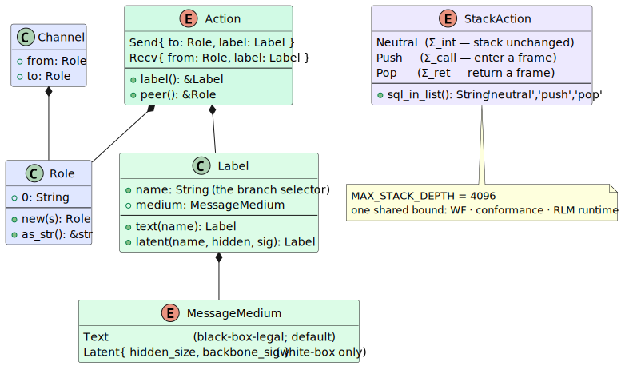
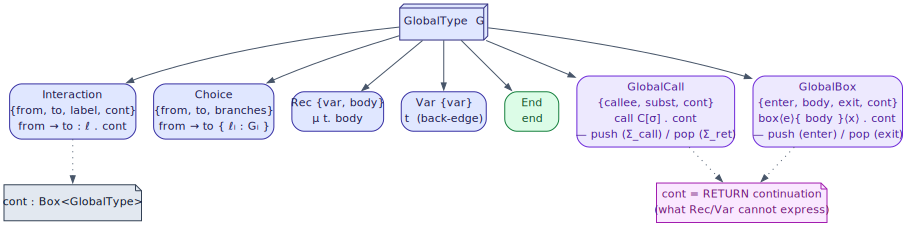
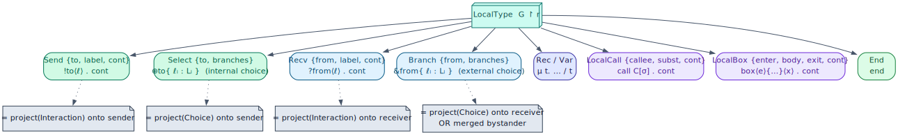
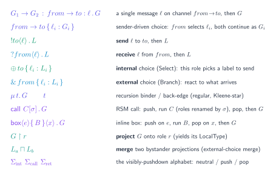

# 01 — CFSM & MPST foundations

> **Thesis.** Write the whole conversation down once, from above, as a **global type**
> `G`. Two finite alphabets — *roles* and *labels* — and seven constructors are enough to
> describe any of pgmcp's coordination patterns, including recursion and hierarchy.

**Source of record:** `src/csm/role.rs` (the vocabulary), `src/csm/mpst/global.rs`
(`GlobalType`), `src/csm/mpst/local.rs` (`LocalType`).
**Builds on:** [00](00-motivation-and-overview.md). **Builds toward:**
[02 — Projection](02-projection-and-wellformedness.md).

---

## 1.1 Two models in one: CFSM and MPST

The CSM rests on two classical formalisms that fit together exactly.

A **Communicating Finite-State Machine** network (CFSM; Brand–Zafiropulo 1983 [7]) is a
set of finite automata that run concurrently and interact *only* by sending and receiving
typed messages over directed channels. The *operational* picture — what actually happens
at runtime — is a CFSM network: each agent is a machine, each `tasks/send` is a message
on a channel.

**Multiparty Session Types** (MPST; Honda–Yoshida–Carbone 2008 [4], JACM 2016 [5]) is the
*typing* discipline layered on top. A whole protocol is written once as a **global type**
`G` (the bird's-eye view); each participant's obligations are derived mechanically by
**projection** `G ↾ r` (chapter 02); and a structural theorem guarantees that the
projected machines, run together, are deadlock-free and orphan-free (chapter 03).

The division of labour is clean and worth memorizing:

```
   MPST  (the types — what SHOULD happen)            CFSM  (the machines — what DOES happen)
   ┌──────────────────────────────┐                 ┌──────────────────────────────────────┐
   │  GlobalType  G               │ ── project ──▶  │  LocalMachine per role  (chapter 05)  │
   │  LocalType   G ↾ r           │ ── compile ──▶  │  states + Send/Recv/Call/Return edges │
   └──────────────────────────────┘                 └──────────────────────────────────────┘
            the contract                                       the implementation
```

Everything in this chapter is the *type* side; the *machine* side is chapter 05.

---

## 1.2 The vocabulary: roles, labels, channels, actions, media

Only **communication** is an action — exactly what MPST and the A2A wire capture. The
vocabulary (`src/csm/role.rs`) is plain data with no behaviour; the transition relation
lives in `src/csm/transition.rs` (chapter 06).



- A **`Role`** is a protocol participant — `Role(pub String)`, a newtype so role identity
  is explicit in every signature. Patterns use short names: `O` (Orchestrator), `R`
  (Reflector), `T` (Tool-Caller), `P` (Planner), `C` (Critic), `S` (Solver).
- A **`Label`** is the alphabet symbol exchanged on a channel: `{ name, medium }`. The
  `name` is the **selector** — branches are distinguished and matched by name; the
  `medium` is carried metadata that does *not* participate in branch selection.
- A **`Channel { from, to }`** is a *directed FIFO* between two roles.
- An **`Action`** is a communication *from one role's viewpoint*: `Send { to, label }`
  emits a label; `Recv { from, label }` consumes one.
- A **`MessageMedium`** is how the message travels — `Text` or `Latent`:

```rust
#[serde(tag = "medium", content = "data", rename_all = "snake_case")]
pub enum MessageMedium {
    /// Text / JSON over the A2A JSON-RPC wire. The default and the only medium a
    /// black-box agent can use.
    #[default]
    Text,
    /// A latent hidden-state tensor handed off via RecursiveLink. `hidden_size`
    /// pins the source backbone width; a receiving outer-link `W₃` maps it to the
    /// target width (or `W₃ = I` when the widths already match).
    Latent { hidden_size: usize, backbone_sig: String },
}
```

The medium distinction is load-bearing for *safety*, not just metadata: a **black-box**
agent (Claude Code, Codex, pi — anything with no hidden-state API) can speak only `Text`.
Putting such a role on a `Latent` edge is a **projection error** caught before any agent
runs. That law is stated and proved in [chapter 03](03-safety-metatheorems.md); the medium
is defined here so the `Label` type is stable across the text and latent tracks.

---

## 1.3 The global type: seven constructors

A `GlobalType` (`src/csm/mpst/global.rs`) is the bird's-eye description of a whole
protocol. Its variant set is load-bearing, so here it is verbatim:

```rust
#[serde(tag = "type", content = "data", rename_all = "snake_case")] // ADR-006: ADJACENT
pub enum GlobalType {
    /// `from → to : label . cont` — a single message then the continuation.
    Interaction { from: Role, to: Role, label: Label, cont: Box<GlobalType> },
    /// `from → to { labelᵢ : Gᵢ }` — sender-driven choice.
    Choice { from: Role, to: Role, branches: Vec<GlobalBranch> },
    /// `μ var. body` — recursion binder.
    Rec { var: TypeVar, body: Box<GlobalType> },
    /// `var` — a back-edge to an enclosing `Rec`.
    Var { var: TypeVar },
    /// `call C[σ] . cont` — an RSM call to the named sub-protocol `callee`,
    /// roles renamed by `subst`, continuing as `cont` AFTER the callee returns.
    GlobalCall { callee: ProtocolRef, subst: BTreeMap<Role, Role>, cont: Box<GlobalType> },
    /// `box⟨enter⟩{ body }⟨exit⟩ . cont` — an inline hierarchical sub-region.
    GlobalBox { enter: Label, body: Box<GlobalType>, exit: Label, cont: Box<GlobalType> },
    /// `end` — protocol completion.
    End,
}
```

Read the constructors as a small grammar (the notation legend is §1.6):

| Constructor | Notation | Meaning |
|-------------|----------|---------|
| `Interaction` | `from → to : ℓ . G` | one message `ℓ` on channel `from→to`, then `G` |
| `Choice` | `from → to { ℓᵢ : Gᵢ }` | `from` *selects* one label `ℓᵢ`, sends it to `to`, both continue as `Gᵢ` |
| `Rec` | `μ t. G` | bind recursion variable `t` in `G` |
| `Var` | `t` | a back-edge to the enclosing `μ t` |
| `GlobalCall` | `call C[σ] . G` | push a frame, run named sub-protocol `C` (roles renamed by `σ`), pop, continue `G` |
| `GlobalBox` | `box⟨enter⟩{ B }⟨exit⟩ . G` | push, run *inline* region `B`, pop on `exit`, continue `G` |
| `End` | `end` | done |

The first four are **regular** (finite-state): `Rec`/`Var` compile to back-edge self-loops,
which is Kleene-star, not context-free. The last three new constructors — added by
[ADR-030](../decisions/030-pushdown-hierarchical-csm.md) — are the **context-free** ones
that lift the CSM to a *visibly-pushdown* recognizer (chapter 04).

### Why `cont` is the discriminating field

`GlobalCall` and `GlobalBox` each carry a `cont` — the **return continuation**. That is
precisely what a tail `Rec`/`Var` back-edge *cannot* express: a back-edge can "loop back",
but it cannot "loop back **and then continue afterwards**" without a stack to remember
where to resume. The presence of `cont` after a call/box is the syntactic mark of genuine
context-freeness:

```
   Rec/Var:    μt. ( … . t )            ← tail loop; no "after"            (regular)
   GlobalCall: call C . ( … cont … )    ← run C, RETURN here, continue cont (context-free)
```

Because `callee: ProtocolRef` is a *name* (resolved through a `ProtocolEnv`, not inlined),
a protocol can name **itself** — finite syntax for unbounded recursion, the basis of the
`RecursiveCf` protocol (chapter 08) and the Recursive Language Model (chapter 09).
`subst: BTreeMap<Role, Role>` injectively renames the callee's roles into the caller's
space; `GlobalBox` instead inlines its `body` (so the body cannot itself recurse), which is
the right shape for one-shot bounded nesting like a crucible plan's sub-tree.



---

## 1.4 The local type: one role's view

Projecting `G` onto a role `r` yields a **`LocalType`** (`src/csm/mpst/local.rs`) — the
same grammar from one participant's perspective. A global `Interaction` becomes a `Send`
for its sender, a `Recv` for its receiver, and *nothing* for a bystander; a global
`Choice` becomes a `Select` (internal choice, `⊕`) for the role that drives it and a
`Branch` (external choice, `&`) for the role that offers it.

```rust
#[serde(tag = "type", content = "data", rename_all = "snake_case")] // ADR-006: ADJACENT
pub enum LocalType {
    /// `!to⟨label⟩ . cont` — send `label` to `to`.
    Send   { to: Role, label: Label, cont: Box<LocalType> },
    /// `?from⟨label⟩ . cont` — receive `label` from `from`.
    Recv   { from: Role, label: Label, cont: Box<LocalType> },
    /// `⊕to{ labelᵢ : Lᵢ }` — internal choice (projection of a Choice onto its sender).
    Select { to: Role, branches: Vec<LocalBranch> },
    /// `&from{ labelᵢ : Lᵢ }` — external choice (onto the receiver, or a merged bystander).
    Branch { from: Role, branches: Vec<LocalBranch> },
    Rec { var: TypeVar, body: Box<LocalType> },
    Var { var: TypeVar },
    /// `call C[σ] . cont` — play the callee frame, then continue.
    LocalCall { callee: ProtocolRef, subst: BTreeMap<Role, Role>, cont: Box<LocalType> },
    /// `box⟨enter⟩{ body }⟨exit⟩ . cont` — play the inline box, then continue.
    LocalBox  { enter: Label, body: Box<LocalType>, exit: Label, cont: Box<LocalType> },
    End,
}
```

The two choice forms are the heart of the discipline:

- **`Select` (`⊕`)** — *internal choice*: this role decides which label to send. It is the
  projection of `Choice` onto its **sender** `from`.
- **`Branch` (`&`)** — *external choice*: this role reacts to whichever label arrives. It is
  the projection of `Choice` onto its **receiver** `to`, **or** the merge of a
  *bystander's* branch continuations (chapter 02).



---

## 1.5 Recursive ASTs ⇒ adjacent serde tagging (ADR-006)

Both `GlobalType` and `LocalType` are **recursive** enums (`Rec`/`Var` + boxed `cont`).
They therefore use `#[serde(tag = "type", content = "data")]` — **adjacent** tagging — and
never internally-tagged `#[serde(tag = "type")]`.

This is not a stylistic choice. Internal tagging on a recursive enum stalls rustc's
monomorphization collector for ~2 hours; adjacent tagging compiles fast and serializes to
the stable shape `{"type": "...", "data": {...}}`. The round-trip tests in each module are
the canary — e.g. from `global.rs`:

```rust
let g = rec("t", interaction("O", "R", Label::text("ping"), var("t")));
let json = serde_json::to_string(&g).unwrap();
assert!(json.contains(r#""type":"rec""#));        // adjacent tag, not internal
let back: GlobalType = serde_json::from_str(&json).unwrap();
assert_eq!(back, g);                               // exact round-trip
```

The stable JSON shape matters beyond compile time: the `GlobalType` round-trips through the
`csm_protocols.global_type` JSONB column unchanged, which is why **no schema migration was
needed to store the new pushdown constructors** (chapter 13).

---

## 1.6 Notation legend

This is the typeset notation used throughout the treatise (rendered as a TikZ figure for
the printable version):



| Symbol | Reads as | Constructor |
|--------|----------|-------------|
| `from → to : ℓ . G` | "`from` sends `ℓ` to `to`, then `G`" | `GlobalType::Interaction` |
| `from → to { ℓᵢ : Gᵢ }` | "`from` chooses a branch toward `to`" | `GlobalType::Choice` |
| `!to⟨ℓ⟩ . L` | "send `ℓ` to `to`, then `L`" | `LocalType::Send` |
| `?from⟨ℓ⟩ . L` | "receive `ℓ` from `from`, then `L`" | `LocalType::Recv` |
| `⊕to{ ℓᵢ : Lᵢ }` | "internally choose a label to send `to`" | `LocalType::Select` |
| `&from{ ℓᵢ : Lᵢ }` | "offer/branch on what `from` sends" | `LocalType::Branch` |
| `μ t. …` / `t` | recursion binder / back-edge | `Rec` / `Var` |
| `call C[σ] . G` | "call sub-protocol `C` (roles renamed by `σ`), return, then `G`" | `GlobalCall` |
| `box⟨e⟩{ B }⟨x⟩ . G` | "enter region `B`, exit, then `G`" | `GlobalBox` |
| `G ↾ r` | "project `G` onto role `r`" | `project` (ch. 02) |

---

## 1.7 Worked example: a two-message request/response

The smallest interesting protocol — an Orchestrator asks a Reflector a question and gets an
answer — is two interactions:

```
   G  =  O → R : q . R → O : a . end
```

In code (the ergonomic constructors keep literals readable):

```rust
let g = interaction("O", "R", Label::text("q"),
        interaction("R", "O", Label::text("a"), end()));
assert_eq!(g.participants().len(), 2);   // {O, R}
```

Projecting (chapter 02) gives the two machines:

```
   G ↾ O  =  !R⟨q⟩ . ?R⟨a⟩ . end          (O sends q, then awaits a)
   G ↾ R  =  ?O⟨q⟩ . !O⟨a⟩ . end          (R awaits q, then sends a)
```

Notice the duality: every `!to⟨ℓ⟩` in one role's type is matched by a `?from⟨ℓ⟩` in the
other's. That exact matching is what projection guarantees and what makes the composed
network deadlock-free — the subject of the next two chapters.

---

*Next: [02 — Projection & well-formedness](02-projection-and-wellformedness.md). Back to
[README](README.md).*
