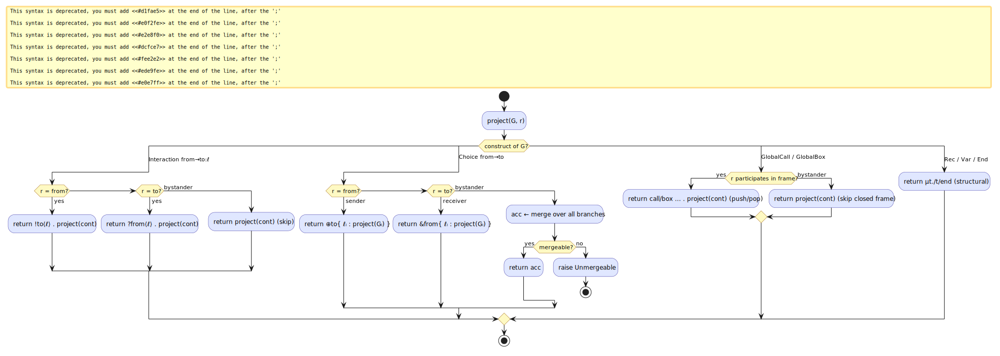
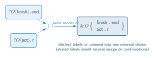
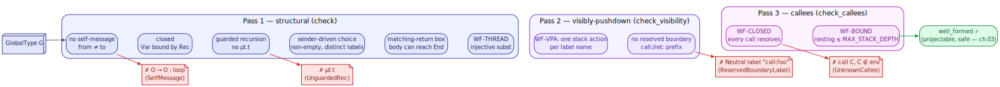

# 02 — Projection & well-formedness

> **Thesis.** Projection `G ↾ r` is a *total recursive function* that reads the global
> protocol and writes one role's local type — turning a sender into a `Send`, a receiver
> into a `Recv`, and a bystander into a *merge* of what it would do across the branches it
> does not control. Well-formedness is the eight-rule gate that guarantees the function
> succeeds and its output is meaningful.

**Source of record:** `src/csm/mpst/project.rs` (`project`, `merge`),
`src/csm/mpst/wellformed.rs` (`well_formed_in`).
**Builds on:** [01](01-cfsm-mpst-foundations.md). **Builds toward:**
[03 — Safety](03-safety-metatheorems.md).

---

## 2.1 Projection, defined

For a global type `G` and a role `r`, the projection `G ↾ r` is the local type describing
exactly `r`'s obligations. The defining equations (Honda–Yoshida–Carbone [4], restricted to
the merge pgmcp's fixed patterns actually need) are:

```
   (from → to : ℓ . G) ↾ r  =  !to⟨ℓ⟩ . (G ↾ r)        if r = from
                            =  ?from⟨ℓ⟩ . (G ↾ r)       if r = to
                            =  G ↾ r                      otherwise         (bystander skips)

   (from → to {ℓᵢ : Gᵢ}) ↾ r =  ⊕to{ ℓᵢ : Gᵢ ↾ r }      if r = from        (internal choice)
                             =  &from{ ℓᵢ : Gᵢ ↾ r }     if r = to          (external choice)
                             =  ⊓ᵢ (Gᵢ ↾ r)              otherwise          (MERGE the branches)

   (μ t. G) ↾ r            =  μ t. (G ↾ r)
   t ↾ r                   =  t
   (call C[σ] . G) ↾ r     =  call C[σ] . (G ↾ r)        if r ∈ image(σ)    (participant)
                            =  G ↾ r                      otherwise          (bystander skips frame)
   (box⟨e⟩{B}⟨x⟩ . G) ↾ r  =  box⟨e⟩{B↾r}⟨x⟩ . (G ↾ r)   if r ∈ participants(B)
                            =  G ↾ r                      otherwise
   end ↾ r                 =  end
```

The three interesting cases are the *bystander* of a choice (a merge), and the *participant
vs bystander* of a call/box (the **participation rule**, the load-bearing reconciliation
that keeps the pushdown projection sound — §2.4).



### The algorithm (literate)

`project(g, r)` is a structural recursion that never fails on a well-formed input. In
literate form (the Rust is `src/csm/mpst/project.rs:45`):

```
procedure project(G, r):                                 ▷ returns LocalType or ProjectionError
    case G of
      Interaction(from, to, ℓ, cont):
          c ← project(cont, r)
          if   r = from then return  !to⟨ℓ⟩ . c           ▷ I am the sender
          elif r = to   then return  ?from⟨ℓ⟩ . c          ▷ I am the receiver
          else               return  c                      ▷ bystander: skip to continuation

      Choice(from, to, branches):
          if   r = from then return  ⊕to { ℓᵢ : project(Gᵢ, r) }     ▷ internal choice
          elif r = to   then return  &from { ℓᵢ : project(Gᵢ, r) }    ▷ external choice
          else
              acc ← project(branch₁, r)                     ▷ bystander must look identical …
              for each later branch bᵢ:                     ▷ … across every branch it does not drive
                  acc ← merge(acc, project(bᵢ, r))          ▷ (may raise Unmergeable)
              return acc

      Rec(t, body):  return μ t. project(body, r)
      Var(t):        return t

      GlobalCall(callee, σ, cont):                          ▷ PARTICIPATION RULE (§2.4)
          c ← project(cont, r)
          if r ∈ image(σ) then return  call callee[σ] . c   ▷ play the frame (push/pop)
          else                 return  c                     ▷ bystander skips the closed frame

      GlobalBox(enter, body, exit, cont):
          c ← project(cont, r)
          if r ∈ participants(body) then
                               return  box⟨enter⟩{ project(body, r) }⟨exit⟩ . c
          else                 return  c

      End:           return end
```

The bystander cases are the only ones that can fail, and only via `merge`. That failure is
*loud*: `ProjectionError::Unmergeable` is returned, never a silently-picked branch.

---

## 2.2 The merge operation `⊓`

When role `r` is a **bystander** to a choice — it neither sends nor receives the selecting
label — its behaviour must look the *same* no matter which branch the sender chose, because
`r` never learns the choice directly. `merge(a, b)` (`⊓`) reconciles the two projected
continuations, succeeding only when they are genuinely reconcilable:

```
procedure merge(a, b):                                   ▷ returns LocalType or Unmergeable
    if a = b then return a                                ▷ identical — trivially mergeable

    if a and b are both OFFERS from the SAME sender f:    ▷ external-choice merge (the key rule)
        return  &f { union of their branch-lists,         ▷ shared labels: recurse on continuations
                     recursing merge on shared labels }     distinct labels: unioned

    if a = μt.A and b = μt.B (same variable):
        return  μt. merge(A, B)                            ▷ merge recursion bodies

    if a = call C[σ].A and b = call C[σ].B (same callee+σ):
        return  call C[σ] . merge(A, B)                    ▷ merge return continuations

    if a = box⟨e⟩{A}⟨x⟩.A' and b = box⟨e⟩{B}⟨x⟩.B':
        return  box⟨e⟩{ merge(A,B) }⟨x⟩ . merge(A', B')

    otherwise: raise Unmergeable(a, b)                     ▷ no later message can distinguish them
```

An **offer** is a `Recv` or a `Branch` — the only shapes that can participate in the
external-choice merge. The decisive rule is the second: two receives from the *same* sender
with *distinct* labels combine into one `Branch` offering both. This is exactly what makes a
choice's bystander projectable. The canonical example (from the Deliberation pattern,
chapter 08) is the Tool-Caller, who receives `act` in one branch and `finish` in the other:

```
   merge( ?O⟨finish⟩ . end ,  ?O⟨act⟩ . t )   =   &O { finish : end ,  act : t }
```



`merge(?O⟨x⟩, !O⟨x⟩)` — a receive against a send — is `Unmergeable`: no later message lets
the bystander tell which branch it is in, so the protocol is rejected at projection time
rather than producing a machine that could deadlock.

The two `ProjectionError`s are:

| Error | Meaning |
|-------|---------|
| `Unmergeable { left, right }` | a bystander's branch continuations diverge irreconcilably (`left ⊓ right` undefined) |
| `UnresolvedCallee { name }` | a `GlobalCall` names a sub-protocol absent from the environment (WF-CLOSED normally catches this earlier) |

---

## 2.3 Well-formedness: the eight-rule gate

Projection's soundness rests on `G` being **well-formed** — the static side-conditions that
make it projectable and its projection meaningful. `well_formed_in(g, env)`
(`src/csm/mpst/wellformed.rs`) runs **three passes**; a failure in any pass is a refusal
*before any agent runs*.



**Pass 1 — structural (`check`):**

| Rule | `WfError` | Rejects |
|------|-----------|---------|
| No self-messages | `SelfMessage` | `from = to` in an `Interaction`/`Choice` |
| Closed | `UnboundVar` | a `Var t` with no enclosing `μ t` |
| Guarded recursion | `UnguardedRec` | `μt.t`, `μt.μs.t` (a variable at its `Rec` head with no communication prefix) |
| Sender-driven choice | `EmptyChoice`, `DuplicateChoiceLabel` | a branch-less choice, or two branches sharing a label name |
| Matching-return box | `MalformedBox` | a `GlobalBox` with an empty boundary label, or a body that can never reach `End` (so the frame could never pop) |
| Injective call (WF-THREAD) | `NonInjectiveSubst` | a `GlobalCall` whose `subst` maps two callee roles onto one caller role, or has no participants |

**Pass 2 — visibly-pushdown (`check_visibility`, WF-VPA):**

| Rule | `WfError` | Rejects |
|------|-----------|---------|
| One stack action per symbol | `VpaSymbolConflict` | a label name used with two different stack actions |
| Reserved boundary prefix | `ReservedBoundaryLabel` | an ordinary (`Neutral`) label squatting the synthesized `call:`/`ret:` prefix |

**Pass 3 — callees (`check_callees`, WF-CLOSED + WF-BOUND):**

| Rule | `WfError` | Rejects |
|------|-----------|---------|
| Closed callees (WF-CLOSED) | `UnknownCallee` | a `GlobalCall` to a name absent from the environment |
| Bounded nesting (WF-BOUND) | `StackBoundExceeded` | static (acyclic) call nesting exceeding `MAX_STACK_DEPTH = 4096` |

Pass 3 is **cycle-guarded**: it descends into a callee only if it is not already being
expanded on the current path, so a self- or mutually-recursive protocol (e.g. `RecursiveCf`)
terminates the well-formedness walk in finite time even though its *runtime* nesting is
unbounded. The `WF-VPA` and `WF-BOUND` rules are what make the recognized language a *visibly
pushdown language* (chapter 04) rather than an arbitrary context-free one — the property the
conformance checker depends on.

---

## 2.4 The participation rule (why VPA, not general PDA)

The single most important design decision in the pushdown lift is how projection treats a
call/box frame. The rule (`project.rs:121`, ADR-030):

> A role that **participates** in a frame — it is in the substitution image of a
> `GlobalCall`, or in the participants of a `GlobalBox` body — projects to a
> `LocalCall`/`LocalBox` and **pushes and pops synchronously** with the other participants.
> A **bystander** skips the entire closed frame, projecting only the return continuation.

`WF-THREAD` (the injectivity rule) guarantees a frame's role-set is *fixed across choice
branches*, so a bystander is never "in the call in one branch and out of it in another."
That is what keeps `merge` total and projection sound **without any global broadcast** —
each participant's push/pop is locally visible, never announced to the whole network. This
per-participant visibility is precisely *why the recognizer is a visibly-pushdown automaton
(VPA) and not a general pushdown automaton* (chapter 04): the stack action is determined by
the symbol each role sees, not hidden in a global state.

---

## 2.5 Worked example: a Critic-gated loop projects

A protocol whose only exit runs through a Critic's verdict (the shape crucible synthesizes,
chapter 11) exercises both the merge and the bystander cases:

```
   G  =  μL. O → S : attempt_req . S → O : attempt . O → C : verify_req .
              C → O { pass : O → S : release . end
                      fail : L }
```

Projecting onto the **worker** `S` (a bystander to the `C → O` choice) must merge the two
branches: in `pass`, `S` receives `release`; in `fail`, the loop variable `L` re-engages `S`
with another `attempt_req`. Both are *receives from the orchestrator* `O`, so the
external-choice merge applies and `S ↾` is well defined:

```
   G ↾ S  =  μL. ?O⟨attempt_req⟩ . !O⟨attempt⟩ . &O { release : end ,  attempt_req : L }
```

Had the two branches given `S` *incompatible* behaviour (a send in one, a receive in the
other), projection would return `Unmergeable` and crucible would refuse to drive the plan —
exactly the desired failure. This subtlety (a worker is a bystander at the Critic's choice,
so the fold must re-engage it inside the `fail` branch to keep both arms a same-sender
receive) is what the tests `critic_loop_well_formed_and_projects` and
`linear_chain_is_drivable` pin.

---

*Next: [03 — Safety metatheorems](03-safety-metatheorems.md). Back to [README](README.md).*
