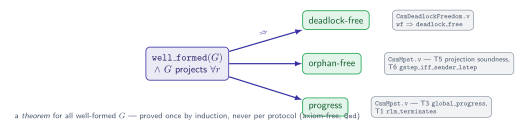
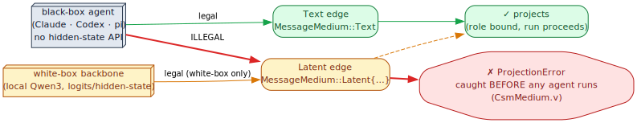

# 03 — Safety metatheorems

> **Thesis.** Once a global type is well-formed and projects, the network of its projected
> machines is **deadlock-free, orphan-free, and progressing** — not because we tested for
> it, but because it is a *theorem*. Two further safety properties — the black-box law and
> the anti-recursion guard — are likewise enforced *structurally*, before any agent runs.

**Source of record:** the MPST metatheorem (Honda–Yoshida–Carbone [4], Scalas–Yoshida [6]);
mechanized in `docs/formal/rocq/Csm{Mpst,DeadlockFreedom,Medium}.v` (chapter 13).
**Builds on:** [02](02-projection-and-wellformedness.md). **Builds toward:**
[04 — Automata spine](04-automata-spine.md).

---

## 3.1 Safety is a theorem, not a convention

This is the central payoff of the MPST discipline, and the reason coordination is worth
reifying as a type at all. The metatheorem (specialized to pgmcp's setting):

> **Theorem (MPST safety).** If `G` is well-formed (chapter 02) and projects onto every
> participant, then the CFSM network `{ G ↾ r }ᵣ`, executed over its directed FIFO
> channels, is:
> - **deadlock-free** — it never reaches a non-terminal state in which every role is
>   blocked waiting;
> - **orphan-free** — no message is sent that no one ever receives, and no role waits
>   forever for a message no one sends;
> - **progressing** — every reachable non-terminal configuration can take a step, and
>   (under the bounded-recursion discipline of chapter 04) every run reaches `End`.

The proof is *compositional*: each property is established once, for **all** well-formed
`G`, by induction on the type — never per protocol. Contrast the work-item tracker
(`src/tracker/transition.rs`), whose analogous guarantee was hand-proved with a transition
matrix plus property tests; MPST gives the *multiparty generalization* of that as a single
metatheorem. The Rocq mechanization names the pieces (chapter 13):

| Property | Rocq result (`docs/formal/rocq/`) |
|----------|-----------------------------------|
| projection is sound (the projected machines simulate `G`) | `CsmMpst.v` — T5 projection soundness, T6 operational correspondence (`gstep_iff_sender_lstep`) |
| well-formedness is preserved by reduction (subject reduction) | `CsmMpst.v` — T4 `wf_preserved` |
| global progress | `CsmMpst.v` — T3 `global_progress` |
| `well_formed(G) ⇒ deadlock_free(G) ∧ progress(G)` | `CsmDeadlockFreedom.v` (the certificate behind `protocol_soundness`) |
| recursion / deliberation terminate | `CsmMpst.v` — T1 `rlm_terminates`, T2 `deliberation_terminates` |

The practical consequence drives crucible's refusal logic (chapter 11): the Orchestrator
**refuses to drive** a plan whose synthesized `G` is not well-formed or does not project,
exactly as it refuses an unverified plan — because driving it would forfeit the theorem.

---

## 3.2 The black-box law: a type-level safety property

The first of two safety laws beyond the MPST core is the **black-box-Text-only law**
(ADR-009, mechanized in `CsmMedium.v` + TLC):

> **Law (black-box medium).** A role bound to a **black-box** agent — one with no
> hidden-state/logit API: Claude Code, Codex, pi — may appear **only** on `Text`-medium
> edges. A black-box role on a `Latent` edge is a `ProjectionError`, caught at projection
> time, before any agent runs.

This makes *"you cannot put Claude in the latent loop"* a **structural impossibility**
rather than a guideline — the same move the tracker made with *"an agent cannot
self-verify."* The protocol *skeleton* is identical for a text MAS and a latent
RecursiveMAS; only the `MessageMedium` on each `Label` differs (chapter 01). So the
observer, the TLA⁺ specs, and the Rocq proofs are all *medium-agnostic*, and the one extra
side-condition — a black-box role never sits on a `Latent` edge — is checked once, at
projection, where it costs nothing at runtime.

`CsmMedium.v` proves the discipline never misfires: a well-media-formed protocol never
places a black-box role on a latent edge. Because the fleet's worker leaves are black-box
text agents (chapter 11), every fleet edge is `Text`, and the law is satisfied by
construction; the `Latent` machinery exists for the white-box RecursiveMAS track and is
walled off by exactly this law.

---

## 3.3 The anti-recursion guard

The second law protects the recursion mechanism from itself (chapter 09):

> **Law (anti-recursion guard).** A worker *leaf* must not be able to re-enter the pattern
> machinery. Fleet leaves are MCP-disabled (`--no-builtin-tools`, no pgmcp surface): a leaf
> that could call `a2a_pattern_*` again would recurse unboundedly outside the depth/budget
> discipline.

Where the black-box law is enforced at projection (a *type* property), the anti-recursion
guard is enforced at *deployment*: the fleet shim (`fleet/a2a-shim.mjs`, chapter 11) hosts
each leaf as a pure string→string responder with no MCP access. Recursion therefore happens
only where it is *metered* — inside the Recursive Language Model engine, bounded by
`depth_remaining` and `budget_remaining` (chapter 09) — never accidentally, by a leaf that
re-enters orchestration.

---

## 3.4 What the safety story does *not* yet explain

The MPST metatheorem above is the *finite-state* story: it holds for regular protocols and,
crucially, must be *extended* to cover the recursive/hierarchical ones (`GlobalCall`,
`GlobalBox`). Doing that without losing **decidable conformance** is the entire reason the
CSM is a *visibly*-pushdown system rather than a general pushdown one. Why that specific
automata class — and why a *bounded* stack is the linchpin that keeps the Rocq proofs an
ordinary induction — is the next chapter.

---

*Next: [04 — The automata spine](04-automata-spine.md). Back to [README](README.md).*
