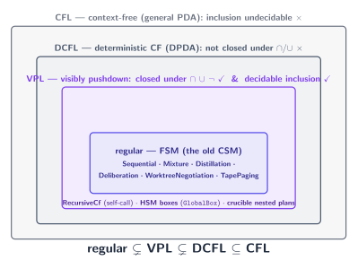
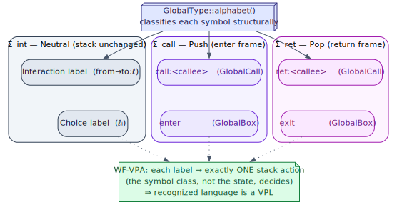
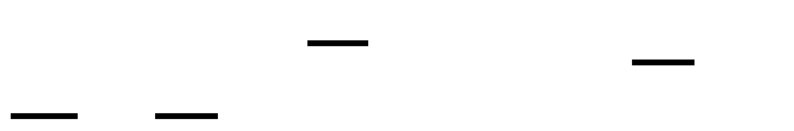
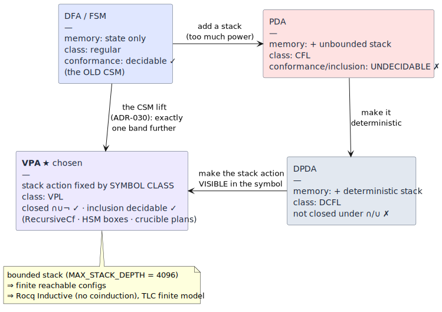

# 04 — The automata spine

> **Thesis.** A *recursive* or *hierarchical* protocol needs a **stack**. But a stack, in
> general, buys undecidability. The CSM threads the needle by lifting from finite-state to
> exactly one class further — the **visibly-pushdown languages (VPL)** — the largest class
> past *regular* that keeps the two properties a conformance checker cannot live without:
> closure under `∩ ∪ ¬` and *decidable inclusion*. A large *bounded* stack then keeps the
> proofs an ordinary induction.

**Source of record:** `src/csm/role.rs` (`StackAction`, `MAX_STACK_DEPTH`),
[ADR-030](../decisions/030-pushdown-hierarchical-csm.md). **Builds on:**
[01](01-cfsm-mpst-foundations.md)–[03](03-safety-metatheorems.md). **Builds toward:**
[05 — Data model](05-data-model-and-compiled-machines.md).

---

## 4.1 The classes, defined before use

| Term | Definition | Recognizes |
|------|-----------|-----------|
| **DFA / FSM** | Deterministic finite automaton: states + transitions, **no memory** beyond the current state. | the **regular** languages |
| **PDA** | Pushdown automaton = FSM + an unbounded LIFO **stack** the transition relation may push/pop freely. | the **context-free** languages (CFL) |
| **DPDA** | *Deterministic* PDA. | the deterministic CFLs (**DCFL**) |
| **VPA** | *Visibly* pushdown automaton (Alur–Madhusudan 2004 [1]): a PDA whose stack action (push / pop / none) is fixed by the **input symbol's class** (call / return / internal), **not** by the state. | the **visibly pushdown** languages (**VPL**) |
| **RSM** | Recursive State Machine (Alur et al. 2005 [2]): finitely many component machines ("boxes") that **call** one another with matched return. Equivalent in power to pushdown systems. | (VPL, via call/return) |
| **HSM** | Hierarchical State Machine (Harel statecharts 1987 [3]): states may contain nested sub-states (composite states). | (realized here as RSM boxes) |
| **well-nested / Dyck-balanced** | A run whose calls and returns match like balanced brackets — every call closed by exactly one later return. | — |
| `Σ_int, Σ_call, Σ_ret` | The internal / call / return partition of a VPA's alphabet. | — |

The CSM was, before [ADR-030](../decisions/030-pushdown-hierarchical-csm.md), provably
**finite-state**: a `LocalState` is a flat integer, and the only recursion (`Rec`/`Var`)
compiled to back-edge self-loops — Kleene-star, *regular*, not context-free. Hierarchical
crucible plans were *flattened* at the protocol boundary. The pushdown lift moves the
recursive/hierarchical protocols out exactly one band, to VPL.

---

## 4.2 The strict language hierarchy

The containment that frames the entire design (each `⊊` is *proper* — a strict, witnessed
inclusion):

```
   regular  ⊊  VPL  ⊊  DCFL  ⊆  CFL
```



Each CSM protocol lives in a specific band:

| Band | Protocols | Why |
|------|-----------|-----|
| **regular** (the old CSM) | Sequential · Mixture · Distillation · Deliberation · WorktreeNegotiation · TapePaging | finite-state: `Rec`/`Var` back-edges only, no genuine stack |
| **VPL** (this layer) | **RecursiveCf** (a protocol that calls itself) · **HSM boxes** (`GlobalBox`) · **crucible nested plans** | unbounded matched call/return nesting, but *visibly* pushdown |
| DCFL / CFL | *(deliberately unused)* | a general PDA would lose closure + decidable inclusion |

The legacy regular protocols are **byte-identical** under the lift — a call-free protocol
compiles to `Internal`-only edges, and a golden test asserts the seven legacy protocols are
unchanged (chapter 05). The lift is purely additive.

---

## 4.3 Why VPL is the sweet spot

This is the load-bearing argument. A *conformance checker* must decide, for a recorded run,
whether it is a legal trace of the protocol — and, to compose and to verify, it benefits
enormously from the recognized language being closed under intersection, union, and
complement. The classes differ sharply on exactly these properties:

| Class | Closed under `∩ ∪ ¬`? | Inclusion `L₁ ⊆ L₂` decidable? |
|-------|:---:|:---:|
| regular | ✓ all three | ✓ |
| **VPL** | **✓ all three** | **✓** |
| DCFL | ✗ (not under `∩`/`∪`) | ✓ (only vs another DCFL) |
| CFL (general PDA) | ✗ | ✗ **undecidable** |

VPL is the **largest class strictly above regular** that still retains *both* — closure
*and* decidable inclusion (Alur–Madhusudan [1]). Go one step further to general
context-free, and inclusion becomes undecidable: you could no longer mechanically decide
"does this run conform?" — the whole point of the observer. So the CSM stops *exactly* at
VPL: far enough to express unbounded matched call/return nesting (a crucible plan running a
sub-plan to completion and *returning* to the parent step; an RLM calling itself), no
further.

### The visibility invariant in code

What makes a pushdown automaton *visibly* pushdown is that the stack action is determined by
the **symbol class**, not the state. That is exactly `StackAction` (`src/csm/role.rs`):

```rust
pub enum StackAction {
    /// Σ_int — an ordinary Interaction/Choice message; the stack is unchanged.
    Neutral,
    /// Σ_call — entering a sub-protocol frame (a GlobalCall/GlobalBox boundary); push.
    Push,
    /// Σ_ret — a sub-protocol reached End; pop.
    Pop,
}
```

`GlobalType::alphabet()` classifies every symbol *structurally*: `Interaction`/`Choice`
labels are `Neutral`; a `GlobalCall` contributes the reserved `call:<name>` (`Push`) and
`ret:<name>` (`Pop`); a `GlobalBox` contributes its explicit `enter` (`Push`) and `exit`
(`Pop`). `WF-VPA` (chapter 02) enforces that each label name maps to exactly one stack
action and no ordinary label squats the `call:`/`ret:` prefix — *that* is what guarantees
the recognized class is a VPL and not a general PDA. And because the action is per-symbol,
it is also **per-participant visible**, which is why projection (chapter 02) can push and
pop each role's stack locally with no global broadcast.



---

## 4.4 RSM and HSM: one mechanism, two readings

The CSM does not implement three automata. It implements **one** — a VPA — and lets RSM and
HSM *structure* the protocols that compile down to it:

- **RSM** — a `GlobalCall` to a *named, closed* sub-protocol pushes a frame; the callee's
  `End` pops it and resumes the caller's `cont`. Because the callee is a *name*, a protocol
  may call **itself** → unbounded nesting from finite syntax (`RecursiveCf`). The `subst`
  role-renaming is the RSM "box" discipline.
- **HSM** — a composite/hierarchical state is realized **as an RSM box**: an inline
  `GlobalBox` is a sub-region entered on `enter` (push) and exited on `exit` (pop). HSM thus
  *falls out of* RSM with no separate machinery — the nesting a crucible plan tree carries
  becomes nested boxes (chapter 11).



A crucial reconciliation with ADR-009, which had *rejected* Harel statecharts at the
coordination layer: ADR-030 adopts hierarchy, but only its **recursive/nesting structure**,
recast as RSM call/return over a VPA — **not** Harel's broadcast-event / AND-parallel
semantics. The original objection (broadcast is the wrong shape for point-to-point A2A)
still stands and is *avoided* precisely because the mechanism is point-to-point
call/return. *Hierarchy — yes; Harel's broadcast model — still no.*

---

## 4.5 The bounded-stack linchpin

A genuine PDA has an *unbounded* stack, and unbounded behaviour is what forces
**coinduction** in a proof assistant and an *infinite* model in a model checker. The CSM
sidesteps both with one design choice — a large but **finite** bound,
`MAX_STACK_DEPTH = 4096` (`src/csm/role.rs`), shared by the well-formedness check, the
conformance engine, and the RLM runtime so the conformance stack and the runtime call stack
are *literally the same depth*:

```
   bound D = 4096  ─▶  the reachable-configuration set is FINITE  ─┬─▶  Rocq: an ordinary `Inductive`
                                                                   │     + a well-founded `(D − depth)`
                                                                   │     measure — no `cofix`
                                                                   └─▶  TLC: a finite model
                                                                         (MaxStackDepth = 2 for checking)
```

The slogan (ADR-030): *"coinduction is the price of unbounded behaviour; a configurable
bound buys it back."* A push past the bound is a **`DepthExceeded`** refusal — a real,
surfaced limit, never silent truncation. Note the deliberate split: the *static* conformance
bound is large (4096, where deep nesting costs nothing — it is cheap trace-checking), while
the *runtime* RLM depth cap is tiny (4, because each level issues real LM sub-calls and so
its depth is a cost/DoS bound). Equating them would be a DoS vector; they are documented as
distinct (chapter 09).

This is the same VPL+bounded-stack machinery the **context-tape** subsystem uses for its
`TapeDslMask` weighted pushdown automaton — see
[context-tape chapter 12](../context-tape/12-weighted-automata-constrained-addressing.md);
the two subsystems sit in the same band of the hierarchy for the same reason.



---

*Next: [05 — Data model & compiled machines](05-data-model-and-compiled-machines.md). Back
to [README](README.md).*
