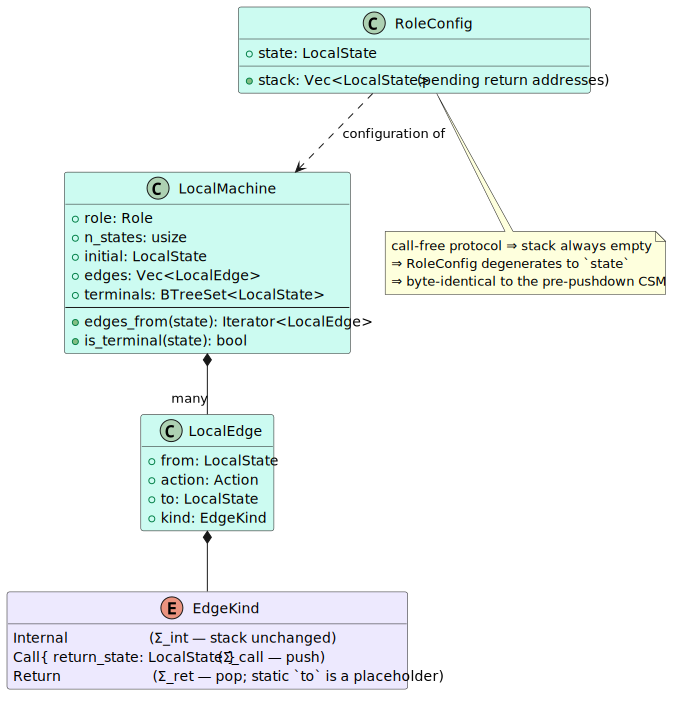
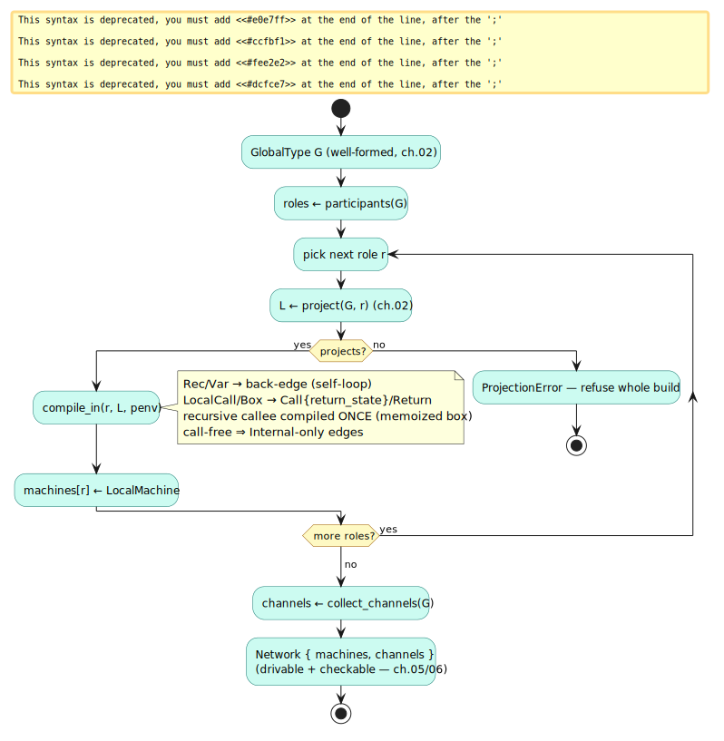
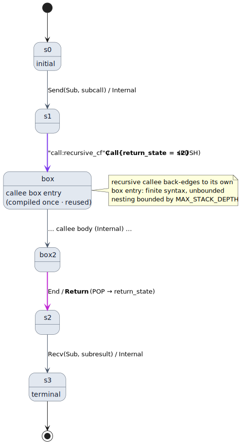

# 05 — Data model & compiled machines

> **Thesis.** A `LocalType` is a tree; a runnable machine is a graph of integer states.
> `compile_in` linearises one into the other, turning `Rec`/`Var` into back-edges and
> `GlobalCall`/`GlobalBox` into matched **`Call`/`Return` boundary edges** over a single
> state space — and a *recursive* callee is compiled **once** and reused, so finite syntax
> yields unbounded nesting. Crucially: a **call-free** protocol compiles to `Internal`-only
> edges, *byte-identical* to the pre-pushdown CSM.

**Source of record:** `src/csm/machine.rs` (`LocalMachine`, `EdgeKind`, `compile_in`,
`Network`). **Builds on:** [04](04-automata-spine.md). **Builds toward:**
[06 — Conformance](06-conformance-and-the-observer.md).

---

## 5.1 The runtime data model

A role's machine is a flat graph (`src/csm/machine.rs`). A `LocalState` is just a `usize`;
the edges carry the visibly-pushdown class:

```rust
pub type LocalState = usize;

pub enum EdgeKind {
    /// An ordinary peer communication; the conformance stack is unchanged.
    Internal,
    /// A frame-entry boundary: push `return_state` (where to resume once the
    /// callee/box returns), then move to this edge's `to` (the callee/box entry).
    Call { return_state: LocalState },
    /// A frame-exit boundary: pop the return context and resume at the popped state.
    /// A `Return` edge's static `to` is a placeholder — the real target is the popped
    /// return address supplied by the pushdown engine.
    Return,
}

pub struct LocalEdge { pub from: LocalState, pub action: Action, pub to: LocalState, pub kind: EdgeKind }

pub struct LocalMachine {
    pub role: Role,
    pub n_states: usize,
    pub initial: LocalState,
    pub edges: Vec<LocalEdge>,
    pub terminals: BTreeSet<LocalState>,
}
```

The three `EdgeKind`s are the whole pushdown story in one enum:

| `EdgeKind` | Stack effect | Created from |
|------------|--------------|--------------|
| `Internal` | none | every `Send`/`Recv`/`Select`/`Branch` — ordinary communication |
| `Call { return_state }` | **push** `return_state` | a `LocalCall` or a `LocalBox` entry |
| `Return` | **pop** | a `LocalCall`/`LocalBox` body reaching `End` |

The decisive invariant: **a call-free protocol produces only `Internal` edges**, so its flat
machine is byte-identical to the pre-pushdown CSM. The `Call`/`Return` edges are read *only*
by the pushdown conformance engine's ε-closure (chapter 06), never by the call-free
driver/`check_step` paths — which is why the seven legacy regular protocols are unchanged
under the lift (a golden test asserts this).



---

## 5.2 Compilation: tree → graph

`compile_in(role, lt, penv)` walks the local type with a small `Compiler` that allocates
fresh integer states and emits edges. The full pipeline from a global type is: **project
onto the role, then compile the projection** (`Network::build_in`):



The core is the recursive `go(lt, entry)` (literate form of `machine.rs:180`). The `entry`
parameter is the subtle part: when a `Rec` binder or a box/callee entry supplies a state,
that state becomes the node's *own* state, so a binder and its body's head coincide and a
`Var` can back-edge to it:

```
procedure go(lt, entry):                          ▷ returns the entry LocalState; emits edges
    case lt of
      End:
          s ← entry or fresh()
          if inside a box/callee body                  ▷ box_exit_labels non-empty
              then emit  (s) --Return--> (s)            ▷ pop point; static `to` is a placeholder
              else mark s terminal
          return s

      Var(t):    return rec_env[t]                       ▷ resolve the back-edge target

      Rec(t, body):
          s ← entry or fresh()
          rec_env[t] ← s                                 ▷ bind BEFORE compiling body …
          go(body, entry = s)                            ▷ … so body's head reuses s (the loop point)
          restore rec_env[t]
          return s

      Send(to, ℓ, cont):                                 ▷ Recv/Select/Branch are analogous
          s ← entry or fresh()
          t ← go(cont, fresh)
          emit  (s) --Send(to, ℓ) / Internal--> (t)
          return s

      LocalCall(callee, σ, cont):
          s ← entry or fresh()
          ret ← go(cont, fresh)                          ▷ the RETURN state (where to resume)
          cr  ← σ⁻¹(self.role)                           ▷ which callee-role this machine plays
          box ← compile_callee_box(callee, cr)           ▷ memoized — a recursive callee reuses its box
          emit  (s) --"call:callee" / Call{return_state = ret}--> (box)
          return s

      LocalBox(enter, body, exit, cont):
          s ← entry or fresh()
          ret  ← go(cont, fresh)
          bodyEntry ← fresh()
          push exit onto box_exit_labels; go(body, entry = bodyEntry); pop
          emit  (s) --enter / Call{return_state = ret}--> (bodyEntry)
          return s
```

Two mechanisms deserve emphasis:

1. **Back-edges (`Rec`/`Var`).** Binding `rec_env[t] ← s` *before* compiling the body is
   what makes recursion a self-loop rather than an infinite unrolling. `μt. ?O⟨ping⟩ . t`
   compiles to **one** state with **one** self-edge and no terminal — exactly the regular,
   Kleene-star shape.
2. **Memoized callee boxes (the RSM back-edge).** `compile_callee_box` allocates and
   *memoizes the entry state before compiling the body*, keyed by `(callee-name,
   callee-role)`. A self-recursive callee therefore reuses its own box instead of unrolling
   forever — finite syntax, unbounded nesting, with the depth bounded only by the
   conformance stack (`MAX_STACK_DEPTH`).



### Worked example: a linear chain

`!P⟨plan⟩ . ?P⟨ans⟩ . end` compiles to **3 states, 2 edges, 1 terminal** — `s₀ --Send(P,
plan)--> s₁ --Recv(P, ans)--> s₂ (terminal)`, all `Internal`. The test
`compile_linear_send_recv_chain` pins exactly these counts; `compile_recursion_creates_a_back_edge`
pins the 1-state self-loop for the recursive case.

---

## 5.3 The network: one machine per role + the channel topology

A `Network` is the whole protocol as a CFSM system: one `LocalMachine` per participant plus
the directed channel topology. `Network::build_in` is the one-call bridge from a global type:

```
procedure build_in(protocol, G, penv):
    for each role r in participants(G):
        L  ← project(G, r)                 ▷ may raise ProjectionError — refuse the whole build
        machines[r] ← compile_in(r, L, penv)
    channels ← collect_channels(G)          ▷ every from→to used anywhere in G
    return Network { protocol, machines, channels }
```

If *any* role fails to project, the whole build fails — a divergent-bystander protocol (the
unmergeable `T` from chapter 02) makes `Network::build` return `Err`, so an ill-formed plan
never yields a partial, drivable network. `build_in` is what `csm_show_projection`,
`csm_protocol_plan`, and the conformance observer all call to obtain the machines they
operate on.

---

## 5.4 The pushdown configuration

Replaying a run (chapter 06) tracks, per role, not just a state but a **pushdown
configuration** — the state plus the stack of pending return addresses:

```rust
pub struct RoleConfig {
    pub state: LocalState,
    pub stack: Vec<LocalState>,   // call/box frames entered but not yet returned
}
```

For a call-free protocol the stack stays empty, and `RoleConfig` degenerates to just
`state` — the pushdown replay coincides exactly with the pre-pushdown finite-state replay.
For a call-bearing protocol the stack *is* the extra information that distinguishes "in the
sub-plan at depth 3" from "in the sub-plan at depth 1," which is precisely what makes
pause/resume work *at depth* (chapter 10: *"the stack of frames is the position"*). How that
configuration evolves — and what makes a run *accept* — is the next chapter.

---

*Next: [06 — Conformance & the observer](06-conformance-and-the-observer.md). Back to
[README](README.md).*
