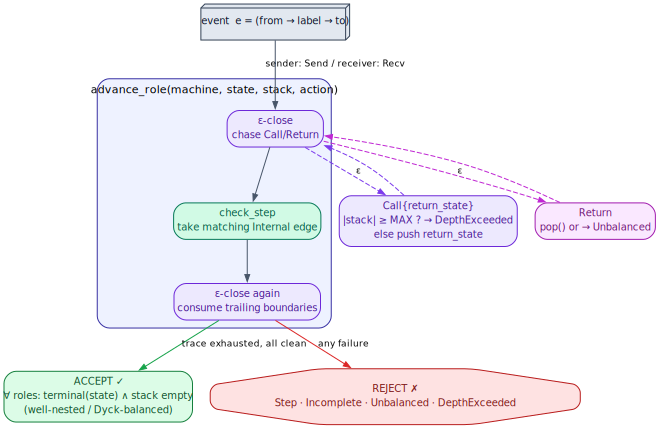
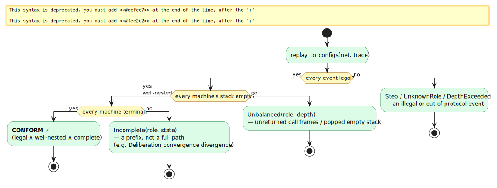
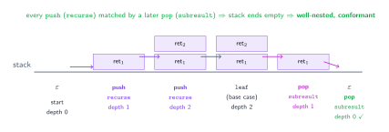
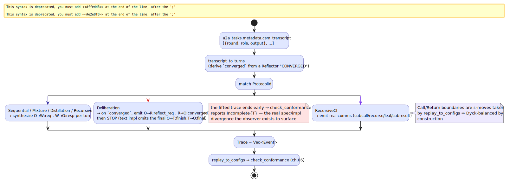

# 06 — Conformance & the observer

> **Thesis.** A run is a `Trace` of communications. Replaying it against the projected
> network — advancing the sender and receiver of each event through one pure legality
> oracle, with `Call`/`Return` boundaries chased as silent ε-moves — decides conformance.
> A run conforms iff **every event is legal, every machine ends terminal, and every stack
> ends empty** (well-nested). The observer never edits anything: a divergence is a
> *finding*.

**Source of record:** `src/csm/transition.rs` (`check_step`), `src/csm/conformance.rs`
(`epsilon_close`, `replay_to_configs`, `check_conformance`, `lift_transcript`).
**Builds on:** [05](05-data-model-and-compiled-machines.md). **Builds toward:**
[07 — A2A](07-a2a-protocol-and-agent-model.md).

---

## 6.1 The run record: events and traces

```rust
pub struct Event { pub from: Role, pub to: Role, pub label: Label }   // from sends label to to
pub type Trace = Vec<Event>;                                          // a run, in order
```

Semantics are **synchronous (rendezvous)** — the faithful model of A2A's *blocking*
`tasks/send` (chapter 07): each event advances *both* endpoints, the sender on a `Send` and
the receiver on the matching `Recv`. This is the per-conversation analogue of the work-item
tracker's per-item `check_transition` gate: one chokepoint decides legality.

---

## 6.2 The legality oracle: `check_step`

`check_step` (`src/csm/transition.rs`) is **pure and total** — the single authoritative
function both the (future) interpreter and the observer funnel through, so they cannot
diverge. It only ever considers `Internal` edges; the stack boundaries are handled by the
ε-closure (§6.3):

```
procedure check_step(machine, state, action, recv_head):     ▷ → next state | StepError
    for each edge e leaving `state`:
        if e.kind ≠ Internal:  continue                       ▷ Call/Return are not consumed here
        if e.action = action:
            if action is Recv(_, ℓ) and recv_head = some h and h ≠ ℓ:
                return RecvNotHead(expected = ℓ, head = h)    ▷ FIFO channel discipline
            return e.to                                       ▷ legal — advance
    return NoEdge(state)                                      ▷ no edge performs this action
```

A receive must match the **head** of its input channel (`recv_head`) when one is supplied —
the FIFO discipline that distinguishes "received `b` while `a` was queued ahead of it" from
a legal step. `NoEdge` and `RecvNotHead` are the two `StepError`s.

---

## 6.3 The ε-closure: where the stack lives

Between consuming communications, a role may cross `Call` (push) and `Return` (pop)
boundary edges — these are *structural ε-moves*, not events in the trace. `epsilon_close`
chases them until the role rests at a state with no boundary edge (waiting for a
communication, or terminal). It is the well-nesting discipline made operational:

```
procedure epsilon_close(machine, state, stack):              ▷ mutates stack; → resting state
    loop:
        for each edge e leaving `state`:
            case e.kind of
              Call{return_state}:
                  if |stack| ≥ MAX_STACK_DEPTH: raise DepthExceeded   ▷ the decidability guard
                  push return_state onto stack;  state ← e.to;  continue loop
              Return:
                  r ← pop(stack)  or raise Unbalanced                 ▷ a pop on empty = not well-nested
                  state ← r;  continue loop
              Internal:  (ignore — not an ε-move)
        return state                                          ▷ no boundary edge fired: rest here
```

Advancing one role by one event is then: **ε-close → take the matching `Internal` edge
(`check_step`) → ε-close again** (`advance_role`), so any boundaries immediately following
the communication are consumed and the role rests at its next waiting/terminal state.



The bound `MAX_STACK_DEPTH = 4096` makes `epsilon_close` *terminate even on a pathological
no-communication recursion* — a push past the bound is `DepthExceeded`, a pop on an empty
stack is `Unbalanced`. This is the operational face of the bounded-stack linchpin
(chapter 04): the loop is guaranteed to halt, so conformance is decidable.

---

## 6.4 The acceptance condition

`replay_to_configs` runs the whole trace, returning each role's final `RoleConfig (state,
stack)`. `check_conformance` then accepts iff **three** conditions all hold:

```
procedure check_conformance(net, trace):
    configs ← replay_to_configs(net, trace)        ▷ every event legal? else Step/UnknownRole/DepthExceeded
    for each (role, cfg) in configs:
        if cfg.stack ≠ ∅:  return Unbalanced(role, |cfg.stack|)     ▷ (2) well-nested: every call returned
        if not terminal(cfg.state):  return Incomplete(role, cfg.state)  ▷ (3) ran to completion
    return CONFORM ✓                                ▷ (1) legality already enforced during replay
```

In words — a run conforms iff:

1. **every event is legal** (each endpoint had a matching `Internal` edge), *and*
2. **every machine's stack is empty** (the run is well-nested / Dyck-balanced — every `Call`
   matched by its `Return`), *and*
3. **every machine ends in a terminal state** (the run is a complete protocol path, not a
   prefix).



The five `ConformanceError`s name exactly where a run failed:

| `ConformanceError` | Meaning |
|--------------------|---------|
| `UnknownRole { role, ord }` | an event names a role with no machine in the network |
| `Step { ord, role, err }` | an endpoint could not take the event's action (`NoEdge`/`RecvNotHead`) |
| `Incomplete { role, state }` | the run ended with a machine in a non-terminal state (a prefix) |
| `Unbalanced { role, depth }` | the run ended with unreturned call frames, or popped an empty stack (not well-nested) |
| `DepthExceeded { role, ord }` | a `Call` would push past `MAX_STACK_DEPTH` |

Note `replay_to_configs` **does not** assert termination — a mid-protocol *prefix* (a paused
session, possibly mid-call with a non-empty stack) replays cleanly to its configurations.
That is exactly the stack-aware pause/resume recovery input of chapter 10: *"the stack of
frames is the position."* Acceptance (`check_conformance`) is the stricter check that also
demands terminality and an empty stack.



---

## 6.5 Lifting a real run: the observer

The protocols describe what *should* happen; a running `a2a_pattern_*` tool produces a
*transcript* of what *did*. `lift_transcript(pattern, turns)` maps that transcript into a
`Trace`, synthesising the orchestrator-side request/response labels each pattern's global
type expects. It is **faithful to what the tool did** — it never invents steps the run did
not perform, so a divergent run yields a non-conforming trace.



The design philosophy is **observer-first** (ADR-009): the five pattern tools stay
byte-for-byte intact, and a read-only monitor lifts their existing transcripts. The
interpreter (driving patterns *from* the protocol) came later, behind a flag, and only after
the observer showed conformance. The payoff is that a *spec/implementation divergence
becomes a true, located finding* rather than a silent bug. The canonical example is
**Deliberation**: on convergence the protocol's global type next has the orchestrator ask
the Tool-Caller to finalise (`O→T:finish . T→O:final`), but the text implementation stops at
the Reflector's `converged`. `lift_transcript` therefore ends the trace early, and
`check_conformance` reports `Incomplete { role: "T", … }` — precisely the divergence the
observer exists to surface, not a checker bug.

This is also why `RecursiveCf` is interesting: `lift_transcript` emits only the *real*
communications (`subcall`, `recurse`, `leaf`, `subresult`); the `Call`/`Return` boundaries
are structural ε-moves taken by `replay_to_configs`. So a depth-`k` recursive run is
**Dyck-balanced by construction** — it leaves every stack empty iff every `recurse` is
matched by its `subresult` unwind. A run that nests deeper than it unwinds ends `Unbalanced`;
one that nests past the bound ends `DepthExceeded` (chapter 14 walks a depth-3 example).

---

*Next: [07 — The A2A protocol & agent model](07-a2a-protocol-and-agent-model.md). Back to
[README](README.md).*
