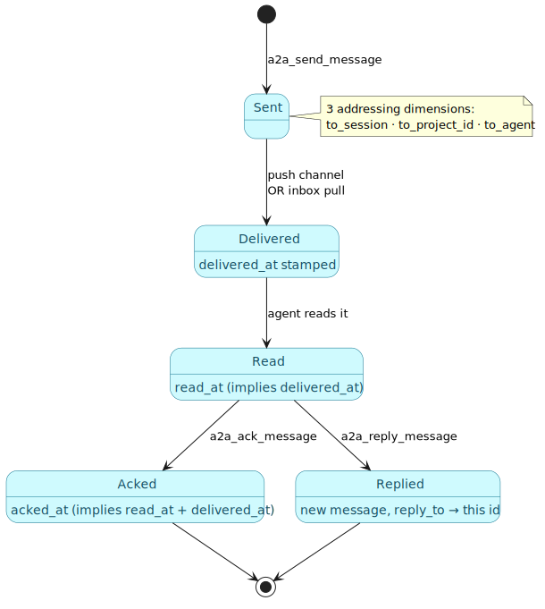
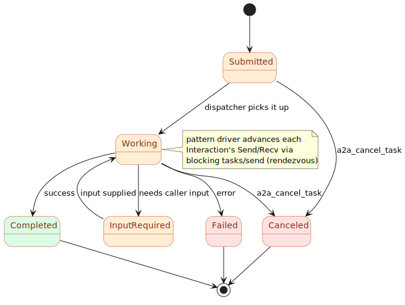

# 07 — The A2A protocol & agent model

> **Thesis.** The protocols of chapters 01–06 are *abstract* — roles, labels, channels.
> They run on a concrete substrate: the **Agent-to-Agent (A2A)** layer, which has two
> distinct planes — a *mailbox* (durable, addressable, asynchronous notes between agents)
> and a *task protocol* (synchronous JSON-RPC request/response with a lifecycle) — over a
> Postgres-backed agent **registry**.

**Source of record:** `src/a2a/` (`types.rs`, `dispatcher.rs`, `mailbox.rs`,
`mailbox_store.rs`, `server.rs`, `sse.rs`, `best_practices.rs`).
**Builds on:** [06](06-conformance-and-the-observer.md). **Builds toward:**
[08 — Patterns](08-five-patterns-as-protocols.md).

---

## 7.1 Two planes, one fleet

A2A separates two genuinely different communication needs, and conflating them would be a
design error. The **mailbox plane** is for durable, addressable, fire-and-forget notes ("FYI,
I moved that file"); the **task plane** is for a request that blocks until a typed result
comes back (the substrate the patterns' `Send`/`Recv` map onto).


| | **Mailbox plane** | **Task plane** |
|---|-------------------|----------------|
| purpose | durable async notes between agents | synchronous request → typed result |
| tables | `agent_messages` + `agent_message_receipts` | `a2a_tasks` + `a2a_messages` + `a2a_artifacts` + `a2a_events` |
| tools | `a2a_send_message` / `reply` / `ack` / `inbox` | `a2a_send_task` / `get_task` / `subscribe_task` / `cancel_task` |
| delivery | pull (reliable floor) + push channels | blocking call + SSE stream |
| maps to CSM | `WorktreeNegotiation` (typed mailbox kinds) | every `Interaction`'s `Send`/`Recv` |

---

## 7.2 The mailbox plane

A mailbox message (`mailbox_store.rs`, table `agent_messages`) carries a sender, a body, a
threading link, and — crucially — **three independent addressing dimensions**, any of which
may be set:

```
agent_messages(id, from_agent, from_session,
               to_session,      -- a precise instance (one running agent)
               to_project_id,   -- a project-wide broadcast
               to_agent,        -- a client-type broadcast (all "code-generator" peers)
               kind, subject, body, reply_to → id, created_at, expires_at)
```

Threading is `reply_to` (a self-reference to another message's `id`). Delivery is tracked by
a separate **receipts** table with *monotonic* timestamps:

```
agent_message_receipts(message_id, recipient_session, recipient_agent,
                       delivered_at, read_at, acked_at, channel)
```

A read implies delivered; an ack implies read and delivered (the `Mark::{Delivered, Read,
Acked}` ladder updates with `COALESCE`, never moving a timestamp backward). The `kind` is a
**closed vocabulary** (`mailbox.rs::MessageKind`): `message`, `request`, `fyi`, plus the
WorktreeNegotiation steps `request_worktree`, `accept`, `decline`, `moved`. Push delivery
(`delivery.rs`) renders undelivered messages into model-visible context channels
(`DeliveryChannel`: `prompt`, `session_start`, `posttooluse`, `inbox_pull`), but **the
reliable floor is the `a2a_inbox` pull** — an agent can always poll, even if a push channel
was missed.



The mailbox is where `WorktreeNegotiation` (chapter 08) lives: its `request_worktree` /
`accept` / `decline` / `moved` exchange is a *typed* mailbox conversation that shares the
projection/conformance machinery without being an `a2a_pattern_*` run.

---

## 7.3 The task plane

A task (`types.rs`, table `a2a_tasks`) is the synchronous unit the pattern driver speaks. Its
lifecycle is a six-state machine:

```rust
pub enum TaskState { Submitted, Working, InputRequired, Completed, Canceled, Failed }
// terminal = Completed | Canceled | Failed
```



A `Task` carries the conversation and its results:

```
Task { id: Uuid, session_id, status: TaskStatus, history: Vec<Message>,
       artifacts: Vec<Artifact>, metadata,
       recursion_rounds: u32, current_round: u32, parent_task_id: Option<Uuid> }
```

A `Message` is `{ role: User|Agent, parts: Vec<Part>, metadata }`, where a `Part` is `Text`,
`File`, or `Data`. The `metadata.rlm` slot is where the Recursive Language Model frame rides
(chapter 09) — the same `Message` shape carries an ordinary task *and* a recursion frame.

The wire is **JSON-RPC** (`server.rs`): `POST /a2a/jsonrpc` with `tasks/send`, `tasks/get`,
etc.; an agent card at `/.well-known/agent.json`; and a streaming endpoint
`/a2a/sse/{task_id}`. Events persist to `a2a_events(task_id, kind, payload, sequence)`;
`emit_event` also fires `pg_notify`, though the SSE bridge currently *polls* the events table
on a 200 ms cadence (the `pg_notify` listener path is reserved). The synchronous, blocking
nature of `tasks/send` is exactly what makes the rendezvous semantics of the conformance
checker (chapter 06) faithful: a `Send` event and its matching `Recv` happen together.

---

## 7.4 The agent registry and discovery

Roles are *abstract*; binding a role to an actual agent needs a registry. The persisted
registry is the Postgres table **`a2a_agents`**, written by `a2a_register_agent`:

```
a2a_agents(name PK, version, description, url, capabilities jsonb,
           skills jsonb, specialty text[], recommended_role, last_seen_at)
-- upsert: ON CONFLICT (name) DO UPDATE … last_seen_at = NOW()
```

The orchestration-routing fields are `specialty` (e.g. `["search", "retrieval"]`) and
`recommended_role` (e.g. `"Critic"`). **Liveness** is *not* a column on `a2a_agents`; it is a
join to the separate `mcp_clients` table (`alive`, `last_seen`, `mcp_session_id`) — the
registry says *what an agent is*, the client table says *whether it is up right now*.

Three discovery tools build on this:

- **`a2a_find_agents_by_specialty`** — `WHERE specialty && $1::text[] AND ($2 IS NULL OR
  recommended_role = $2)`. This is how the Orchestrator binds a protocol role to a fleet peer
  (chapter 11): "give me an agent whose specialty array overlaps `{formal-verification}`."
- **`a2a_active_agents`** — live `mcp_clients` grouped by project, enriched with the advisory
  role/specialty; returns the precise `mcp_session_id` addressing handle.
- **`a2a_fleet_view`** — a single read-only join: registry ⋈ `agent_trust` (importance prior,
  promotion counts) ⋈ `agent_outcomes` aggregate (reports, success rate, last outcome) ⋈
  `mcp_clients` (live flag). One call answers "who is in the fleet, how trustworthy are they,
  and are they up?"

Outcome reporting closes the loop: `a2a_report_outcome` → `best_practices.rs::record_outcome`
writes the `agent_outcomes` ledger and bumps `agent_trust`, mirrored into a `memory_observation`.
This is the reward signal the learned routing policy consumes (chapter 11) — a run's outcome
makes the next role-binding better-informed.

With the substrate in place — a registry to find agents, a mailbox for async notes, and a
blocking task protocol for the `Send`/`Recv` of each `Interaction` — the five named patterns
are simply *protocols over this substrate*. That is the next chapter.

---

*Next: [08 — The patterns as protocols](08-five-patterns-as-protocols.md). Back to
[README](README.md).*
