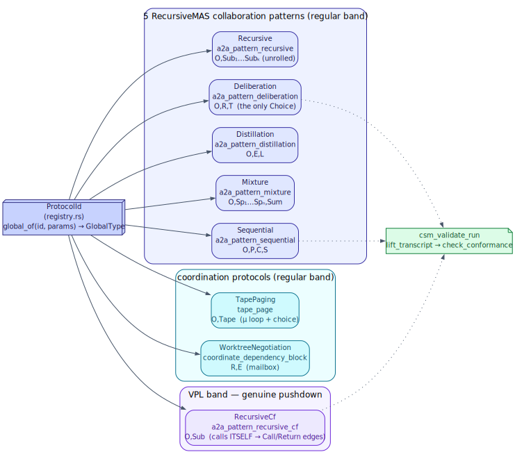
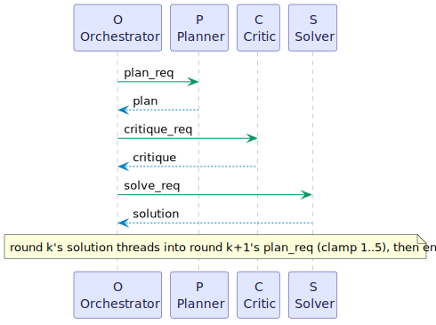
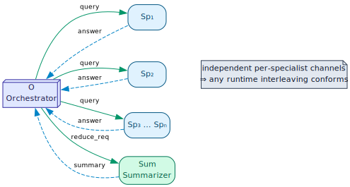
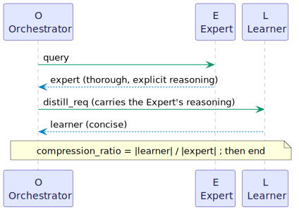
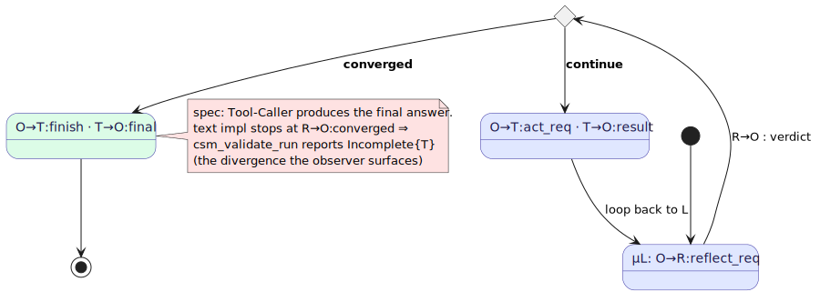

# 08 — The patterns as protocols

> **Thesis.** Each `a2a_pattern_*` coordination tool is the *implementation* of a named
> `GlobalType` — its **contract**. The five RecursiveMAS collaboration patterns, plus three
> coordination protocols, are all entries in one registry whose join key matches a recorded
> run to its protocol. Seven live in the regular band; one, `RecursiveCf`, is the genuine
> pushdown protocol that bridges to the Recursive Language Model.

**Source of record:** `src/csm/registry.rs` (`ProtocolId`, `global_of`),
`src/csm/examples.rs` (`deliberation`, `recursive_cf`, `tape_paging`, `worktree_negotiation`).
**Builds on:** [07](07-a2a-protocol-and-agent-model.md), [01](01-cfsm-mpst-foundations.md)–[02](02-projection-and-wellformedness.md).
**Builds toward:** [09 — Recursive Language Model](09-recursive-language-model.md).

---

## 8.1 The registry: one enum, eight protocols

`ProtocolId` (`src/csm/registry.rs`) names all eight protocols. The `pattern_skill_id`
matches `a2a_tasks.skill_id` (the tool name), so a recorded run is unambiguously matched to
its contract; `global_of(id, params)` builds the concrete `GlobalType`:

```rust
pub enum ProtocolId {
    Sequential, Mixture, Distillation, Deliberation, Recursive,  // the 5 RecursiveMAS patterns
    WorktreeNegotiation,   // cross-project worktree coordination (mailbox)
    TapePaging,            // context-tape paging control loop
    RecursiveCf,           // the genuine pushdown RLM (self-calling)
}
```



| Protocol | `skill_id` | Roles | Band | Source |
|----------|-----------|-------|------|--------|
| Sequential | `a2a_pattern_sequential` | `O, P, C, S` | regular | `sequential(rounds)` |
| Mixture | `a2a_pattern_mixture` | `O, Sp₁…Spₙ, Sum` | regular | `mixture(n)` |
| Distillation | `a2a_pattern_distillation` | `O, E, L` | regular | `distillation()` |
| Deliberation | `a2a_pattern_deliberation` | `O, R, T` | regular | `deliberation()` |
| Recursive | `a2a_pattern_recursive` | `O, Sub₁…Subₖ` | regular | `recursive(depth)` |
| WorktreeNegotiation | `coordinate_dependency_block` | `R, E` | regular | `worktree_negotiation()` |
| TapePaging | `tape_page` | `O, Tape` | regular | `tape_paging()` |
| **RecursiveCf** | `a2a_pattern_recursive_cf` | `O, Sub` | **VPL** | `recursive_cf()` |

These eight follow the **RecursiveMAS** collaboration patterns (Yang et al.,
arXiv:2604.25917, Table 1); pgmcp's `src/a2a/dispatcher.rs` implements the paper's
text-recursion baseline. Where the text implementation diverges from the paper's role
structure (the Deliberation case, §8.3), the observer surfaces it — *that divergence is the
point* (chapter 06).

---

## 8.2 The four linear patterns

Four patterns are straight-line (regular) protocols — request/response chains and fan-outs,
with no genuine choice. Their grammars (verbatim from `registry.rs`):

**Sequential** — Planner → Critic → Solver, unrolled `rounds` times (each round's Solver
output threads into the next Planner):

```
   sequential(rounds) =  O→P:plan_req . P→O:plan . O→C:critique_req . C→O:critique .
                         O→S:solve_req . S→O:solution . ⟨next round | end⟩
```



**Mixture** — fan out the same query to N specialists, then a Summarizer reduces. The fan-out
is modelled as a causal sequence; independent per-specialist channels mean *any* runtime
interleaving conforms (the live tool fans out in parallel, capped at 8):

```
   mixture(n) =  O→Sp₁:query . Sp₁→O:answer . … . O→Spₙ:query . Spₙ→O:answer .
                 O→Sum:reduce_req . Sum→O:summary . end
```



**Distillation** — an Expert answers thoroughly; a Learner answers concisely, conditioned on
the Expert's reasoning:

```
   distillation() =  O→E:query . E→O:expert . O→L:distill_req . L→O:learner . end
```



**Recursive** (the finite ladder) — depth-bounded self-recursion *unrolled* into distinct
roles `Sub₁…Subₖ`; the RLM's internal steps (peek/filter/chunk/stitch) are local computation,
not communication, so they are correctly absent from the protocol:

```
   recursive(depth) =  O→Sub₁:subcall . Sub₁→O:subresult . … . O→Subₖ:subcall . Subₖ→O:subresult . end
```

---

## 8.3 Deliberation: the only genuine choice

Deliberation is the one collaboration pattern with a **sender-driven choice** (and therefore
the one whose projection exercises the external-choice merge of chapter 02). A Reflector and
a Tool-Caller iterate: the Reflector either proposes a concrete sub-task or signals
convergence:

```
   μL. O→R:reflect_req . R→O { continue : O→T:act_req . T→O:result . L
                               converged : O→T:finish . T→O:final . end }
```



This is also the canonical *spec/implementation divergence* the observer exists to surface.
The paper (and the protocol) have the Tool-Caller produce the final answer on convergence
(`O→T:finish . T→O:final`); the live text implementation reuses the Reflector's text and
stops at `R→O:converged`. So `lift_transcript` ends the trace early and `csm_validate_run`
reports `Incomplete { role: "T" }` — a true, located finding, not a checker bug (chapter 06).
Deliberation is **server-side only**: its choice is resolved at runtime, so it is not a
static plan a client can drive step-by-step (chapter 14, `csm_protocol_plan`).

---

## 8.4 The three coordination protocols

Beyond the five collaboration patterns, three more protocols share the same
projection/conformance machinery:

- **WorktreeNegotiation** (`R, E`) — a two-party negotiation between a blocked dependent's
  **Requester** and a dependency's **Editor**, riding the *mailbox* plane as typed message
  kinds (`request_worktree` / `accept` / `decline` / `moved`, chapter 07). Its gatekeeper
  safety and liveness are machine-checked in `docs/formal/WorktreeNegotiation.{tla,v}`
  (chapter 13). pgmcp's git scanner is the gatekeeper — *not* a protocol role.
- **TapePaging** (`O, Tape`) — the context-tape paging *control* loop, making the residency
  decision conformance-checkable. It is a `μ loop` whose body ends in a **sender-driven
  choice by the controller** `O` over five verbs: `O→Tape:page_in_req . Tape→O:page_in_ack .
  O→Tape{ get | put | page_out | demote | done }`, where only `done` terminates and the other
  four loop. All-`Text` (black-box-legal). See
  [context-tape](../context-tape/README.md).
- **RecursiveCf** (`O, Sub`) — the bridge to chapter 09 (§8.5).

---

## 8.5 RecursiveCf: the genuine pushdown protocol

`Recursive` (§8.2) is a finite *unrolling* — distinct roles `Sub₁…Subₖ`, regular. `RecursiveCf`
is its **context-free counterpart**: a single two-role protocol (`O`, `Sub`) that calls
**itself** through a `GlobalCall` to its own name, so nesting depth is carried by the
*conformance stack* (bounded by `MAX_STACK_DEPTH`), not baked into the type. It is the *only*
protocol in the VPL band, and the static-contract twin of the Recursive Language Model's
runtime recursion.

Two facts (both pinned by tests in `registry.rs`) make it genuinely pushdown:

1. **It is well-formed *only* with its environment.** Against an empty environment its
   self-call is an `UnknownCallee` (WF-CLOSED, chapter 02); against `protocol_env()` — which
   registers `recursive_cf` under its own name — it validates. A protocol that references its
   own name is exactly the finite-syntax-for-unbounded-recursion construct of chapter 04.
2. **Its compiled machine contains real `Call`/`Return` edges.** The test
   `recursive_cf_is_a_genuine_self_calling_pushdown_protocol` asserts the `O` machine has an
   `EdgeKind::Call { .. }` *and* an `EdgeKind::Return` — unlike `Recursive`, whose unrolled
   machine is `Internal`-only. This is the pushdown structure of chapter 05 realized.

A `RecursiveCf` run conforms when it is **well-nested**: every `recurse` (which the
ε-closure turns into a stack push) is matched by its `subresult` unwind (a pop), so the stack
ends empty (chapter 06). The runtime engine that *produces* such runs — decomposing a long
query, recursing on snippets, and stitching the answers, with its frame stack playing the
role of the conformance stack — is the Recursive Language Model, the next chapter.

---

*Next: [09 — The Recursive Language Model](09-recursive-language-model.md). Back to
[README](README.md).*
