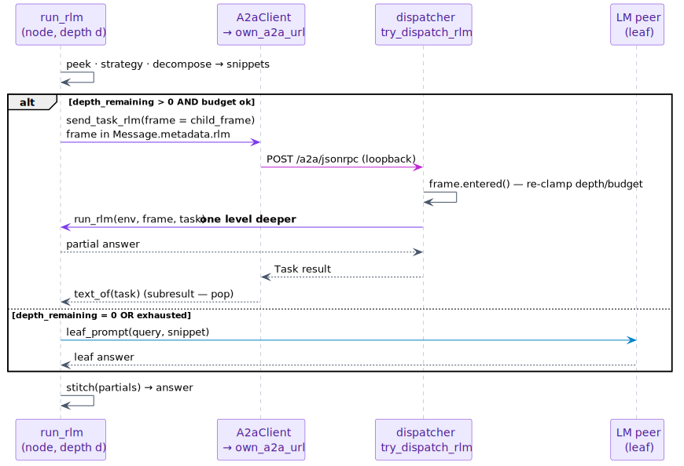
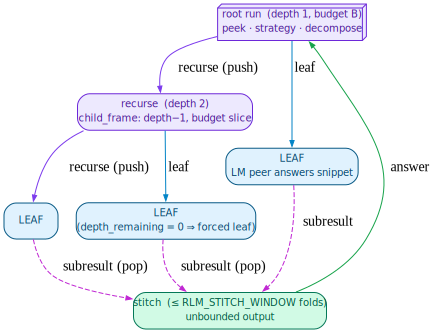
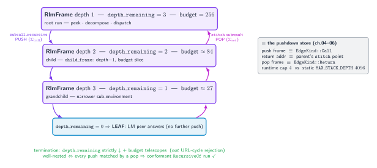

# 09 — The Recursive Language Model

> **Thesis.** The Recursive Language Model (RLM) answers a query whose evidence vastly
> exceeds any context window by *recursing*: peek at the environment, decompose it into
> snippets, and for each snippet either answer it as a **leaf** or **call itself** over a
> narrowed sub-environment — then stitch the partials. The runtime **stack of `RlmFrame`s
> is the pushdown store** of chapter 04, and termination is bought by a strictly-decreasing
> depth and a telescoping budget.

**Source of record:** `src/a2a/rlm.rs` (`RlmFrame`, `run_rlm`, `child_frame`,
`subcall_recursive`), `src/a2a/dispatcher.rs` (`try_dispatch_rlm`).
**Builds on:** [08](08-five-patterns-as-protocols.md), [04](04-automata-spine.md).
**Builds toward:** [10 — State is the trace](10-state-is-the-trace.md).

---

## 9.1 The paradigm

The RLM paradigm (Zhang, Kraska & Khattab, arXiv:2512.24601) treats the corpus as an
**external environment** `ℰ` rather than inlining it into a prompt. To answer a query against
a 1 M-token corpus with a model whose window is far smaller, it: **peeks** into `ℰ`,
**decomposes** the query into snippets, **recursively sub-calls** a peer LM over each small
snippet, and **stitches** the partial answers. The full context is never inlined into any
single prompt — the recursion is what makes the effective context unbounded.

pgmcp's environment is the indexed Postgres corpus (`file_chunks`), and the "code the model
writes" is a parameterized `DecomposeStrategy` (`Chunk` / `SemanticRetrieve` / `Grep`) over
the existing tool catalog, so no sandboxed REPL is needed — safety is by construction
(read-only DB queries). A fifth environment kind, `Store`, is the shared read/write working
memory across the whole recursion tree (the context-tape, chapter 10), which makes the RLM's
*output* unbounded too.

---

## 9.2 The frame: a node of the recursion tree

Every node of the recursion carries an `RlmFrame` (`src/a2a/rlm.rs`), threaded across A2A
peers in `Message.metadata.rlm` so a receiving pgmcp peer *continues decomposing* instead of
answering as a leaf:

```rust
pub struct RlmFrame {
    pub v: u8,                       // schema version
    pub depth: u32,                  // 1-based absolute depth of THIS node (root = 1)
    pub depth_remaining: u32,        // remaining decomposition depth; 0 ⇒ answer as a leaf
    pub budget_remaining: u32,       // upper bound on TOTAL sub-calls this subtree may issue
    pub environment: Value,          // the (sub-)environment to decompose
    pub strategy: Option<String>,    // decomposition strategy, or None to let the peer choose
    pub query: String,               // the original top-level query (every node answers it)
    pub sub_agent_url: String,       // LM peer URL for LEAF snippets (resolved once at root)
    pub reduce_agent_url: Option<String>,  // LM peer URL for stitch/verify
    pub max_chunks: usize,           // per-node fan-out cap
    pub concurrency: usize,          // bounded sub-call concurrency
    pub verify: bool,                // run the verify+self-grade rubric?
    pub path: Vec<String>,           // root → … → parent URLs (observability, not cycle-gating)
    pub root_task_id: Uuid,          // stable across the whole tree (the tape/Store scope key)
}
```

The two fields that *bound* the recursion are `depth_remaining` and `budget_remaining`. The
hard caps are deliberately small:

```rust
pub const MAX_RLM_DEPTH: u32 = 4;     // tree height — a cost/DoS bound
pub const MAX_RLM_BUDGET: u32 = 256;  // total sub-calls across the whole tree
pub const RLM_STITCH_WINDOW: usize = 4;  // partials folded per reduce call (unbounded output)
```

---

## 9.3 The engine: `run_rlm`

The engine (`run_rlm`) is one node's work: peek, choose a strategy, decompose, then dispatch
each snippet as either a recursion or a leaf, and stitch. In literate form:

```
procedure run_rlm(env, frame, task):                 ▷ answers `frame.query` against env
    peek ← sample a small prefix/summary of env       ▷ never inlines the whole corpus
    strategy ← frame.strategy or choose(peek)          ▷ Chunk | SemanticRetrieve | Grep
    snippets ← decompose(env, strategy, ≤ frame.max_chunks)

    can_recurse ← frame.depth_remaining > 0
                  and frame.budget_remaining > 2 · |snippets|     ▷ enough budget to go deeper
    per_child   ← can_recurse ? (frame.budget_remaining − |snippets|) / |snippets| : 0

    jobs ← for each snippet s:
              if can_recurse:
                  Recurse( child_frame(frame, narrow(env, s), per_child) )   ▷ over the loopback
              else:
                  Leaf( leaf_prompt(frame.query, s) )                        ▷ ask the LM peer
    partials ← run jobs (bounded concurrency)
    return stitch(partials)                            ▷ ≤ RLM_STITCH_WINDOW folds → unbounded output
```

The child frame strictly *descends* — depth decreases by one, the budget is sliced among
siblings:

```
procedure child_frame(parent, environment, budget):
    return RlmFrame {
        depth            = parent.depth + 1,
        depth_remaining  = parent.depth_remaining − 1,   ▷ STRICTLY decreasing — the termination measure
        budget_remaining = budget,                        ▷ a slice of the parent's budget (telescoping)
        environment, query = parent.query, root_task_id = parent.root_task_id,
        … carry the rest …
    }
```

---

## 9.4 Self-call over the loopback: recursion as an A2A round-trip

The subtle, beautiful part: a *recursive* sub-call is a **real A2A round-trip to the daemon's
own endpoint**. The node does not call a function; it sends an A2A task — carrying the child
frame in `Message.metadata.rlm` — to its own loopback URL:

```
procedure subcall_recursive(own_url, child_frame, parent_task_id):
    task ← A2aClient(own_url).send_task_rlm(             ▷ "the model calls itself" (the paper)
              skill = "a2a_pattern_recursive",
              options = { parent_task_id },
              frame   = child_frame)                       ▷ frame rides in Message.metadata.rlm
    return text_of(task)
```

The **inbound** side closes the loop. The dispatcher detects the `rlm` frame on an incoming
task and *continues decomposing* instead of answering as a leaf:

```
procedure try_dispatch_rlm(task):                       ▷ dispatcher.rs
    frame ← task.message.metadata["rlm"]  or return None  ▷ no frame ⇒ ordinary/leaf task
    if frame.depth_remaining = 0 or frame.budget_remaining = 0:
        return None                                       ▷ exhausted ⇒ fall through to a leaf answer
    frame ← frame.entered(own_url)                         ▷ defensively re-clamp depth/budget to the caps
    env   ← RlmEnvironment::from_frame(frame.environment, frame)   ▷ Store scoped to frame.root_task_id
    return run_rlm(env, frame, task)                       ▷ recurse one level deeper
```



A security detail worth highlighting: for the `Store` environment, `root_task_id` is bound
**from the trusted frame**, never from the (potentially crafted) environment JSON — so a node
can only ever address *its own tree's* working memory, never a sibling's. (This is the same
frame-bound discipline the context-tape uses, chapter 10.)



---

## 9.5 The recursion ↔ pushdown correspondence

This is the chapter's payoff and the reason the RLM belongs in a treatise about a pushdown
automaton. **The runtime call stack of `RlmFrame`s *is* the pushdown store** of chapter 04:

| Pushdown automaton (chapter 04–06) | RLM runtime |
|------------------------------------|-------------|
| push a frame (`Σ_call`, `EdgeKind::Call`) | `subcall_recursive` descends one level (`child_frame`) |
| stack symbol (the return address) | the parent's continuation (where `stitch` resumes) |
| pop a frame (`Σ_ret`, `EdgeKind::Return`) | a child returns its partial; the parent stitches it |
| well-nested run (stack ends empty) | every recursion returns and is stitched |
| `MAX_STACK_DEPTH` (static, 4096) | `MAX_RLM_DEPTH` (runtime, 4) |

So a recorded RLM run is exactly a `RecursiveCf` trace (chapter 08): conformance-checkable,
Dyck-balanced when every recursion returns. The static contract and the runtime engine are
two readings of one structure.



### Termination, and why the two bounds differ

Termination is guaranteed by the **strictly-decreasing `depth_remaining`** and the
**telescoping `budget_remaining`** — *not* by URL-cycle rejection. This is deliberate: a node
calling its own loopback URL *is* the expected behaviour ("the model calls itself"), so
rejecting URL revisits would break the paradigm. `entered` defensively re-clamps an inbound
frame's depth/budget so a crafted frame cannot exceed the caps.

And the two depth bounds are *intentionally* different (ADR-030 correction #2):

- `MAX_RLM_DEPTH = 4` is a **runtime** bound — each level issues *real LM sub-calls*, so depth
  is a cost/DoS limit that must stay small.
- `MAX_STACK_DEPTH = 4096` is a **static** bound — conformance is cheap trace-checking where
  deep nesting costs nothing, so it can be large.

Equating them (recursing to 4096 at runtime) would turn the RLM into a DoS vector. A recorded
run is conformance-checkable against `RecursiveCf` regardless of the runtime cap — the static
checker simply tolerates far deeper nesting than the runtime ever produces.

---

*Next: [10 — All state is the trace](10-state-is-the-trace.md). Back to [README](README.md).*
