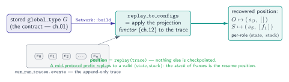
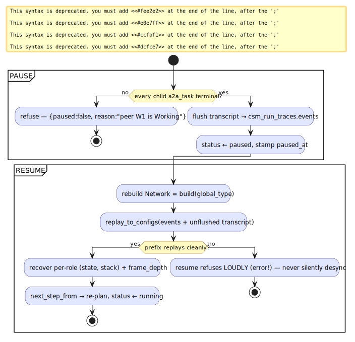

# 10 — All state is the trace

> **Thesis.** The single most economical idea in the CSM: **the recorded trace *is* the
> position.** A role's current state is not stored — it is *recomputed* by replaying the
> trace through the projection functor. One append-only event log therefore serves five
> roles at once: position, resume, content anchor, audit, and control.

**Source of record:** `src/csm/conformance.rs` (`replay_to_states`/`replay_to_configs`),
`src/csm/session_store.rs` (`orchestration_sessions`), `src/csm/trace_store.rs`; migrations
v50/v54/v60. The *decision rationale* for pause/resume, unified tracing, and emergency stop is
recorded in the **crucible** repo (ADR-011/019/020/016 — see
[crucible/docs/csm/06](../../../crucible/docs/csm/06-state-and-control.md)); pgmcp's
context-tape design is [ADR-033](../decisions/033-context-tape-infinite-session.md) +
[`docs/context-tape/`](../context-tape/README.md). **Builds on:**
[06](06-conformance-and-the-observer.md),
[09](09-recursive-language-model.md). **Builds toward:**
[11 — Crucible execution](11-crucible-plan-execution.md).

---

## 10.1 The theorem: position = replay(trace)

In a naive design, resuming a paused multi-agent run means checkpointing every agent's
current state. The CSM does *not* — because projection (chapter 02) is a **functor**
(chapter 12), the recorded trace is a *complete description of position*:

> **Replaying `csm_run_traces.events` through `Network::build(global_type)` recovers every
> role's `LocalState`.** So nothing extra needs to be checkpointed.

This is exactly what `replay_to_states` (chapter 06) computes, and it is the keystone of
pause/resume. Critically, it **does not assert termination**: a mid-protocol *prefix* — a
paused run, possibly mid-call with a non-empty stack — replays cleanly to its configurations.
For a call-bearing run the generalization holds with the stack: `replay_to_configs` recovers
each role's `(state, stack)`, so *"the **stack of frames** is the position"* (ADR-030). A
corrupt prefix that does not replay makes resume refuse *loudly*, never silently desync.



---

## 10.2 Sessions: pause, resume, fork

A session is a thin row in `orchestration_sessions` (migration v50; v54 adds `frame_stack`).
It stores *what cannot be recomputed* — the protocol, the bindings, the unflushed transcript
— and nothing that replay can recover:

```
orchestration_sessions(
   session_key UNIQUE, status,              -- running | paused | resuming | done | failed
   protocol_name, global_type JSONB,        -- so resume can rebuild the projected Network
   orchestrator_role, task_id,
   cursor, critic_iteration, critic_phase,  -- the loop position the FLAT FSM cannot distinguish
   role_peer JSONB,                         -- which fleet peer plays each role
   work_item_root, experiment_ids[], memory_scope,
   pi_session_id, pi_parent_session_id, parent_session_id,
   lease_expires_at, paused_at,
   transcript JSONB,                        -- unflushed orchestrator-side Events
   frame_stack JSONB)                       -- v54: stack-aware resume ("the stack of frames is the position")
```

The lifecycle:

- **Pause** flushes `transcript` to `csm_run_traces.events`, but **refuses unless every child
  `a2a_task` is terminal** — `{ paused: false, reason: "peer W1 is Working" }` — so a pause
  never strands an in-flight peer.
- **Resume** replays the flushed events plus any unflushed transcript through
  `replay_to_states`/`replay_to_configs` to recover where every role sits, then re-plans the
  next step (`next_step_from`). The `critic_iteration`/`critic_phase`/`cursor` columns
  disambiguate *which* loop iteration the flat FSM cannot tell apart.
- **Crash recovery** — a crashed `running` session whose `lease_expires_at` passes is
  auto-flipped to `paused` by the `orchestration_session_reaper` cron, so a crash loses ≤ 1
  step.
- **Fork** is a row copy with `parent_session_id` set — branch a run without re-deriving it.



The status vocabulary is the ADR-003 closed-enum idiom (`SessionStatus::sql_in_list()` pins
the DB CHECK), the same discipline as `StackAction` (chapter 04).

---

## 10.3 Five planes over one event log

ADR-011 made the *protocol position* durable. But position is only one of several things one
wants to recover. The design keeps *one* event log and layers the rest as **annotations** —
never as competing sources of truth.


| Plane | What it adds | Where | ADR |
|-------|-------------|-------|-----|
| **Position** | per-role `(state, stack)` = `replay(events)` | `csm_run_traces.events` | 011 |
| **Content** (the tape) | *what evidence is resident in the window* at a position | `working_set_pages` keyed `rlm:{root_task_id}` | 019 |
| **Trace spans** | OTel-shaped observability over slices of the events | `crucible_trace_spans` (v60) | 020 |
| **Control** | "are we halted?" + the audit of who halted | `system_control` + `crucible_control_journal` | 016 |
| **Tracker / experiment / memory** | task lifecycle, scientific verdicts, durable knowledge | `work_items` / `experiments` / `memory_*` | — |

Two of these deserve elaboration.

**Content plane (the context-tape).** ADR-019 is the *content* plane to ADR-011's *position*
plane — shared `session_key`, distinct state. Where position says "we are at protocol step
7," content says "these corpus pages are resident in the window." Residency is a *mechanical*
function of `(budget, policy, logical-clock)` — never agent judgment, never wall-time — so a
resumed run reconstructs a **bit-identical** working set. The slogan: *"the window is a
cache; the corpus is the address space."* The tape is keyed to the recursion tree from the
*trusted frame* (`rlm:{root_task_id}`), so a crafted frame can only ever address its own
tree — the same security property as chapter 09. (Full design:
[context-tape](../context-tape/README.md).)

**Trace spans (unified tracing).** ADR-020 generalizes "the trace is the position" from
pause/resume to *every* run — client-driven, FV, control events. The crucial discipline:
spans **annotate** `csm_run_traces.events`; *the events stay the sole source of position.* A
span's cached `orch_state`/`frame_depth` is *validated against the replay result, never
trusted over it* — the span is a cache, replay is the oracle. The capture/store split is
"**pi captures, pgmcp stores**." The falsifiable payoff: replaying a captured failing trace
reproduces the same *first divergence*; if a replay ever yielded a different or absent first
divergence, either the trace is not the position (ADR-011 false) or the projection functor is
unsound (ADR-010 regression). This is the engine behind crucible's `trace-investigate`
workflow (crucible mini-treatise, chapter 07).

---

## 10.4 The control plane: stopping the fleet durably

State also includes *"are we running?"* The control plane (ADR-016) is built from **redundant
channels** so the fleet can be halted even with no daemon up:

- a mutable `system_control.halted` row (the fast check) plus a `tokio::sync::watch` flag;
- an immutable **`crucible_control_journal`** of `{action, scope, channel, actor, reason,
  affected_sessions, affected_tasks}` — the audit of who halted, when, and what was abandoned;
- a filesystem **trip-file `~/.crucible/HALT`** (the physical "big red button," works with no
  daemon), written by `scripts/all-stop.sh` (which also POSTs `/api/control/halt`);
- `scripts/on-power-fail.sh` (a UPS low-battery hook) — the only mechanism that *reacts to
  imminent power loss*: all-stop, `checkpoint_all`, clean shutdown, so an ungraceful crash
  loses ≤ 1 step.

Because pausing checkpoints between steps and every position is `replay(trace)`, a halt — even
an abrupt one — is recoverable: resume replays the durable events and picks up where the fleet
left off. The control plane and the position plane are the same idea viewed from two ends:
*one append-only log, replayed, is the whole truth of where the system is.*

---

*Next: [11 — How crucible executes plans](11-crucible-plan-execution.md). Back to
[README](README.md).*
