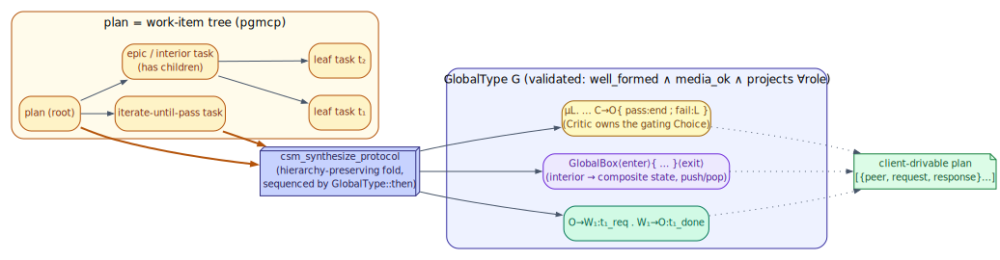
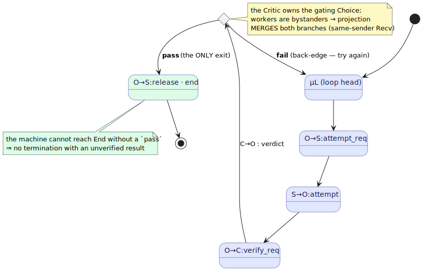

# 11 — How crucible executes plans

> **Thesis.** crucible folds a *plan* — a hierarchical work-item tree — into a typed
> `GlobalType`, validates it, drives it across a fleet of specialist agents, and proves it
> conformant. The fold makes verification **structural**: because the only path to `End`
> runs through a Critic's `pass` branch, the machine *cannot terminate with an unverified
> result.* This chapter is the mechanism; the operational playbook is the
> [crucible mini-treatise](../../../crucible/docs/csm/README.md).

**Source of record:** `csm_synthesize_protocol` (`src/mcp/tools/tool_csm_synthesize_protocol.rs`),
`GlobalType::then` (`src/csm/mpst/global.rs`), `crucible/pi/skills/orchestrator/SKILL.md`.
**Builds on:** [08](08-five-patterns-as-protocols.md), [10](10-state-is-the-trace.md).
**Builds toward:** [12 — Category theory](12-category-theory-layer.md).

---

## 11.1 The operating rule, restated

crucible is a `pi`-orchestrated fleet. The load-bearing rule (chapter 00) governs the whole
pipeline: **pi does all file work; pgmcp synthesizes, validates, drives, and verifies
coordination — it never edits files.** The CSM is what lets pgmcp *drive* without *touching* —
it manipulates protocols and traces, and pi applies every change.

The orchestrator skill's procedure is six steps (`pi/skills/orchestrator/SKILL.md`):

```
 0. orient + quality-baseline   (shift-left: read metrics, attach ratchet criteria)
 1. plan → pgmcp work-item TREE  (work_item_ingest_plan — not a markdown file)
 2. csm_synthesize_protocol      → typed GlobalType; validate well_formed ∧ media_ok ∧ project ∀role
 3. FV-gate (pre-execution)      → refuse to drive until PLAN-VERIFIED
 4. bind roles → specialists     (a2a_find_agents_by_specialty; black-box peers on Text edges)
 5. DRIVE                         (client-driven a2a_send_task | server a2a_pattern_*; loop until Critic pass)
 6. review-FV + csm_validate_run + a2a_report_outcome   (only CI/experiment evidence reaches `verified`)
```

Two refusals are non-negotiable and identical in spirit: **refuse to drive if `well_formed`
or `media_ok` is false** (step 2), and **refuse to drive until `PLAN-VERIFIED`** (step 3).
Both forfeit a guarantee if violated, so both block.

---

## 11.2 The keystone: `csm_synthesize_protocol`

A *plan* in crucible is **not** a markdown file — it is a **work-item tree** persisted in
pgmcp (`plan → epic → task → todo`, with `depends_on` edges and `acceptance_criteria`).
`csm_synthesize_protocol` folds that tree into one typed `GlobalType` (read-only — it never
executes). The fold is hierarchy-preserving (ADR-030):

- **A leaf task** becomes a worker request/response interaction:
  `O → Wᵢ : tᵢ_req . Wᵢ → O : tᵢ_done`.
- **An interior item** becomes a nested **`GlobalBox`** composite state — the sub-tree runs
  to completion and *returns* to the parent step, sequenced via the proven monoid
  `GlobalType::then` (chapter 12). The crucible plan's nesting is thus carried into a genuinely
  hierarchical (pushdown) protocol, not flattened.
- **An iterate-until-pass loop** becomes a cyclic `Rec`/`Var` with a **Critic** owning the
  gating `Choice`.



The fold then validates the result exactly as any protocol is validated (chapters 02, 05):
well-formedness, **media discipline** (black-box agents on `Text` edges only, chapter 03), and
per-role projection. If any check fails, synthesis refuses — the plan is malformed and must be
fixed before driving. On success it emits a client-drivable plan: a list of
`{ peer, request, response }` steps with role→peer bindings.

### `then`: the sequencing primitive

The fold sequences sibling sub-trees with `GlobalType::then` — sequential composition that
grafts a continuation onto every `End` leaf. It is a genuine monoid (verbatim from
`global.rs`): `End` is the two-sided unit, it is associative, and — critically — it is
**closed** (`wf p ∧ wf q ⇒ wf (p;q)`), with projection a homomorphism over it
(`project(p;q) = project(p);project(q)`). That closure theorem is *why the fold is sound*:
composing well-formed pieces yields a well-formed whole, and projecting the whole equals
projecting the pieces. (Chapter 12 develops the algebra; the Rocq proofs are chapter 13.)

---

## 11.3 Verification is structural

The most important property of a synthesized plan is that **the Critic gate is on the only
path to completion.** A Critic-gated loop is:

```
   μL. O → S : attempt_req . S → O : attempt . O → C : verify_req .
        C → O { pass : O → S : release . end          ← the ONLY exit
                fail : L }                              ← back-edge: try again
```



Because the *only* path to `End` runs through the Critic's `pass` branch, **verification is
structural**: the machine *cannot terminate with an unverified result.* This is the
multi-agent analogue of the work-item tracker's "an agent cannot self-verify" — not a
guideline an agent might skip, but a property of the type. A run that never earns `pass` never
reaches `End`, so `check_conformance` reports `Incomplete` rather than a false success.

### The correctness subtlety (why the fold re-engages workers)

A worker `S` is a *bystander* at the Critic's `C → O` choice, so its projection must **merge**
the two branches (chapter 02). A bare loop-`Var` in the `fail` branch is *unmergeable* against
the `pass` branch's `Recv(release)` — they are not the same shape. The fold therefore runs the
workers once and then **re-engages them inside the `revise` branch**, so every worker faces a
*same-sender* `Recv` in both branches (`release` in `pass`, `attempt_req` in `fail`) — the
external-choice merge that keeps it projectable. This is pinned by the tests
`critic_loop_well_formed_and_projects` and `linear_chain_is_drivable`. Without it, a
Critic-gated plan would fail to project and crucible would refuse to drive it — the right
failure, but the fold is built to avoid it.

---

## 11.4 Driving on the fleet, under two laws

The fleet is 16 generative peers declared in `fleet/roster.mjs` (rust-analyzer, code-generator,
formal-verifier, orchestrator, critic, test-generator, security-reviewer, optimizer, debugger,
architect, …), each a `{ name, port, model, recommendedRole, specialty[] }`. Each is hosted by
`fleet/a2a-shim.mjs` as a pure **string→string A2A leaf on a `Text` edge** and registered in
`a2a_agents` via `fleet/launch.mjs`. The Orchestrator binds each protocol role to a peer by
specialty (chapter 07) and drives — client-driven `a2a_send_task` per step by default, or
server-side `a2a_pattern_*` for fan-out/durability.

Two laws govern the fleet (chapter 03), enforced at *different* layers:

- **Black-box law** (enforced at projection): a black-box agent may ride only `Text` edges.
  Because every fleet leaf is a black-box text agent, every fleet edge is `Text`, and the law
  holds by construction. A plan that tried to put a fleet peer on a `Latent` edge would be a
  `ProjectionError` — caught before any agent runs.
- **Anti-recursion guard** (enforced at deployment): fleet leaves are MCP-disabled
  (`--no-builtin-tools`, no pgmcp surface), so a leaf cannot re-enter `a2a_pattern_*` and
  recurse unboundedly. Recursion happens only where it is metered — inside the RLM engine
  (chapter 09).

After driving, the loop closes: `csm_validate_run` checks conformance (chapter 06), and
`a2a_report_outcome` records the result so the learned routing policy improves (chapter 07).
Only CI/experiment evidence advances a work item to `verified` — the CSM gates coordination,
but real-world proof gates completion. The full operator playbook — the FV gate, the fleet
roster, the worked examples — is the [crucible mini-treatise](../../../crucible/docs/csm/README.md).

---

*Next: [12 — The category-theory layer](12-category-theory-layer.md). Back to
[README](README.md).*
