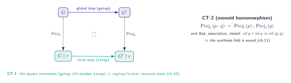
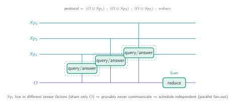

# 12 — The category-theory layer

> **Thesis.** Three algebraic facts make the whole machine sound. Projection is a
> **functor** (so replay recovers state). Sequential composition is a **monoid** with
> well-formedness closure and a projection homomorphism (so the synthesis fold is sound).
> A protocol decomposes into a **monoidal tensor** of independent factors (so disjoint
> roles provably never communicate). None of this is decoration — each is load-bearing.

**Source of record:** [ADR-028](../decisions/028-category-theoretic-layer.md);
`src/csm/mpst/project.rs` (functor), `src/csm/mpst/global.rs` (`then` monoid),
`src/csm/string_diagram.rs` (tensor). **Builds on:** [02](02-projection-and-wellformedness.md),
[05](05-data-model-and-compiled-machines.md). **Builds toward:**
[13 — Formal artifacts](13-formal-verification-artifacts.md).

---

## 12.1 CT-1 — projection is a functor

A *functor* maps objects to objects and morphisms to morphisms while preserving composition
and identity. Projection `Proj_r : Global → Local` is one: it maps a global type to a role's
local type, and — the load-bearing property — it preserves *reduction*. A step of the global
protocol corresponds to a step of the projected machine (the operational correspondence
`gstep_iff_sender_lstep`, chapter 13).

Why this matters operationally: **`csm_validate_run` and `session_checkpoint_resume` recover a
role's endpoint state by replaying the recorded trace through `project`.** That recovery is
sound *iff projection is functorial* — i.e. iff replaying the trace through the projected
machine lands in the same state the global protocol would. The "trace is the position"
theorem of chapter 10 is, precisely, a corollary of CT-1. If projection were *not* a functor,
replaying a trace could land in the wrong state, and every pause/resume would be a potential
desync.

---

## 12.2 CT-2 — composition is a monoid, projection a homomorphism

The synthesis fold (chapter 11) sequences sub-plans with `GlobalType::then` (`;`). For the
fold to be sound, `;` must be well-behaved — and it is a genuine **monoid** with two further
properties proved in Rocq (`CsmMpst.v`):

| Law | Statement | Rocq |
|-----|-----------|------|
| left unit | `End ; g = g` | `gseq_unit_l` |
| right unit | `g ; End = g` | `gseq_unit_r` |
| associativity | `(p ; q) ; r = p ; (q ; r)` | `gseq_assoc` |
| **closure** | `wf p ∧ wf q ⇒ wf (p ; q)` | `wf_gseq` |
| **homomorphism** | `project(p ; q) = project(p) ; project(q)` | `project_gseq_hom` |

The last two are the ones that make the fold trustworthy. **Closure** guarantees that
composing well-formed pieces yields a well-formed whole — so the Orchestrator can fold a plan
subtree from well-formed leaves and the result is automatically well-formed (it never has to
re-derive well-formedness of the composite from scratch). The **homomorphism** guarantees that
projecting the composite equals composing the projections — so `csm_synthesize_protocol` can
fold first and project per-role, or project per-role and compose, and get the *same* machine.
That equivalence is exactly what lets the fold produce sound per-role machines for a deeply
nested plan. (`then`'s implementation is verbatim in chapter 01/11; the laws are mechanized in
chapter 13.)

`End` is the unit, `;` is the product — a monoid `(GlobalType, ;, End)`, and `Proj_r` is a
*monoidal* functor over it.

---

## 12.3 CT-3 — the monoidal tensor: who can never talk

The third structure reads a protocol as a morphism in a **strict monoidal category** whose
objects are *role wires* and whose generating morphisms are interactions. The monoidal
**tensor** `⊗` is parallel (independent) composition: `A ⊗ B` is two sub-protocols whose role
sets are disjoint and which therefore never interact.

`string_diagram::decompose` (`src/csm/string_diagram.rs`, surfaced as `csm_protocol_string_diagram`)
computes this decomposition: a union-find over co-occurring role pairs partitions the roles
into independent **tensor factors**, and a `;`-spine captures the sequential depth. The
actionable, falsifiable payoff:

> **Two roles in different tensor factors provably never communicate** — so they are
> schedule-independent and can run concurrently.

This is not a heuristic: it is read off the protocol's structure, so it is a *guarantee* the
scheduler can rely on. In the Mixture pattern (chapter 08), each specialist `Spᵢ` is its own
tensor factor with respect to the others — they share only the Orchestrator `O` — which is
precisely why the live tool fans them out in parallel and *any* interleaving conforms.

---

## 12.4 Why the category story is load-bearing, not decorative

It is tempting to treat "category theory" as after-the-fact framing. Here it is the opposite —
each structure was adopted because a concrete capability *requires* it:

- **Pause/resume requires CT-1.** Without functoriality, `replay(trace)` could land in the
  wrong state. (Chapter 10.)
- **The synthesis fold requires CT-2.** Without closure + homomorphism, folding a plan tree
  could produce an ill-formed or mis-projected protocol. (Chapter 11.)
- **Concurrent scheduling requires CT-3.** Without the tensor decomposition, "these two agents
  never talk" would be a guess, not a theorem. (The Mixture fan-out.)

ADR-028 records these as CT-1/CT-2/CT-3; ADR-030 reuses them directly for the pushdown lift
(`then` sequences sibling subtrees in the hierarchy-preserving fold; projection now ranges
over call/return reachability). The category story is *extended* by the pushdown work, never
redefined. The next chapter shows the proofs that discharge all three.

---

*Next: [13 — Formal-verification artifacts](13-formal-verification-artifacts.md). Back to
[README](README.md).*
