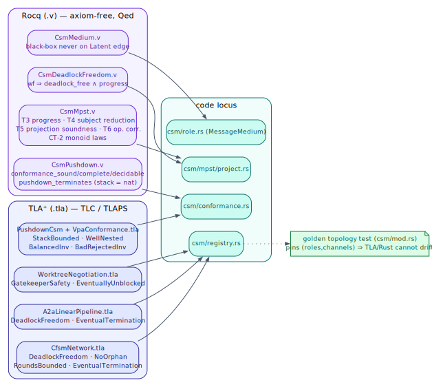
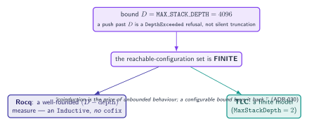

# 13 — Formal-verification artifacts

> **Thesis.** The guarantees of chapters 03–12 are not asserted — they are **machine-checked**.
> Rocq proves the type-theory (projection soundness, subject reduction, progress, conformance
> soundness/completeness/decidability, deadlock-freedom) with **no axioms**; TLA⁺/TLC
> model-checks each pattern network and the pushdown engine. A bounded stack is the single
> trick that keeps the Rocq proofs an ordinary induction.

**Source of record:** `docs/formal/rocq/Csm*.v`, `docs/formal/tla/*.tla`,
`docs/formal/README.md` (the master traceability ledger); `src/csm/tla_export.rs`
(`csm_protocol_to_tla`). **Builds on:** [03](03-safety-metatheorems.md),
[04](04-automata-spine.md), [06](06-conformance-and-the-observer.md). **Builds toward:**
[14 — Tools](14-tool-surface-and-worked-examples.md).

---

## 13.1 The Rocq proofs (axiom-free)

Every result is `Qed` with a clean `Print Assumptions` (no `Axiom`/`Hypothesis`/`Admitted`);
`docs/formal/scripts/verify.sh` `coqc`s each file standalone.

| File | What it proves |
|------|----------------|
| `rocq/CsmMpst.v` | the MPST core: **T1** `rlm_terminates`, **T2** `deliberation_terminates`, **T3** `global_progress`, **T4** `wf_preserved` (subject reduction), **T5** projection soundness (incl. the `GChoice` / external-choice-merge case), **T6** `gstep_iff_sender_lstep` (operational correspondence). Also the CT-2 monoid laws (`gseq`, `gseq_unit_l/r`, `gseq_assoc`, `wf_gseq`, `project_gseq_hom`). |
| `rocq/CsmPushdown.v` | the VPA extension: `conformance_sound`, `conformance_complete`, `conformance_decidable` — a run is accepted **iff** it is a well-nested trace of the protocol (the decidable VPA core). The stack is modeled by its **depth** (a `nat`), matching the ε-closure's unconditional pop; bounded depth gives a well-founded `(D − depth)` measure for `pushdown_terminates`. |
| `rocq/CsmDeadlockFreedom.v` | `well_formed(g) ⇒ deadlock_free(g) ∧ progress(g)` — the certificate behind the `protocol_soundness` tool (chapter 14). |
| `rocq/CsmMedium.v` | the black-box law (chapter 03): a well-media-formed protocol never places a black-box role on a `Latent` edge. |
| `rocq/WorktreeNegotiation.v` | the §8.4 coordination trust boundary (with the TLA twin). |

The finite-fragment technique is what makes these *ordinary* proofs: bounded runs become
finite trees, so the metatheory is structural induction with **no μ/coinduction**. This is the
linchpin (§13.3).

---

## 13.2 The TLA⁺ specs (model-checked)

TLC checks finite instances; the `src/csm/mod.rs` golden topology test pins the Rust
networks' `(roles, channels)` counts against these specs so the model and the code cannot
drift.

| Spec | Network / model | Properties checked |
|------|-----------------|--------------------|
| `tla/CfsmNetwork.tla` | the Deliberation network (synchronous product of O/R/T) | `DeadlockFreedom`, `NoOrphan`, `RoundsBounded`, `EventualTermination` |
| `tla/A2aLinearPipeline.tla` | the linear patterns (Sequential / Mixture / Distillation / Recursive) via per-pattern `.cfg` | `DeadlockFreedom`, `EventualTermination` |
| `tla/PushdownCsm.tla` + `tla/VpaConformance.tla` | the pushdown operational model + the VPA acceptance twin of `CsmPushdown.v` | `StackBounded`, `WellNested`, `BalancedInv`, `BadRejectedInv` |
| `tla/RmasRecursionLoop.tla` | the latent-decode discipline (Track B) | `LatentNeverDecodedMidLoop` (text produced only at the final round's last agent) |
| `tla/WorktreeNegotiation.tla` (+ `_proofs`) | the worktree gatekeeper | `GatekeeperSafety`, `NoUnblockOnClaimAlone`, `EventuallyUnblocked` (TLC + TLAPS) |



---

## 13.3 The bounded-stack linchpin

The recurring theme of chapters 04, 06, and 09 is here made precise as the reason the proofs
are *tractable*. A genuine pushdown automaton has an *unbounded* stack, and unbounded
behaviour forces **coinduction** in Rocq and an *infinite* model in TLC. The CSM's
`MAX_STACK_DEPTH = 4096` bound collapses both:

```
   bound D  ─▶  the reachable-configuration set is FINITE  ─┬─▶  Rocq: a well-founded (D − depth) measure
                                                            │     — an `Inductive`, no `cofix`
                                                            └─▶  TLC: a finite model (MaxStackDepth = 2)
```



ADR-030's slogan: *"coinduction is the price of unbounded behaviour; a configurable bound buys
it back."* The bound is a *large* limit surfaced as a `DepthExceeded` refusal (chapter 06),
not silent truncation — and it is shared by the well-formedness check, the conformance engine,
and the RLM runtime, so the conformance stack and the runtime call stack are literally the
same depth.

---

## 13.4 `csm_protocol_to_tla`: faithful by construction

The link from a live protocol to a model-checkable spec is the deterministic encoder
`csm_protocol_to_tla` (`src/csm/tla_export.rs::encode_tla`). Given a stored `GlobalType`, it
renders a TLA⁺ module using a global-cursor model (a cursor `g`, a `fired` label map, and a
return-address `stack`), emitting `WellNested`/`StackBounded` for pushdown protocols. It is
**pure** — no checker is spawned and no file is written; pi runs SANY/TLC over the output
(chapter 00's operating rule).

The significance for plan verification (the crucible FV gate, chapter 11): the protocol→TLA⁺
encoding is **faithful by construction** — a deterministic, tested encoder — rather than
LLM-authored. The `fv-planner` skill encodes the synthesized `G` with this tool and emits one
obligation per property (`NoStuck`, `Liveness`, `CriticTerminates`, a `DepOrder` per
data-dependency edge, `NoOrphan`, precondition-SAT; plus `WellNested` + `StackBounded` for
pushdown plans), and the `formal-verifier` discharges each against the *real* checker. So a
plan's protocol-soundness proof rests on a faithful encoding, not on a model an LLM might have
gotten subtly wrong.

This is the half of the story that lives on the pgmcp side; the *adjudication* of those
obligations (anti-vacuity, separation of duties) is the crucible FV gate
([crucible mini-treatise](../../../crucible/docs/csm/04-fv-gate.md)).

---

*Next: [14 — Tool surface & worked examples](14-tool-surface-and-worked-examples.md). Back to
[README](README.md).*
