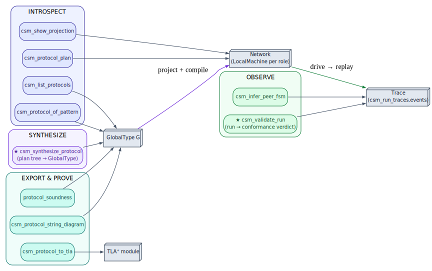

# 14 — Tool surface & worked examples

> **Thesis.** The whole subsystem is reachable through nine `csm_*` MCP tools (plus
> `protocol_soundness`). They cluster into four jobs: *introspect* a protocol, *synthesize*
> one from a plan, *observe* a run, and *export* it for proof. This chapter is the operator's
> reference, then three end-to-end runs.

**Source of record:** `src/mcp/tools/tool_csm_*.rs`, `tool_protocol_soundness.rs`,
`src/mcp/params/a2a_csm.rs`. **Builds on:** all prior chapters. **Builds toward:**
[15 — Glossary](15-glossary-and-notation.md).

---

## 14.1 The ten tools



Every tool is **analytical** — it reads, folds, projects, checks, or encodes, but never edits
a file (chapter 00). The grouping:

### Introspection (read a protocol)

| Tool | Input → Output | Implementing fn |
|------|----------------|-----------------|
| **`csm_list_protocols`** | — → all 8 `ProtocolId`s with participants + well-formedness; upserts each into `csm_protocols` | `tool_csm_list_protocols` |
| **`csm_protocol_of_pattern`** | a pattern name or `a2a_pattern_*` skill id → the `GlobalType` (adjacent-tagged AST), participants, `well_formed` verdict | `tool_csm_protocol_of_pattern` |
| **`csm_show_projection`** | a protocol → for each role: `project` → `compile` → `LocalMachine` (`n_states` + local-type JSON), or the `projection_error` | `tool_csm_show_projection` |
| **`csm_protocol_plan`** | a pattern → the orchestrator's `(peer, request, response)` schedule (`ProtocolDriver::plan`); `drivable:false` for Deliberation/RecursiveCf (runtime choice / unbounded stack) | `tool_csm_protocol_plan` |

### Synthesis (build a protocol from a plan)

| Tool | Input → Output | Implementing fn |
|------|----------------|-----------------|
| **`csm_synthesize_protocol`** ★ | a work-item plan tree → `{ global_type, well_formed, media_ok, drivable, plan:[{peer,request,response}…] }`; the hierarchy-preserving fold (chapter 11). **Read-only** — never executes | `tool_csm_synthesize_protocol` |

### Observation (judge a run)

| Tool | Input → Output | Implementing fn |
|------|----------------|-----------------|
| **`csm_validate_run`** ★ | an `a2a_tasks` id (or a `coordination_id`) → lift the recorded run, `check_conformance`, persist verdict + MSM `encoded_series` to `csm_run_traces`, report an MSM trend vs prior runs | `tool_csm_validate_run` |
| **`csm_infer_peer_fsm`** | a protocol → a passive prefix-tree FSM (L\*-style) over accumulated `csm_run_traces.events`; diffs the inferred alphabet vs the declared `communications()` → a `novel_symbols` flag for off-protocol behaviour | `tool_csm_infer_peer_fsm` |

### Export & soundness (prove it)

| Tool | Input → Output | Implementing fn |
|------|----------------|-----------------|
| **`csm_protocol_to_tla`** | a stored protocol → a faithful TLA⁺ module (`encode_tla`); `WellNested`/`StackBounded` for pushdown protocols. Pure (no checker spawned) | `tool_csm_protocol_to_tla` |
| **`csm_protocol_string_diagram`** | a stored protocol → the monoidal ⊗ decomposition (`tensor_factors`, `sequential_depth`, a unicode render) | `tool_csm_protocol_string_diagram` |
| **`protocol_soundness`** | a `GlobalType` JSON → `deadlock_free` / `has_progress` **by typing** (reduces to MPST `well_formed`, citing `CsmDeadlockFreedom.v`) — no model checker | `tool_protocol_soundness` |

The two ★ tools are the keystones: `csm_synthesize_protocol` is how a plan *becomes* a typed
machine; `csm_validate_run` is how a run is *judged* against it. Each pattern tool's result
carries a `next` hint pointing the caller to `csm_validate_run(task_id=…)`.

---

## 14.2 Worked example A — a Sequential run, end to end

The smallest full loop: synthesize, inspect, drive, validate.

```
1.  csm_protocol_of_pattern({ pattern: "sequential" })
        → GlobalType:  O→P:plan_req . P→O:plan . O→C:critique_req . C→O:critique .
                       O→S:solve_req . S→O:solution . end          (well_formed: true)

2.  csm_show_projection({ pattern: "sequential" })
        → O : !P⟨plan_req⟩ . ?P⟨plan⟩ . !C⟨critique_req⟩ . ?C⟨critique⟩ .
              !S⟨solve_req⟩ . ?S⟨solution⟩ . end        (n_states: 7)
          P : ?O⟨plan_req⟩ . !O⟨plan⟩ . end             (n_states: 3)
          …                                              (one machine per role)

3.  csm_protocol_plan({ pattern: "sequential" })
        → drivable: true, plan: [ {peer:"P", request:"plan_req", response:"plan"},
                                  {peer:"C", request:"critique_req", response:"critique"},
                                  {peer:"S", request:"solve_req", response:"solution"} ]

4.  (drive)  a2a_pattern_sequential({ message, planner_agent, critic_agent, solver_agent })
                → task_id

5.  csm_validate_run({ task_id })
        → { conformant: true }      ✓ every event legal, every machine terminal, stacks empty
```

The verdict `conformant: true` is the run-time confirmation that the live tool walked exactly
the protocol's path (chapter 06).

---

## 14.3 Worked example B — RecursiveCf at depth 3

The genuine pushdown case (chapter 08–09). A depth-3 recursive run produces a *well-nested*
trace; the stack grows on each `recurse` and unwinds on each `subresult`:

```
   trace (real communications only; Call/Return are ε-moves):
     O→Sub:subcall · O→Sub:recurse      ← push frame 1   (stack depth 1)
     O→Sub:subcall · O→Sub:recurse      ← push frame 2   (stack depth 2)
     O→Sub:subcall · O→Sub:leaf         ← base case      (stack depth 2)
     Sub→O:subresult                    ← pop frame      (stack depth 1)
     Sub→O:subresult                    ← pop frame      (stack depth 0)

   csm_validate_run → conformant: true        (Dyck-balanced: every push matched by a pop)
```

A run that nested deeper than it unwound would leave a non-empty stack → `Unbalanced`; one
nesting past `MAX_STACK_DEPTH` → `DepthExceeded`. The test
`recursive_cf_is_a_genuine_self_calling_pushdown_protocol` confirms the `O` machine carries
real `Call`/`Return` edges — the structural proof this is *not* a finite unrolling.

---

## 14.4 Worked example C — a crucible plan becomes a nested-box protocol

The keystone path (chapter 11). A hierarchical plan tree folds into a pushdown protocol:

```
   plan tree:                       csm_synthesize_protocol →
     root
     ├─ phase  (interior)             O→W_a:a_req . W_a→O:a_done                 (leaves of `phase` …)
     │   ├─ a   (leaf)        ⟹       box⟨enter_phase⟩{ … the phase sub-region … }⟨exit_phase⟩   (… as a GlobalBox)
     │   └─ b   (leaf)                 . O→W_root:root_req . W_root→O:root_done
     └─ verify (Critic loop)           . μL. … C→O{ pass:end ; fail:L }          (structural verification)

   → { well_formed: true, media_ok: true, drivable: true, plan: [ … ] }
   → (drive client-side, looping until the Critic emits pass)
   → csm_validate_run({ task_id }) → conformant: true
```

The interior `phase` item became a `GlobalBox` composite state (push/pop), the leaves became
request/response interactions, and the `verify` loop became a Critic-gated `Rec`/`Var` whose
only exit is `pass` — so the run *cannot* be accepted as complete without verification
(chapter 11). This is the entire treatise in one tool call: **a hierarchical plan, folded into
a typed pushdown protocol, projected onto a fleet, driven, and proved conformant — with pgmcp
never touching a file.**

---

*Next: [15 — Glossary & notation](15-glossary-and-notation.md). Back to [README](README.md).*
