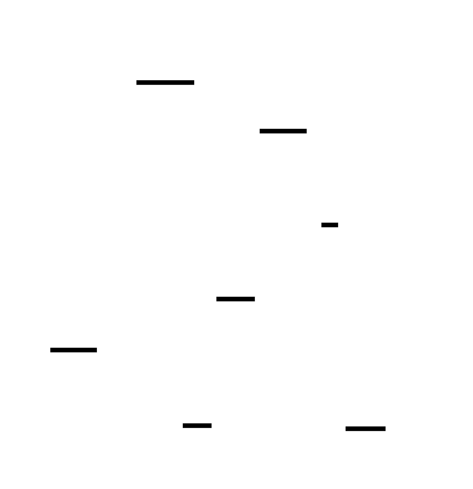
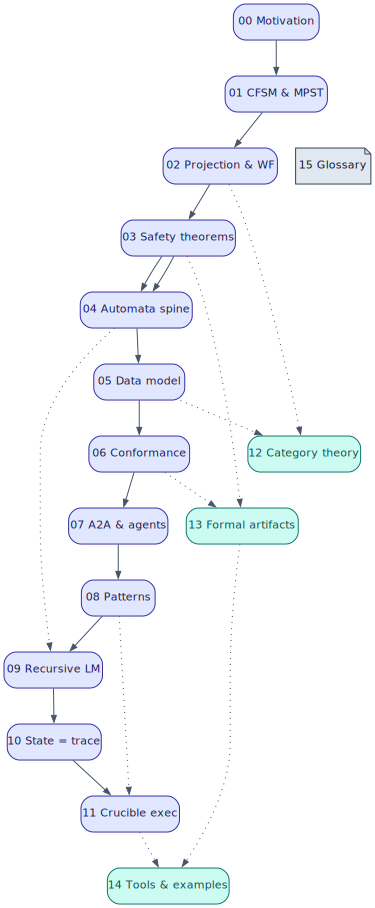

# The Communicating State Machine (CSM) — a reconstruct-from-scratch design record

> **One sentence.** A multi-agent coordination protocol is a **type**; each agent is
> that type's **projection** onto one role; a run **conforms** iff it is a well-nested
> path accepted by the type's **visibly-pushdown automaton** — so agent-to-agent
> coordination becomes statically checkable, model-checked, replayable, and
> pause/resume-recoverable, and **the recorded trace *is* the position**.

This directory is the authoritative, pedagogical, from-scratch design record for the
**CSM subsystem** of pgmcp and for how the **crucible** agent platform uses it to
execute plans. The **code is the source of truth** (the `src/csm/` and `src/a2a/`
crates, the MCP `csm_*`/`a2a_*` tool surface, the migrations, and the machine-checked
`docs/formal/` artifacts); these documents explain *what each component is, what it
does, how it does it, and why it was built that way* — with diagrams, mathematical
prose, literate-programming pseudocode, and citations, following the pgmcp
documentation guidelines (`documentation_guidelines` MCP tool / `src/docguidelines/`).

> **A note on the name.** The code and ADRs call this the **Communicating** State
> Machine (CSM) — a network of *Communicating Finite-State Machines* (CFSM,
> Brand–Zafiropulo 1983 [7]) in the technical sense. The request that motivated this
> treatise used the phrase *"communicative state machine"*; we treat that as a synonym
> and use the project's term **CSM = Communicating State Machine** throughout, never
> silently switching. (See [00 — Motivation](00-motivation-and-overview.md).)

---

## 1. The gap this fills

pgmcp already reified single-model recursion (the **Recursive Language Model**,
`src/a2a/rlm.rs`) and then *multi-agent coordination* as an explicit transition system.
But until now that knowledge was scattered across three decision records
([ADR-009](../decisions/009-a2a-coordination-state-machines.md) — the CFSM+MPST anchor;
[ADR-028](../decisions/028-category-theoretic-layer.md) — the categorical layer;
[ADR-030](../decisions/030-pushdown-hierarchical-csm.md) — the pushdown lift), the
unusually rich inline Rust module docs, and the formal `*.v`/`*.tla` files. **There was
no single narrative that teaches the whole stack end-to-end** — the theory, the data
model, the mechanism, the consumer — in a teachable order. This treatise is that
narrative; the ADRs remain the decisional records (what was decided and what was
rejected), and these chapters are the *explanation*.

---

## 2. The stack at a glance

The CSM is a layered cake. Each layer is defined precisely in the chapter named beside
it; read top-to-bottom for the systems view, or follow the reading order in §3 for the
pedagogical build-up.

| Layer | What it is | Where (chapter · code) |
|-------|-----------|------------------------|
| **Consumer** | crucible turns a *plan* into a typed protocol, drives it on a fleet, and proves it | [11](11-crucible-plan-execution.md) · `crucible/` + [crucible/docs/csm/](../../../crucible/docs/csm/) |
| **Type layer (MPST)** | `GlobalType` (bird's-eye) → `project` → `LocalType` (one role) | [01](01-cfsm-mpst-foundations.md)–[02](02-projection-and-wellformedness.md) · `src/csm/mpst/` |
| **Automata** | finite-state → **visibly-pushdown** (VPA) → RSM/HSM; the decidable conformance class | [04](04-automata-spine.md) · `src/csm/role.rs` (`StackAction`) |
| **Runtime model** | `LocalMachine` (compiled states + `Call`/`Return` edges); the pushdown `RoleConfig` | [05](05-data-model-and-compiled-machines.md) · `src/csm/machine.rs` |
| **Conformance** | lift a run to a `Trace`; replay it; accept iff well-nested + terminal | [06](06-conformance-and-the-observer.md) · `src/csm/conformance.rs` |
| **A2A substrate** | the agent registry, the mailbox plane, and the task plane the protocols run on | [07](07-a2a-protocol-and-agent-model.md) · `src/a2a/` |
| **Patterns** | the five RecursiveMAS patterns + 3 more, each a named protocol | [08](08-five-patterns-as-protocols.md) · `src/csm/registry.rs` |
| **Recursion** | the Recursive Language Model: a call stack of frames *is* the pushdown store | [09](09-recursive-language-model.md) · `src/a2a/rlm.rs` |
| **State** | one append-only event log = position + resume + content + audit + control | [10](10-state-is-the-trace.md) · `src/csm/{session_store,trace_store}.rs` |
| **Algebra** | projection is a functor; composition is a monoid; tensor decomposition | [12](12-category-theory-layer.md) · `src/csm/string_diagram.rs` |
| **Proof** | Rocq + TLA⁺ discharge deadlock-freedom, conformance soundness, termination | [13](13-formal-verification-artifacts.md) · `docs/formal/` |
| **Tools** | the 9 `csm_*` MCP tools + worked examples | [14](14-tool-surface-and-worked-examples.md) · `src/mcp/tools/tool_csm_*.rs` |

The **load-bearing operating rule** (ADR-009; [chapter 00](00-motivation-and-overview.md)):
**pi** (the agent runtime) does *all* file work; **pgmcp** is purely analytical /
communicative / verification — it synthesizes, projects, checks, traces, and recommends,
but **never touches a file**.

---

## 3. Reading order

Read top-to-bottom. Each chapter defines its own terms but builds on the ones above it;
the master glossary (§5) is the consolidated index. The headline figures are the
**language-hierarchy** ([04](04-automata-spine.md)) and the **RLM frame stack**
([09](09-recursive-language-model.md)).

| # | Chapter | What it covers |
|---|---------|----------------|
| — | [ADR-009](../decisions/009-a2a-coordination-state-machines.md) · [ADR-030](../decisions/030-pushdown-hierarchical-csm.md) | *Why* coordination is a typed protocol, and the pushdown lift — the decisions + rejected alternatives. |
| 00 | [Motivation & overview](00-motivation-and-overview.md) | The problem (coordination was invisible to inspection); the operating rule; the naming note; the one-picture tour. |
| 01 | [CFSM & MPST foundations](01-cfsm-mpst-foundations.md) | `Role`/`Label`/`Channel`/`Action`/`MessageMedium`; the `GlobalType` and `LocalType` ASTs; the notation. |
| 02 | [Projection & well-formedness](02-projection-and-wellformedness.md) | `G ↾ r`, the `merge` operation, the `ProjectionError`s, and the eight well-formedness rules. |
| 03 | [Safety metatheorems](03-safety-metatheorems.md) | Deadlock-freedom, progress, orphan-freedom *by typing*; the black-box-Text-only law. |
| 04 | [The automata spine](04-automata-spine.md) | DFA → PDA → DPDA → **VPA** → RSM/HSM; the strict language hierarchy; why VPL is the sweet spot. |
| 05 | [Data model & compiled machines](05-data-model-and-compiled-machines.md) | `LocalMachine`, `EdgeKind {Internal, Call, Return}`, `compile_in`, the pushdown `RoleConfig`. |
| 06 | [Conformance & the observer](06-conformance-and-the-observer.md) | `check_step`, ε-closure over call/return, the accept condition, `lift_transcript`. |
| 07 | [The A2A protocol & agent model](07-a2a-protocol-and-agent-model.md) | The mailbox plane vs the task plane; the registry; discovery; the fleet view. |
| 08 | [The patterns as protocols](08-five-patterns-as-protocols.md) | The 5 RecursiveMAS patterns + WorktreeNegotiation / TapePaging / RecursiveCf as `ProtocolId`s. |
| 09 | [The Recursive Language Model](09-recursive-language-model.md) | `run_rlm`, `RlmFrame`, self-call over the loopback, the recursion↔pushdown correspondence. |
| 10 | [All state is the trace](10-state-is-the-trace.md) | "the trace is the position"; sessions, the content tape, tracing, the control plane. |
| 11 | [How crucible executes plans](11-crucible-plan-execution.md) | `csm_synthesize_protocol`, the Critic-gated loop, "verification is structural", the two laws. |
| 12 | [The category-theory layer](12-category-theory-layer.md) | Projection-as-functor; the `then` monoid; string-diagram tensor decomposition. |
| 13 | [Formal-verification artifacts](13-formal-verification-artifacts.md) | What each Rocq `.v` and TLA⁺ `.tla` proves; `csm_protocol_to_tla`; axiom-freedom. |
| 14 | [Tool surface & worked examples](14-tool-surface-and-worked-examples.md) | Per-tool cards for the 9 `csm_*` tools; three end-to-end worked runs. |
| 15 | [Glossary & notation](15-glossary-and-notation.md) | The full pedagogical glossary; the notation table; the master bibliography. |

---

## 4. Status & test coverage

The subsystem is **delivered and tested** (ADR-030 records 101 `src/csm/` unit tests
green; the legacy finite-state protocols are byte-identical under the pushdown lift, a
golden test pins this). The mechanized proofs are axiom-free (`Qed`, `Print Assumptions`
clean), and `docs/formal/scripts/verify.sh` `coqc`s each `.v` standalone.

| Concern | Source-of-truth tests |
|---------|------------------------|
| Type round-trips (adjacent serde, ADR-006) | `src/csm/mpst/{global,local}.rs` (`#[cfg(test)]`) |
| Projection + the external-choice merge | `src/csm/mpst/project.rs` (`merge_combines_receives_from_same_sender`, …) |
| Well-formedness (8 rules) | `src/csm/mpst/wellformed.rs` |
| Closed-vocabulary golden pins (ADR-003) | `src/csm/role.rs` (`stack_action_vocabulary_is_pinned`) |
| Compiler + pushdown conformance | `src/csm/{machine,conformance,transition}.rs`; `recursive_cf` conforms at depths 2–5 |
| Pattern↔protocol mapping + driver | `src/csm/{registry,driver}.rs` |
| Network topology vs the TLA⁺ specs | `src/csm/mod.rs` golden topology tests |
| Deadlock-freedom / conformance soundness / termination | `docs/formal/rocq/Csm{Mpst,Pushdown,DeadlockFreedom,Medium}.v` |
| Pattern + pushdown invariants, model-checked | `docs/formal/tla/{CfsmNetwork,PushdownCsm,VpaConformance,A2a*}.tla` |

---

## 5. Master glossary (short index)

Every term, acronym, and symbol used across the set, defined once. The full pedagogical
glossary with examples is [chapter 15](15-glossary-and-notation.md); this is the index.

| Term | One-line definition | Full treatment |
|------|---------------------|----------------|
| **CSM** | Communicating State Machine — the network-of-CFSMs model of A2A coordination. | [00](00-motivation-and-overview.md) |
| **CFSM** | Communicating Finite-State Machine (Brand–Zafiropulo 1983 [7]): a finite automaton whose alphabet is send/receive over channels. | [01](01-cfsm-mpst-foundations.md) |
| **MPST** | Multiparty Session Types (Honda–Yoshida–Carbone 2008 [4]): a typing discipline for message-passing protocols. | [01](01-cfsm-mpst-foundations.md) |
| **`GlobalType`** | The bird's-eye protocol type `G` — who sends what to whom, in what order. | [01](01-cfsm-mpst-foundations.md) |
| **`LocalType`** | One role's view `G ↾ r`, obtained by projection. | [01](01-cfsm-mpst-foundations.md) |
| **projection** `G ↾ r` | The function deriving a role's local type from the global type. | [02](02-projection-and-wellformedness.md) |
| **`merge`** (`⊓`) | The operation reconciling a bystander's branch continuations (incl. external-choice merge). | [02](02-projection-and-wellformedness.md) |
| **well-formedness** | The static side-conditions making `G` projectable and its projection meaningful. | [02](02-projection-and-wellformedness.md) |
| **DFA / PDA / DPDA / VPA** | Finite / pushdown / deterministic-pushdown / *visibly*-pushdown automata. | [04](04-automata-spine.md) |
| **VPL** | Visibly Pushdown Language (Alur–Madhusudan 2004 [1]): the decidable, closure-complete class CSM targets. | [04](04-automata-spine.md) |
| **RSM / HSM** | Recursive / Hierarchical State Machine — boxes that call each other / composite states. | [04](04-automata-spine.md) |
| **`StackAction`** | `Neutral` / `Push` / `Pop` — the visibly-pushdown stack action a symbol triggers. | [04](04-automata-spine.md) |
| **`MAX_STACK_DEPTH`** | `4096` — the one shared bound (WF, conformance, RLM) that keeps the model finite/decidable. | [04](04-automata-spine.md) |
| **`LocalMachine`** | A role's compiled finite/pushdown automaton: states + `Internal`/`Call`/`Return` edges. | [05](05-data-model-and-compiled-machines.md) |
| **`EdgeKind`** | `Internal` (ordinary comm) / `Call{return_state}` (push) / `Return` (pop). | [05](05-data-model-and-compiled-machines.md) |
| **`RoleConfig`** | A pushdown configuration `(state, stack)` for one role during replay. | [05](05-data-model-and-compiled-machines.md) · [06](06-conformance-and-the-observer.md) |
| **conformance** | The decision: does a recorded run conform to the protocol? (well-nested + terminal + legal). | [06](06-conformance-and-the-observer.md) |
| **`Trace`** | `Vec<Event>` — the recorded sequence of communications, the canonical run record. | [06](06-conformance-and-the-observer.md) |
| **ε-closure** | The chase of `Call`(push)/`Return`(pop) boundary edges between input events. | [06](06-conformance-and-the-observer.md) |
| **A2A** | Agent-to-Agent — the JSON-RPC protocol + mailbox the fleet communicates over. | [07](07-a2a-protocol-and-agent-model.md) |
| **`ProtocolId`** | The enum naming the 8 protocols (5 patterns + WorktreeNegotiation + TapePaging + RecursiveCf). | [08](08-five-patterns-as-protocols.md) |
| **RLM** | Recursive Language Model (Zhang–Kraska–Khattab 2025 [10]): decompose a long query, recurse, stitch. | [09](09-recursive-language-model.md) |
| **`RlmFrame`** | One recursion frame (`depth_remaining`, `budget_remaining`, `environment`); the stack of them is the pushdown store. | [09](09-recursive-language-model.md) |
| **MessageMedium** | `Text` (black-box-legal) or `Latent` (hidden-state, white-box only). | [01](01-cfsm-mpst-foundations.md) · [03](03-safety-metatheorems.md) |
| **black-box law** | A black-box role may appear only on `Text` edges; a `Latent` edge is a `ProjectionError`. | [03](03-safety-metatheorems.md) |
| **"the trace is the position"** | Per-role state = `replay(trace)`; nothing else need be checkpointed. | [10](10-state-is-the-trace.md) |
| **Critic-gated loop** | A recursion whose only exit runs through a Critic's `pass` branch ⇒ verification is structural. | [11](11-crucible-plan-execution.md) |

**Symbols** (always in backticks): `G` global type · `L` / `G ↾ r` local type / projection ·
`!to⟨ℓ⟩` send · `?from⟨ℓ⟩` receive · `⊕` internal choice (select) · `&` external choice (branch) ·
`μ var.` recursion binder · `Σ_int`/`Σ_call`/`Σ_ret` internal/call/return alphabet · `⊓` merge ·
`⊊` proper subset · `;` sequential composition (`then`) · `⊗` monoidal tensor · `ε` empty/silent move.

---

## 6. Diagrams: toolchain & palette

All diagrams are rendered to committed SVGs by [`diagrams/render.sh`](diagrams/render.sh)
from sources in [`diagrams/src/`](diagrams/src/), using tools cataloged in
[`docs/reference/diagramming-tools.md`](../reference/diagramming-tools.md). **PlantUML is
preferred** (sequence / state / activity / class); **Graphviz** renders ASTs, trees, and
traceability graphs; **D2** renders nested-container architecture; **TikZ** renders math,
nested sets, stack-frame evolution, and string diagrams. **Mermaid is deliberately not
used.** To regenerate: `cd diagrams && ./render.sh`.

The **pinned palette** (one concept = one colour) is shared by every diagram:

| Concept | Colour | Hex | Concept | Colour | Hex |
|---------|--------|-----|---------|--------|-----|
| Role / participant | indigo | `#4f46e5` | Medium: Text | green | `#16a34a` |
| Send · ⊕ | emerald | `#059669` | Medium: Latent | amber | `#d97706` |
| Recv · & | sky | `#0284c7` | GlobalType | indigo-deep | `#3730a3` |
| Push · Call (Σ_call) | violet | `#7c3aed` | LocalMachine | teal | `#0d9488` |
| Pop · Return (Σ_ret) | fuchsia | `#c026d3` | Conformance accept | green | `#16a34a` |
| Internal (Σ_int) | slate | `#475569` | Conformance reject | red | `#dc2626` |
| Critic gate / verify | gold | `#ca8a04` | Mailbox plane | cyan | `#0891b2` |
| RLM frame / stack | violet | `#7c3aed` | Task plane | orange | `#ea580c` |
| pi (file work) | green | `#16a34a` | pgmcp (analytical) | indigo | `#4f46e5` |

---

## 7. Source-of-truth file manifest

**Type layer (`src/csm/mpst/`):** `global.rs` (`GlobalType`, `ProtocolEnv`, `then`),
`local.rs` (`LocalType`), `project.rs` (`project`, `merge`), `wellformed.rs` (8 WF rules).
**CFSM vocabulary:** `src/csm/role.rs` (`Role`, `Label`, `MessageMedium`, `Channel`,
`Action`, `StackAction`, `MAX_STACK_DEPTH`).
**Machines & conformance:** `src/csm/{machine,transition,conformance,driver}.rs`.
**Catalog & examples:** `src/csm/{registry,examples,media,string_diagram,tla_export,inference,trajectory,validate}.rs`, `src/csm/mod.rs` (golden tests).
**State:** `src/csm/{store,session_store,trace_store}.rs`.
**A2A & RLM (`src/a2a/`):** `types.rs`, `dispatcher.rs`, `rlm.rs`, `recursion.rs`,
`mailbox.rs`, `mailbox_store.rs`, `best_practices.rs`, `client.rs`, `server.rs`, `sse.rs`.
**Tool surface (`src/mcp/`):** `tools/tool_csm_*.rs`, `tools/tool_protocol_soundness.rs`,
`tools/tool_a2a_*.rs`, `params/a2a_csm.rs`, `server/handlers/{csm,a2a}.rs`.
**Schema (`src/db/migrations/`):** `v8_csm_protocols.rs`, `v50_orchestration_sessions.rs`,
`v54_csm_pushdown.rs`, `v60_crucible_trace.rs`.
**Formal (`docs/formal/`):** `rocq/Csm{Mpst,Pushdown,DeadlockFreedom,Medium}.v`,
`tla/{CfsmNetwork,PushdownCsm,VpaConformance,RmasRecursionLoop,A2aSequential,A2aMixture,A2aDistillation,A2aRecursiveRlm,WorktreeNegotiation}.tla`.
**Decisions:** `docs/decisions/{009,028,030,003,006}-*.md`.

---

## 8. References

DOIs verified against Crossref; arXiv IDs against the live arXiv. Each chapter cites the
subset it uses, at the point of use.

1. R. Alur, P. Madhusudan. "Visibly pushdown languages." *STOC '04*, 2004. [doi:10.1145/1007352.1007390](https://doi.org/10.1145/1007352.1007390)
2. R. Alur, M. Benedikt, K. Etessami, P. Godefroid, T. Reps, M. Yannakakis. "Analysis of recursive state machines." *ACM TOPLAS*, 27(4), 2005. [doi:10.1145/1075382.1075387](https://doi.org/10.1145/1075382.1075387)
3. D. Harel. "Statecharts: a visual formalism for complex systems." *Sci. Comput. Program.*, 8(3), 1987. [doi:10.1016/0167-6423(87)90035-9](https://doi.org/10.1016/0167-6423(87)90035-9)
4. K. Honda, N. Yoshida, M. Carbone. "Multiparty asynchronous session types." *POPL '08*, 2008. [doi:10.1145/1328438.1328472](https://doi.org/10.1145/1328438.1328472)
5. K. Honda, N. Yoshida, M. Carbone. "Multiparty asynchronous session types." *Journal of the ACM*, 63(1):9, 2016. [doi:10.1145/2827695](https://doi.org/10.1145/2827695)
6. A. Scalas, N. Yoshida. "Less is more: multiparty session types revisited." *POPL '19*, 2019. [doi:10.1145/3290343](https://doi.org/10.1145/3290343)
7. D. Brand, P. Zafiropulo. "On communicating finite-state machines." *Journal of the ACM*, 30(2), 1983. [doi:10.1145/322374.322380](https://doi.org/10.1145/322374.322380)
8. P. Thiemann, V. T. Vasconcelos. "Context-free session types." *ICFP '16*, 2016. [doi:10.1145/2951913.2951926](https://doi.org/10.1145/2951913.2951926)
9. A. Das, H. DeYoung, A. Mordido, F. Pfenning. "Nested session types." *ESOP 2021*. [doi:10.1007/978-3-030-72019-3_7](https://doi.org/10.1007/978-3-030-72019-3_7)
10. A. L. Zhang, T. Kraska, O. Khattab. "Recursive Language Models." arXiv:2512.24601, 2025. <https://arxiv.org/abs/2512.24601>
11. Yang et al. "Recursive Multi-Agent Systems." arXiv:2604.25917, 2026. (the RecursiveMAS collaboration patterns the five A2A patterns implement)
12. L. Caires, F. Pfenning. "Session types as intuitionistic linear propositions." *CONCUR 2010*. [doi:10.1007/978-3-642-15375-4_16](https://doi.org/10.1007/978-3-642-15375-4_16)
13. P. Wadler. "Propositions as sessions." *ICFP '12*, 2012. [doi:10.1145/2364527.2364568](https://doi.org/10.1145/2364527.2364568)
14. D. Angluin. "Learning regular sets from queries and counterexamples." *Information and Computation*, 75(2), 1987. [doi:10.1016/0890-5401(87)90052-6](https://doi.org/10.1016/0890-5401(87)90052-6)
15. L. Lamport. "Time, clocks, and the ordering of events in a distributed system." *CACM*, 21(7), 1978. [doi:10.1145/359545.359563](https://doi.org/10.1145/359545.359563)

---

*Each chapter ends with a "Back to [README](README.md)" footer. Start at
[00 — Motivation & overview](00-motivation-and-overview.md).*
