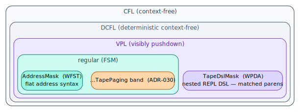

# ADR-033 — Context-tape infinite session for RLMs (the window is a cache, the corpus is the address space)

**Status:** Accepted — the data-plane `context-tape` crate, the `pgmcp/src/tape/` control plane, the nine black-box-legal verbs + the white-box `tape_repl`, and the frozen `crucible-context-tape-3x3x5` pre-registration are implemented and tested (engine policy proptests, DB-backed clock/atomicity/round-trip tests, the REPL trust-boundary suite, and the vocabulary golden pins are green). The 3×3×5 *execution* is dataset-gated. · **Date:** 2026-06-22

**Relates to:** ADR-003 (closed-vocabulary idiom — `PageState`/`EvictionPolicy`/`EvictReason`/`PageKind`), ADR-009 (A2A coordination state machines — "the trace *is* the position", here the *content* plane to its *position* plane), ADR-021 (logging discipline — by-design `warn!` vs `error!`), ADR-030 (pushdown/hierarchical CSM — its language-class lattice, which already lists `TapePaging` in the regular band), ADR-032 (native FV / the `lling-llang` symbolic core the addressing masks are a ground instance of). Modules: the sibling `context-tape` crate (`address`/`page`/`store`/`ooc`/`index`/`repl`), `src/tape/` (`engine`/`working_set`/`store`/`data_plane`/`real_data_plane`/`registry`/`hydrate`/`prefetch`/`address_resolve`/`repl_host`/`vocab`), `src/mcp/{params,tools,server/handlers}/…tape…`, `src/a2a/rlm.rs`, `src/experiment/context_tape.rs`, migrations `v51_working_set` / `v53_working_set_bytes`. **Full design:** [`docs/context-tape/`](../context-tape/README.md).

## Context

> *How does a Recursive Language Model answer a query whose evidence — and whose answer — vastly exceeds any single context window, deterministically enough that a paused run resumes exactly and a measurement is reproducible?*

A Recursive Language Model (`RLM`; Zhang–Kraska–Khattab, arXiv:2512.24601) treats the
corpus as an *external environment*, decomposes a query, recursively sub-calls a peer
model over each snippet, and stitches the partials — never inlining the full context.
That paradigm needs a substrate that (a) gives a sub-call **random access** to any slice
of the corpus, (b) gives the recursion a **shared, writable working memory** so output
can grow without bound, and (c) is **deterministic** so a pause/resume is bit-identical.
pgmcp had no such substrate: it could retrieve (top-`k` semantic, grep), but it could not
*page* — no residency budget, no eviction, no durable replayable working set, no
recursion-shared accumulator.

The terms used below, defined before use:

| Symbol / term | Definition |
|---|---|
| **page** | The unit of paging: a situated chunk / observation / summary the model sees. |
| **working set** | The multiset of pages resident for one `(session, cursor)` under the token **budget** `B`. |
| **residency** | Whether a page is resident; decided **mechanically** from `(budget, policy, logical-clock)`, never agent judgment. |
| **logical clock** | A per-session monotonic counter (`working_set_config.logical_clock`); every `last_access_ord` snapshots it. **Never wall-time.** |
| **eviction policy** | The victim-selection rule under budget pressure (`importance_weighted` default; `lru`/`lfu`/`ttl`/`fifo`/`cost_aware`). |
| **demotion ladder** | On eviction, page in a compact `SummaryNode` standing in for the evicted leaf (the compressed-swap analogue). |
| **OOC overlay** | The out-of-core tier: cold **clean** pages spill to mmap'd segments, served with no DB round-trip. |
| **situate** | Prepend the deterministic `build_context_prefix` header to a corpus chunk, so a paged-in page reads like its embedding-time form. |
| **tree** | The recursion-tree scope (`TreeId == RlmFrame.root_task_id`); one tape per tree, `Scratch` pages tree-local. |
| **black-/white-box** | A caller with no hidden state (Claude/Codex) vs a local backbone; only white-box may run `tape_repl`. |

This ADR's two constrained-decoding masks slot into the very language-class lattice
ADR-030 introduced — the flat `AddressMask` is **regular** (a WFST), the nested
`TapeDslMask` is a **VPL** (a WPDA, matched parens = visible call/return):

## Decision

Implement the infinite RLM session as a **logical-clock virtual-memory paging tape**
across three planes — *the window is a cache; the corpus is the address space.*

1. **A data-plane crate (`context-tape`).** The tape itself: `PageAddress` (a uniform
   handle with an order-preserving key, a human path, and a graph `node_id`), `Page`, the
   `TapeStore` hot tier (a `PathMap` trie + dirty model + the addressing-index portfolio),
   the OOC overlay, and checkpoint/restore. CPU-only, no pgmcp dependency.
2. **A control plane (`pgmcp/src/tape/`).** The *mechanical residency decision*: the
   `PagingEngine` (`page_in` / `evict_to_fit` / the demotion ladder / `admit_scratch`), the
   `WorkingSet` + logical clock, the read-only hydration bridge, the per-tree registry, and
   durable persistence to two tables.
3. **A verb surface.** Nine black-box-legal verbs (`tape_get/put/peek/slice/grep/fuzzy/semantic/list/stat`),
   the white-box `tape_repl`, and `experiment_preregister_context_tape`.

**The keystone constraint:** `last_access_ord` is a *logical* clock value, not wall-time.
Residency is therefore a deterministic function of the replayed trace, so a paused session
reconstructs a bit-identical working set — and `bump_clock` (an atomic relative increment
`RETURNING`) is the *sole* clock authority, so a config flush can never regress it.

**The RLM tie-in:** one tape per recursion tree, with a shared *accumulating* `Store`
(`accum/<parent>/…` scratch pages folded in bounded windows) that makes output unbounded;
the tree id is bound from the *trusted* frame, never caller JSON, so a recursion cannot
reach a sibling's memory.

## Alternatives rejected

| Alternative | Why rejected |
|---|---|
| **Inline the whole prompt / rely on long-context models** | Does not scale to an unbounded corpus, costs quadratically in attention, and yields no *durable, replayable* residency. It is the experiment's **baseline** arm, against which the tape must show ≥ 2× max-context. |
| **Flat RAG retrieval, no residency or write-back** | Re-fetches per sub-call, has no shared writable memory (so output is bounded), and no eviction/budget — it is the **control** arm (RLM, no tape). The tape adds the paging + Store that control lacks. |
| **Wall-clock LRU/CLOCK cache** | Breaks replay determinism: residency would depend on replay speed, so resume would be merely *equivalent*, not bit-identical, and the pre-registration would be irreproducible. The policies use a **logical** clock; `Lru`/`Ttl`/`Fifo` were de-wrappered from a wall-clock library precisely for this. |
| **Add `indexmap` for the insertion-ordered working set** | This phase adds **no new external crate**. `OrderedPages` (HashMap + Vec + tombstones) gives the two operations the engine needs without a dependency. |
| **Store `Page` values in a single PathMap serialization for OOC** | PathMap's `ArenaCompactTree` stores one `u64` per path and `serialize_paths` is value-less, so neither alone holds a `Page`. A spill segment is therefore the `.act`/`.vals`/`.paths` triple, with bytes in the `.vals` sidecar. |
| **Let an agent pin/evict pages, or self-assert a verified experiment decision** | Residency is mechanical, never agent judgment (no agent-assertable `pinned`); a decision is "verified" only when the *server* computes the frozen criterion — mirroring the tracker's missing `Agent` arm into `verified`. |

## Consequences

- **Unbounded effective context + output with a finite window.** The Orchestrator
  decomposes, sub-calls page their slices, and the stitch accumulates into the shared
  `Store`, so no single prompt holds the whole set.
- **Exact, durable resume.** Content rides alongside ADR-009's position; a paused session
  rehydrates a bit-identical working set (logical clock). Crash recovery is WAL + the v53
  cascade trigger + replay.
- **The boundary is unchanged.** Corpus READ-ONLY; the nine verbs are analytical (no
  shell/exec, never write user files); `tape_repl` is a deny-by-default rhai sandbox
  admitted only for a white-box caller + an open experiment; write-back promotion is
  doubly gated and OFF by default.
- **The win is conditional, not assumed.** Until `experiment_preregister_context_tape`
  decides positive (with real datasets + models), the tape is available infrastructure,
  not a proven improvement.
- **Costs (honest).** A per-tree store has a RAM + reaper cost (`drop_tree` at the root,
  the TTL reaper for orphans); the human-path region axis is total only over non-negative
  chunk indices (the positional key axis is total over all `i64`); `tape_semantic` depends
  on embeddings being backfilled.

## Verification

- **Unit/property:** the six policies + the token/budget/pinned invariants
  (`engine.rs`, a 400-case proptest); the address round-trips + order-preserving encoding
  (`address.rs`); the bridge round-trip (`address_resolve.rs`); the REPL sandbox
  (`rhai_engine.rs`: no `eval`, op/page/byte budgets, corpus-write refused) and the
  admission gate (`repl_host.rs`, exhaustive); the closed-vocabulary golden pins
  (`vocab.rs`, `context_tape.rs`).
- **DB-backed:** clock atomicity + `save_config` non-regression, the all-or-nothing atomic
  flush, and the scratch byte persist→load→rehydrate round-trip (`store.rs`); plus the
  `pgmcp-testing` tape suites (`tape_verbs`, `tape_paging_lifecycle`,
  `tape_hydration_bridge`, `tape_resume_lifecycle`, `tape_repl_lifecycle`,
  `repl_host_trust_boundary`, `context_tape_preregister`).
- **Empirical gate:** the frozen `crucible-context-tape-3x3x5` pre-registration is the
  accept/reject rule; its execution is dataset-gated (Oolong / BrowseComp-Plus / LongBench
  v2 + live models) and fabricates no measurement.

## References

1. A. L. Zhang, T. Kraska, O. Khattab. *Recursive Language Models.* arXiv:2512.24601, 2025.
2. P. J. Denning. *The working set model for program behavior.* CACM 1968. [doi:10.1145/363095.363141](https://doi.org/10.1145/363095.363141)
3. L. A. Belády. *A study of replacement algorithms for a virtual-storage computer.* IBM Systems Journal 1966. [doi:10.1147/sj.52.0078](https://doi.org/10.1147/sj.52.0078)
4. L. Lamport. *Time, clocks, and the ordering of events in a distributed system.* CACM 1978. [doi:10.1145/359545.359563](https://doi.org/10.1145/359545.359563)
5. R. Alur, P. Madhusudan. *Visibly pushdown languages.* STOC 2004. [doi:10.1145/1007352.1007390](https://doi.org/10.1145/1007352.1007390)

*The complete reconstruct-from-scratch design — theory, architecture, addressing, data
plane, index, engine, determinism, schema, verbs, security, RLM/experiment, and the
weighted-automata layer — is [`docs/context-tape/`](../context-tape/README.md).*
