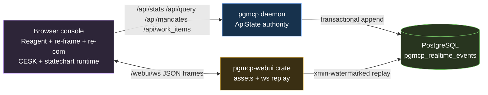

# 034. Web UI Admin Console Architecture

- Status: Accepted
- Date: 2026-07-02
- Scope: `webui/`, `/webui`, `/webui/ws`, `/api/stats`, `/api/query`, `/api/mandates`, `/api/work_items`

## Context

pgmcp needs a local operator console for daemon health, realtime events, mandates,
search, and work tracking. The prior plan selected a research-grade frontend
control plane: a CESK machine on re-frame, an authored hierarchical statechart, a
pushdown navigation stack, effects as data, bounded stores, and resumable
realtime over a transactional PostgreSQL event log. The browser application is a
React application written in ClojureScript with Reagent, re-frame, and re-com.

`vinary-viewer` was reviewed because it was inspired by the same web UI plan. It
proved a useful outer discipline: one mediator boundary, explicit events and
effects, separate state ownership for UI/domain/cache data, and bounded live
refresh. That discipline is complementary. It does not replace the planned
CESK/statechart architecture.

Terms:

| Term | Meaning |
|------|---------|
| CESK | Control, Environment, Store, Kontinuation. Here, control is the current event, environment is effect adapters and immutable runtime inputs, store is UI/domain/ring state, and continuation is the navigation stack. |
| Statechart | A finite-state control model extended with hierarchy and orthogonal regions, following Harel's statechart idea. |
| Reagent | The ClojureScript interface to React used for the component tree. |
| re-frame | The ClojureScript event/effect/subscription architecture that owns `app-db` and dispatch. |
| re-com | The Reagent component library used for application controls and layout primitives. |
| Mediator | A single audited boundary between browser code and daemon APIs. |
| LWW | Last-writer-wins by monotonic server sequence number. |
| XID watermark | A PostgreSQL transaction-id visibility guard; websocket replay reads only event rows whose inserting transaction is older than the current snapshot xmin. |

## Decision

Use a layered architecture:

1. The root daemon remains the authority for privileged work. It owns embedding,
   fuzzy indexes, MCP tool twins, token-gated mutations, and the primary write
   pool.
2. The `pgmcp-webui` crate is CUDA-free. It serves static assets and the
   websocket replay endpoint, and may use a read-only PostgreSQL URL when
   configured.
3. The browser runtime is a Reagent/re-frame/re-com React application. It keeps
   the planned CESK/statechart shape, and the authored statechart remains the
   semantic transition authority. Re-frame is the reactive transport: it owns
   events, effects, subscriptions, and `app-db`, but it must not become a second
   semantic state machine.
4. `vinary-viewer` contributes only adapter discipline: a mediator boundary,
   effects at the edge, and separate state ownership. It is not an alternative to
   the formal control plane.

## Vinary-viewer Review

`vinary-viewer` was reviewed from these local architecture sources:

| Source | Relevant finding | pgmcp decision |
|--------|------------------|----------------|
| `vinary-viewer/docs/theory/01-reactive-architecture.md` | The renderer follows `view = f(state)`: plain events enter re-frame, handlers return new state plus effects, subscriptions derive view data, and Reagent renders from subscriptions. | Adopt the same reactive loop, but route semantic events through `pgmcp.webui.machine/run` so re-frame is transport rather than the semantic authority. |
| `vinary-viewer/docs/architecture/01-overview.md` | The Electron renderer has one `window.vv` preload mediator to privileged main-process IO, and state ownership is split between `app-db`, DataScript content cache, and main-process OS resources. | Adopt the single audited boundary idea as closed REST endpoints plus `/webui/ws`; keep browser state in a serializable CESK store and keep websocket handles outside `app-db`. |
| `vinary-viewer/docs/design-decisions/0010-bounded-content-retention-and-render-metadata.md` | Live-refresh memory is bounded by tab-history reachability; watcher cleanup and content-cache retraction are driven by one retained-file ownership set. | Adopt the bounded-ownership discipline as event rings, reject rings, request ledgers, per-topic watermarks, and replay cursors; pgmcp does not need a DataScript document cache because it is an operator console, not a document previewer. |

The reviewed architecture has real benefits for pgmcp:

- One mediated edge for privileged or effectful work.
- Explicit event/effect boundaries.
- Separate ownership for UI state, domain facts, and runtime resources.
- Bounded retention rather than unbounded live-refresh accumulation.
- Reactive rendering from subscriptions rather than imperative UI mutation.

Those benefits are included. What is not adopted is `vinary-viewer` as a
replacement control model. It lacks several benefits the pgmcp plan explicitly
requires:

| Required pgmcp benefit | Why the CESK/statechart remains necessary |
|------------------------|-------------------------------------------|
| Authored valid transition model | The statechart declares allowed states and transitions before state is committed. |
| Orthogonal control regions | View, connection, activity, query, mandates, work, and events progress independently but within one machine step. |
| Pushdown navigation | `K` records view continuation history so navigation is modeled, testable state rather than incidental UI state. |
| Current-request guards | Dynamic targets are resolved from the pre-event snapshot, so stale REST completions cannot overwrite newer query or mandate results. |
| Observable totality | Unknown or invalid events enter a bounded reject ring instead of being silently ignored. |
| Replay/debug serializability | The machine under re-frame `app-db` is plain data, so tests, browser inspection, and replay can inspect the same state shape. |

Therefore the relationship is compositional: `vinary-viewer` provides adapter and
ownership discipline, while the pgmcp CESK/statechart provides the formal control
semantics. No planned CESK/statechart benefit is intentionally traded away.

## Architecture



The browser application is composed as:

```text
Reagent/re-com component event
  -> re-frame dispatch vector
  -> CESK/statechart machine step
  -> re-frame app-db commit
  -> effects-as-data interpreted by re-frame fx handlers
  -> server response/websocket frame re-enters dispatch
```

The browser machine is:

```text
event
  -> C = current event
  -> E = effect adapters and runtime inputs
  -> S = {control, ui, domain, rings}
  -> K = pushdown navigation stack
  -> MODEL-declared statechart transition
  -> {S', K', effects-as-data}
  -> effect interpreter at the edge
```

The CESK machine is stored under re-frame `app-db` as serializable data. Runtime
handles such as websocket objects remain outside the machine store in the edge
effect namespace.

## Frontend Module Boundaries

The ClojureScript runtime is split by responsibility:

| Namespace | Responsibility |
|-----------|----------------|
| `pgmcp.webui.schema` | Closed topic set, event names, constants, and validation predicates. |
| `pgmcp.webui.model` | Initial CESK machine and authored statechart model. |
| `pgmcp.webui.machine` | Pure transition engine: `step`, `run`, target resolution, bounded rejects. |
| `pgmcp.webui.domain` | Pure store helpers for rings, topic watermarks, query rows, and mandates. |
| `pgmcp.webui.events` | re-frame event handlers; semantic events route through the machine. |
| `pgmcp.webui.fx` | re-frame effect interpreters for REST, websocket, localStorage, and edge hooks. |
| `pgmcp.webui.subs` | re-frame subscriptions for derived view data. |
| `pgmcp.webui.views.*` | Reagent/re-com components for shell, overview, query, events, mandates, and work. |
| `pgmcp.webui.core` | Bootstraps re-frame and mounts the Reagent root. |

Application rendering must not be implemented with `innerHTML`, string-built
HTML, or manually registered DOM listeners. The only DOM interaction allowed in
`core` is mounting the React root. Edge hooks such as websocket callbacks,
keyboard shortcuts, and localStorage access live behind re-frame effects and
dispatch back into the normal event path.

The browser statechart has ten orthogonal regions:

| Region | Current role |
|--------|--------------|
| `view` | `overview`, `query`, `events`, `mandates`, `work`; `Alt+Left` pops `K`. |
| `connection` | `idle`, `connecting`, `live`, `closed`, `error`. |
| `activity` | `ready`, `loading` as a derived aggregate over the bounded request ledger. |
| `query` | `editing`, `submitted`, `loaded`, `failed`; current-request guards prevent stale completions from overwriting newer results or moving the region. |
| `mandates` | `idle`, `loading`, `loaded`, `failed`; scoped independently from query and stats reads. |
| `work` | `idle`, `loading`, `loaded`, `failed`; read-only tracker smart views preserve work tracking without exposing a broad browser-side MCP or SQL client. |
| `resources` | `idle`, `loading`, `loaded`, `failed`; the htop/glances Resources pane's fetch lifecycle over the gated `/api/resources` read (per-core CPU, system memory, GPU via NVML, and pgmcp's own RSS / worker-pool / DB-pool consumption), auto-loaded on mount with the same current-request guard as query/mandates/work. |
| `panel` | `idle`, `loading`, `loaded`, `failed`; a generic fetch-and-render lifecycle shared by the mutually-exclusive read panes (metrics, clients, database, logs, experiments). One region tracks the active panel; staleness is guarded per panel by the request ledger keyed on `[:panels id]`, so a stale completion for one panel cannot overwrite another. |
| `events` | `streaming`, `paused`; pause/resume is a formal statechart transition, with bounded queued frames drained on resume. |
| `session` | `unknown`, `authenticating`, `authorized`, `unauthorized`; validates the `[webui]` token against a gated read before loading data and drives the login overlay. A `401` on any gated request returns the region to `unauthorized`. Auth state is a formal region, not an ad-hoc UI boolean. |

Undefined events are rejected into a bounded ring rather than ignored or thrown.
This keeps `step` total and observable.

Dynamic transition targets are resolved from the pre-event machine snapshot, not
from the progressively mutated state of earlier orthogonal regions. That rule is
important for current-request guards: settling a request in one action cannot
change whether another region was allowed to transition for the same event.

## Realtime Semantics

The server appends compact event rows:

```text
pgmcp_realtime_events(seq, ins_xid, topic, entity_kind, entity_id, op, payload, created_at)
```

The websocket reader returns rows where:

```text
seq > client_cursor
AND ins_xid < pg_snapshot_xmin(pg_current_snapshot())
```

This avoids advancing a client past an uncommitted lower sequence number. The
browser applies frames only when `seq > appliedSeq`, so duplicate replay is
idempotent. Entity caches built on this log must store per-entity sequence
numbers and seq-stamped logical delete tombstones rather than retracting
referenced entities.

## Operational Bounds

The web UI exposes only controls that the daemon enforces:

| Config key | Enforcement point |
|------------|-------------------|
| `heartbeat_secs` | Websocket idle heartbeat interval. |
| `replay_page` | Maximum PostgreSQL event rows returned per replay poll. |
| `max_msgs_per_sec` | Per-connection inbound websocket message budget. |
| `max_connections` | Process-local active websocket connection cap. |
| `handshake_rate_per_min` | Process-local websocket upgrade rate budget. |

The implementation deliberately does not expose inert development, broadcast,
query-rate, or retention knobs. REST query limits stay with the closed REST
handlers, and realtime cleanup is owned by the database/cron layer rather than
the websocket runtime.

## Algorithm

Literate pseudocode for one machine step:

```text
function step(machine, event):
  C := event
  matched := false
  effects := []

  for each orthogonal region r in MODEL:
    transition := MODEL[r].states[S.control[r]].on[event.type]
    if transition exists:
      target := resolve(transition.target, event)
      if target is invalid:
        append bounded reject
      else:
        S.control[r] := target
        for action in transition.actions:
          {S, K, effects} := apply(action, S, K, E, event, effects)
      matched := true

  if MODEL.handlers[event.type] exists:
    run its actions
    matched := true

  if not matched:
    append bounded reject

  return {S, K, effects}
```

## Build Boundary

The CLJS source is compiled with:

```bash
./scripts/build-webui-cljs.sh
```

That script runs the scoped `webui` Shadow CLJS release build and copies the
compiled module to `webui/resources/app.js`. The Rust web UI crate embeds only
`webui/resources/app.js`, `webui/resources/app.css`, and
`webui/resources/index.html`, so release binaries do not need Node.js or a CLJS
toolchain at runtime.

The active correction plan is
`docs/design/webui-reframe-correction-plan.md`. It is the implementation
checklist for the Reagent/re-frame/re-com rewrite and defines the acceptance
criteria for replacing any direct-DOM prototype code.

## Admin-console expansion (2026-07)

The original console was five read-only panes (overview, query, events, mandates,
work) over a deliberately closed four-endpoint REST surface. The overhaul turns
it into a full workspace + database management console. The CESK/statechart +
re-frame + re-com control plane is unchanged and remains authoritative; the
expansion is a **presentation-layer build + a curated surface expansion**, not a
new control model.

### Root cause corrected — a presentation layer

The prototype rendered every payload as a `JSON.stringify` `<pre>` dump because
the original acceptance criteria were 100% architectural (state ownership,
effect-as-data, bounded rings) and asked for no table, chart, formatted number,
Markdown, or highlighting. The overhaul adds that missing layer: purpose-built
`widgets` (stat tiles, typed `data-table`, kv-grid, status chips, meters,
sections), hand-authored SVG charts (`viz` + `widgets/chart`, no charting
library), rendered Markdown, tree-sitter code highlighting, and an embedded
editor. **New acceptance criterion:** no pane's default view is a raw
`<pre>`-JSON dump; a raw-JSON toggle is permitted only as a non-default escape
hatch (`smoke-webui-render.py` enforces this).

### Rendering toolkit — hiccup everywhere, no `innerHTML`

The strict no-`innerHTML` / no-string-HTML gate is **kept intact**; every rich
renderer emits hiccup:

- **Markdown (GFM):** unified → remark-parse → remark-gfm → remark-rehype →
  rehype-slug, then a pure `render/hast->hiccup` walker with a tag/attr
  allow-list (no `rehype-raw`; embedded raw HTML is dropped, XSS-safe).
- **Code highlighting:** `web-tree-sitter` parses; a highlights query yields
  capture spans; `render/spans->hiccup` emits `[:span.cm-* …]`. Grammars are
  vendored under `webui/resources/grammars/` and embedded by `webui/build.rs`
  into the binary (served at `/webui/grammars/…`).
- **Editing:** lightning-bug (CodeMirror 6 + tree-sitter) is embedded as a React
  component; it manages its own DOM internally (in `node_modules`, not our
  code), and all non-serializable handles (workspace, EditorRef, rxjs
  subscription) live in `fx`.

This is why we do **not** adopt vinary-viewer's `innerHTML` ADR-0003 exception:
an operator console renders bounded payloads, so we pay the cheap VDOM cost and
keep the gate maximally meaningful. The only CSP relaxation is
`script-src 'self' 'wasm-unsafe-eval'` (WebAssembly instantiation for
tree-sitter/CodeMirror; it does not permit JS `eval`). The release build is
`:simple` (not `:advanced`) because advanced property-renaming breaks the
unified/remark, web-tree-sitter, and CodeMirror interop — the shared baseline
with vinary-viewer and lightning-bug.

### Curated surface expansion — still not a broad SQL/MCP client

The console cannot become a broad SQL or MCP client (see Consequences). The new
capabilities are delivered as **curated, server-defined** endpoints on the
daemon's `webui_api` sub-router, all behind the token+origin auth middleware
(`src/api/auth.rs`): `GET /api/resources` (per-core CPU / memory / NVML GPU /
pgmcp worker-pool telemetry from an O(1) sampler), `GET /api/metrics`
(time-bucketed tool-call / cron / quality series), `GET /api/db/{tables,rows}`
(an **allow-listed** table browser — every table/column/filter/op validated
against a static registry, values bound as params; never arbitrary SQL),
`GET /api/logs/{tail,grep}` (bounded log tail + liblevenshtein fuzzy grep),
`GET /api/experiments…` (scientific ledgers, reusing the committed ledger
renderer), and token-gated audited operator writes (Phase E). Reads use the
daemon pool with read-only SQL; the `[webui] ro_database_url` pool remains the
websocket realtime-reader's least-privilege boundary. Audited mutations run on
the daemon (write) pool and each write one `webui_audit_log` row (v66) + one
realtime event in the same transaction as the domain change.

### Realtime producers — the P0 fix

`append_realtime_event` was defined but never called, so the event log was always
empty. The `src/realtime/` seam (closed-vocab `Topic`/`Op` enums pinned to the
v64 CHECK by golden tests, typed per-topic `RealtimeEvent` builders, and an
in-transaction `append_realtime_event_tx` sink that binds the row to the
mutation's xact so the xid-watermark makes it visible iff/when the mutation
commits) is now emitted from the mutating paths (tracker / mandate / cron /
index / client / scanner / control / trace / task / status). ADR-021 posture:
in-transaction emits propagate (a lost event on a committed mutation would
desync the feed); own-transaction emits are caught → `error!`.

### Authentication

All webui-consumed `/api/*` routes are gated by the same `[webui] token` +
origin allow-list as the websocket (`src/api/auth.rs`, applied as a `route_layer`
on the `webui_api` sub-router). An unset token is a pass-through (loopback-trust
posture, unchanged for existing installs). Producer/CI/A2A routes keep their own
credentials and are deliberately not wrapped.

### Post-ship refinements (2026-07)

Daily use surfaced defects + depth gaps, fixed as a refinement (pgmcp tracker
epic `webui-post-ship-refinement` under #2299; no architectural change — the
curated-surface + hiccup-everywhere + operator-write-audit invariants all hold):

- **Overview data plumbing.** Several `domain.cljs` normalizer keys were guessed
  short/kebab names the verbatim-keywordized snake_case payload never carried
  (Index `project_name`/`indexed_file_count`, Cron `job_name`/`run_count`);
  aligned them, computed the success rate in-FE, added `AVG(duration_ms)` + a
  latest-non-ok `Reason` to `cron_job_rollup`, and a `phase` field to
  `DaemonInfo`. Regression-pinned by new `render_test.cljs` cases.
- **Client liveness.** The Clients view forced `include_exited=true` (every client
  ever recorded) and the liveness cron `continue`d past NULL-pid rows (immortal
  across reboots). Fixed: default live-only (`?include_exited` opt-in + a
  "show exited" toggle), and a `[clients] stale_after_secs` time-backstop that
  expires NULL-pid rows by activity age (reboot-safe — no PID to invalidate).
- **Task-management depth.** `/api/work_items` gained kind/status/project/
  parent_id filters (validated against the closed 15-kind / 12-status
  vocabularies, 400 on unknown) + a `GET /api/work_items/{public_id}` detail
  (timeline + acceptance criteria + bug details) + a `GET /api/work_items/tree`
  hierarchy; the Work pane exposes those filters, an "All" browse, a list↔tree
  toggle, and per-item drill-down.
- **Experiment depth + association.** The Experiments pane drills into the
  existing `/{slug}` detail + `/ledger`; `PATCH /api/experiments/{slug}` (audited,
  `AuditAction::ExperimentUpdate`, widened by migration v68) assigns/clears a
  project; a backfill cron (git_ref → plan_ref → work-item link) + `experiment_open`
  cwd inference (mcp-session → `mcp_clients.cwd` → longest-path-prefix) stop
  project-less experiments at the source.
- **Log filters.** `/api/logs/tail` gained `since`/`until` (RFC3339, JSON format)
  beside the pre-existing level filter and the liblevenshtein fuzzy grep.

## Consequences

- No benefits of the CESK/statechart plan are intentionally dropped.
- The checked-in runtime is CLJS, and its model-declared statechart remains the
  source of truth for browser control semantics.
- Re-frame is mandatory for browser events, effects, subscriptions, and
  reactive rendering. It is not optional scaffolding and must not be bypassed by
  component-local semantic state.
- Reagent and re-com are mandatory for the component tree and controls. Direct
  DOM rendering is an architectural violation.
- The web UI cannot become a broad SQL or MCP client. Browser reads go through
  closed REST surfaces and the websocket replay protocol.
- The read-only PostgreSQL URL is a structural hardening option, not a
  prerequisite for local loopback development.

## References

- David Harel, "Statecharts: A Visual Formalism for Complex Systems," *Science
  of Computer Programming*, 8(3), 1987. DOI:
  <https://doi.org/10.1016/0167-6423(87)90035-9>.
- Alistair Cockburn, "Hexagonal Architecture," 2005,
  <https://alistair.cockburn.us/hexagonal-architecture/>.
- David Van Horn and Matthew Might, "Abstracting Abstract Machines," 2010,
  <https://arxiv.org/abs/1007.4446>.
