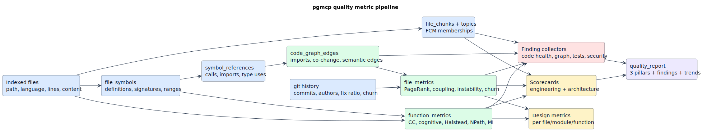
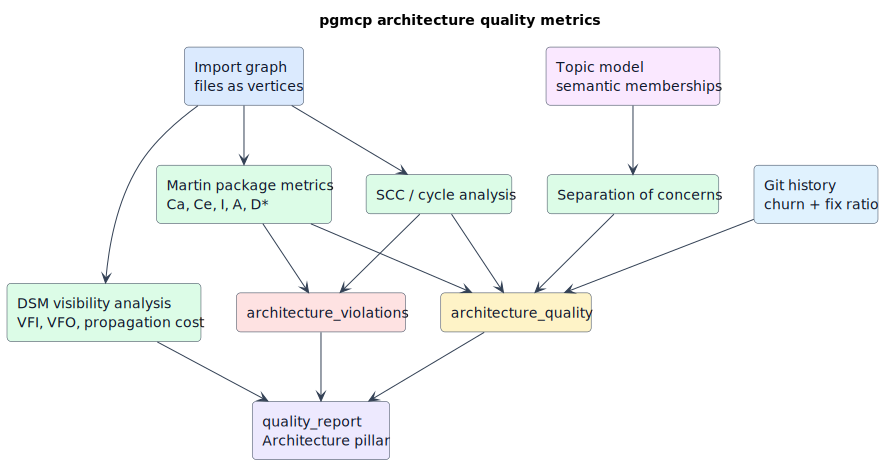
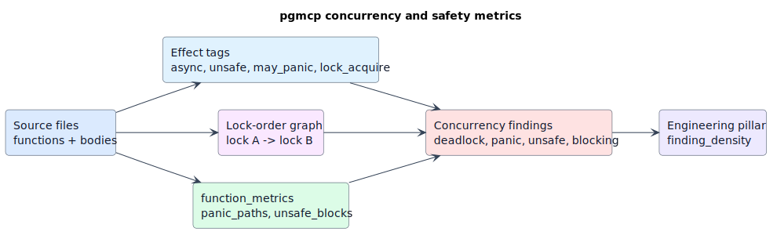
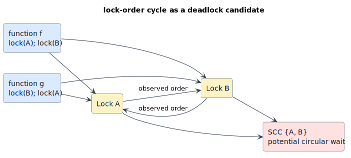

# pgmcp code-quality metrics

This document is the technical reference for pgmcp's code-quality metrics. It
explains the engineering, architecture, design, graph-theoretic, concurrency, and
related risk signals that feed `engineering_scorecard`, `architecture_quality`,
`design_metrics`, `quality_report`, and the associated drill-down tools.

It complements [grading-reliability.md](grading-reliability.md), which explains
why pgmcp's grades use fixed thresholds, honest `N/A`, and no project-relative
curves.

## Reading map

Use this document in three ways:

| Reader goal | Start here | Then run |
|---|---|---|
| Understand a project's current health | [Quality report aggregation](#quality-report-aggregation) | `pgmcp tool quality_report project=<name> format=markdown` |
| Investigate architecture risk | [Architecture metrics](#architecture-metrics) | `architecture_quality`, `architecture_violations`, `architecture_dsm` |
| Investigate design or maintainability risk | [Design and maintainability metrics](#design-and-maintainability-metrics) | `design_metrics`, `complexity_hotspots`, `code_on_fire` |
| Investigate concurrency risk | [Concurrency and safety metrics](#concurrency-and-safety-metrics) | `deadlock_candidates`, `panic_paths`, `unsafe_clusters` |

## Core vocabulary

The quality system is built from indexed files, extracted symbols, dependency
edges, graph metrics, function metrics, and finding collectors. The following
symbols are used throughout:

| Symbol | Meaning |
|---|---|
| `G = (V, E)` | A directed graph with vertices `V` and edges `E`. In pgmcp, vertices may be files, functions, locks, or modules depending on the tool. |
| `n = |V|` | Number of vertices. |
| `m = |E|` | Number of edges. |
| `u → v` | A directed edge from `u` to `v`, such as "file `u` imports file `v`". |
| `deg⁺(v)` | Out-degree: number of outgoing edges from `v`. |
| `deg⁻(v)` | In-degree: number of incoming edges to `v`. |
| `reachable(u)` | Vertices transitively reachable from `u`. |
| `SCC` | Strongly connected component: a maximal set of vertices where each vertex can reach every other vertex. |
| `CFG` | Control-flow graph for one function or method. |
| `score ∈ [0, 100]` | A positive quality score, where higher is better. |
| `N/A` | Backing data was absent or stale; excluded from averages rather than counted as zero. |

## Metric pipeline

The quality pipeline separates observations, derived metrics, findings, and
grades. This separation is deliberate: raw measurements remain inspectable, while
scorecards are summaries.



Diagram source: [metric-pipeline.puml](diagrams/metric-pipeline.puml).

The persistent substrates are:

| Table | Quality role | Representative fields |
|---|---|---|
| `file_metrics` | Per-file graph/process metrics | `pagerank`, `betweenness`, `in_degree`, `out_degree`, `afferent_coupling`, `efferent_coupling`, `instability`, `commit_count`, `author_count`, `fix_commit_ratio`, `churn_rate`, `days_since_last_change` |
| `function_metrics` | Per-function static metrics | `cyclomatic`, `cognitive`, `halstead_volume`, `halstead_difficulty`, `halstead_effort`, `halstead_bugs`, `npath`, `maintainability_index`, `fan_in`, `fan_out`, `panic_paths`, `unsafe_blocks` |
| `code_graph_edges` | File dependency graph | `source_file_id`, `target_file_id`, `edge_type`, `weight` |
| `symbol_references` | Function/type/reference graph | `source_symbol_id`, `target_symbol_id`, `target_raw`, `ref_kind`, `source_line` |
| `chunk_topic_assignments` | Semantic topic memberships | `topic_id`, `membership_score` |

## Grading theory

pgmcp treats a score as an absolute measurement, not as a rank within the current
project. A weak project should not look healthy merely because every file is weak.

### Letter grades

The mapping is:

| Score range | Grade |
|---|---|
| `score ≥ 90` | `A` |
| `80 ≤ score < 90` | `B` |
| `70 ≤ score < 80` | `C` |
| `60 ≤ score < 70` | `D` |
| `score < 60` | `F` |

The continuous GPA map is:

`gpa(score) = clamp(score / 25, 0, 4)`.

For a pillar with scorable dimensions `D`, pgmcp computes:

`pillar_gpa = (Σ_{d ∈ D} gpa(score_d)) / |D|`.

If every dimension is `N/A`, the pillar itself is `N/A`. This prevents missing
topic, graph, or function metrics from silently becoming an `F`.

### Finding density

`quality_report` adds a finding-density dimension to each pillar. The finding
categories map to pillars as follows:

| Finding category | Pillar |
|---|---|
| `code_health`, `tests_docs`, `duplication`, `concurrency`, `hygiene` | Engineering |
| `architecture`, `dependency` | Architecture |
| `security` | Security |

Each file contributes at most once per pillar, at its worst severity. Unlocated
project-level findings contribute directly. Severity weights are:

| Severity | Weight |
|---|---:|
| `critical` | `10.0` |
| `high` | `4.0` |
| `medium` | `1.0` |
| `low` | `0.25` |
| `info` | `0.0` |

The score is:

`finding_density = 100 · (1 − clamp((Σ worst_file_weight + Σ unlocated_weight) / file_count, 0, 1))`.

This formula intentionally de-duplicates by file so a ranking-style tool cannot
turn every ranked row into a defect.

### Literate algorithm: quality aggregation

```text
Given a project P:
  1. Resolve P to exactly one project id.
  2. Collect Engineering dimensions from indexed files, file_metrics, and function_metrics.
  3. Collect Architecture dimensions from topics, import graph, file_metrics, and DSM analysis.
  4. Run finding collectors with bounded per-tool timeouts.
  5. Derive Security dimensions from security findings and advisory data.
  6. Add one finding_density dimension per pillar.
  7. For each pillar, average only scorable dimensions.
  8. Average scorable pillar GPAs into the overall GPA.
  9. Append current pillar GPAs to the historical trend view.
```

## Engineering scorecard

`engineering_scorecard` is an operational readiness scorecard. It asks whether a
project is maintainable by a team, testable, stable, and current.

| Dimension | Formula or rule | Backing data | Interpretation |
|---|---|---|---|
| `code_structure` | `100 · max(0, 1 − |avg_file_lines − 200| / 800)` | `indexed_files.line_count` | Rewards files near a moderate size; penalizes very small fragmentation and very large modules. |
| `dependency_health` | `100 · (1 − files_in_import_cycles / file_count)` | import graph SCCs | Cycles make change order and ownership harder. |
| `test_quality` | `100 · min(5 · test_file_count / file_count, 1)` | path heuristics | A test-file ratio proxy, not line coverage. |
| `documentation` | `100 · min(10 · markdown_file_count / file_count, 1)` | `indexed_files.language` | A documentation presence proxy. |
| `code_stability` | `100 · (1 − min(avg_churn, 5) / 5)` | `file_metrics.churn_rate` | High churn lowers stability. |
| `bug_fix_ratio` | `100 · max(0, 1 − 3 · avg_fix_commit_ratio)` | `file_metrics.fix_commit_ratio` | High bug-fix commit share indicates defect pressure. |
| `coupling` | `100 · (1 − min(avg(Ca + Ce), 20) / 20)` | `file_metrics.afferent_coupling`, `efferent_coupling` | Lower inter-file coupling is better. |
| `complexity` | `100 · (1 − complex_files / files_with_functions)` where complex means worst function `CC > 15` | `function_metrics.cyclomatic` | `N/A` if function metrics are absent. |
| `team_distribution` | `100 · min(avg_author_count, 4) / 4` | `file_metrics.author_count` | A bus-factor proxy; solo repos score low honestly. |
| `freshness` | `100 · (1 − min(avg_days_since_change, 365) / 365)` | `file_metrics.days_since_last_change` | Penalizes stale files. |

The Operational Readiness Review gates are stricter Boolean checks:

| Gate | Pass condition |
|---|---|
| `no_circular_deps` | no files in import cycles |
| `test_coverage` | `test_file_count / file_count ≥ 0.1` |
| `has_documentation` | at least one markdown document |
| `low_churn` | average churn `< 3.0` |
| `low_fix_ratio` | average fix ratio `< 0.3` |
| `no_god_files` | no file has more than `2000` lines |
| `bus_factor_ok` | average authors `≥ 1.5` |
| `recently_maintained` | average stale days `< 180` |

## Architecture metrics

`architecture_quality` measures system structure rather than local code shape.



Diagram source: [architecture-metrics.puml](diagrams/architecture-metrics.puml).

### Positive architecture dimensions

| Dimension | Formula or rule | Interpretation |
|---|---|---|
| `separation_of_concerns` | `100 · max(0, 1 − max(avg_topics_per_file − 1, 0) / 10)` | Lower topic diversity per file means less concern mixing. Stale or absent topics produce `N/A`. |
| `loose_coupling` | `100 · (1 − min(avg(Ca + Ce), 20) / 20)` | Lower average coupling is better. |
| `sdp_compliance` | `100 · (1 − sdp_violations / import_edges)` | Stable files/modules should not depend on unstable targets. |
| `acyclicity` | `100 · (1 − files_in_cycles / total_files)` | Cyclic imports lower architecture clarity. |
| `test_coverage` | `100 · min(3 · test_file_count / total_files, 1)` | Coarser than the engineering scorecard's test proxy. |
| `doc_coverage` | `100 · min(10 · markdown_file_count / total_files, 1)` | Documentation presence. |
| `module_balance` | PageRank evenness against expected `1 / total_files` | Detects centrality concentration. |
| `api_stability` | `100 · (1 − min(avg_churn, 5) / 5)` | Public architecture should not churn excessively. |
| `dependency_health` | `100 · (1 − avg_fix_commit_ratio)` | Fix-heavy dependency surfaces are less healthy. |
| `code_organization` | `100 · (1 − clamp(avg(Ca + Ce) / 30, 0, 1))` | Card & Glass-style module complexity surrogate. |

`quality_report` extends the Architecture pillar with:

| Dimension | Formula | Interpretation |
|---|---|---|
| `oo_coupling` | `100 · (1 − clamp(avg(CBO) / 20, 0, 1))` | Coupling-between-objects proxy from distinct referenced files. |
| `propagation_cost` | `100 · (1 − propagation_cost)` | Inverse DSM visibility density. Lower propagation cost is better. |

### Martin package metrics

For a module:

| Metric | Formula | Meaning |
|---|---|---|
| `Ca` | count of external files importing this module | Afferent coupling; responsibility borne by the module. |
| `Ce` | count of external files this module imports | Efferent coupling; dependencies needed by the module. |
| `I` | `Ce / (Ca + Ce)` | Instability. `I = 0` is maximally stable; `I = 1` is maximally unstable. |
| `A` | `abstract_files / total_files` | Abstractness. pgmcp detects traits/interfaces/abstract classes heuristically. |
| `D*` | `|A + I − 1|` | Distance from the main sequence. Lower is better. |

The zones are:

| Zone | Condition | Risk |
|---|---|---|
| Main sequence | low `D*` | Balanced abstraction and instability. |
| Zone of pain | low `A`, low `I` | Concrete and stable; hard to change. |
| Zone of uselessness | high `A`, high `I` | Abstract and unstable; often over-engineered. |

### Design Structure Matrix

A Design Structure Matrix (DSM) is the adjacency matrix of `G`. pgmcp computes
the transitive closure conceptually, without materializing the full matrix.

For each vertex `v`:

`VFO(v) = |reachable(v)|`.

`VFI(v) = |{u ∈ V : v ∈ reachable(u)}|`.

The propagation cost is:

`PC = (Σ_{v ∈ V} VFO(v)) / n²`.

`PC` is the average fraction of the system affected by a change to a random
element. pgmcp classifies vertices by median splits over `VFI` and `VFO`:

| Class | Condition | Architectural role |
|---|---|---|
| `core` | high `VFI`, high `VFO` | Central load-bearing code. |
| `shared` | high `VFI`, low `VFO` | Utility/foundation code. |
| `control` | low `VFI`, high `VFO` | Orchestrator/entry-point code. |
| `peripheral` | low `VFI`, low `VFO` | Leaf or isolated code. |

### Architecture violations

`architecture_violations` reports:

| Violation | Rule | Severity in tool |
|---|---|---|
| `dependency_cycle` | SCC with at least two files | critical |
| `god_module` | depth-2 module with more than `15` files, excluding deliberate catalog/test patterns | high |
| `bidirectional_dependency` | both `u → v` and `v → u` exist | high |
| `sdp_violation` | stable source (`I < 0.3`) depends on unstable target (`I > 0.7`) | medium |
| `zone_of_pain` | `I < 0.3`, `A < 0.3`, and module has more than `3` files | medium |
| `zone_of_uselessness` | `I > 0.7`, `A > 0.7`, and module has more than `2` files | low |
| `layer_violation` | declared architecture layer imports a forbidden layer | high |

## Graph theory metrics

Most architecture tools operate on directed graphs. Edges have different meanings
depending on the graph:

| Graph | Vertex | Edge |
|---|---|---|
| File import graph | file | file imports another file/module |
| Function call graph | function symbol | function calls another function |
| Co-change graph | file | files changed together in git history |
| Lock-order graph | lock name | one lock is acquired before another |

### PageRank

PageRank measures global structural importance. With damping `α`, pgmcp uses power
iteration:

`PR(v) = (1 − α) / n + α · Σ_{u → v} PR(u) / deg⁺(u) + α · dangling_mass / n`.

Files or functions with high PageRank are useful starting points for code review:
many paths of dependency importance point toward them.

### Betweenness centrality

Betweenness measures brokerage. Let `σ_st` be the number of shortest paths from
`s` to `t`, and `σ_st(v)` the number of those paths that pass through `v`.

`CB(v) = Σ_{s ≠ v ≠ t} σ_st(v) / σ_st`.

pgmcp computes Brandes-style betweenness and normalizes directed-graph scores by:

`(n − 1)(n − 2)`.

A high-betweenness file or function is a control or dependency bridge. Small
changes there can affect otherwise separate regions.

### Louvain modularity

Community detection groups code into graph communities. pgmcp runs Louvain on an
undirected weighted view. Its modularity objective is:

`Q = (1 / m) · Σ_{i,j in same community} (w_ij − γ · k_i · k_j / m)`.

Here `w_ij` is edge weight, `k_i` is weighted degree, `m` is total edge weight,
and `γ` is the resolution parameter. A high-quality architecture usually has
communities that align with directory/module boundaries.

### Strongly connected components and cycles

An SCC is a maximal cycle-capable region of a directed graph. In an import graph,
an SCC with at least two files is a circular dependency. In a lock-order graph, an
SCC with at least two locks is a possible deadlock pattern.

```text
Tarjan SCC detection, literate form:
  For every unvisited vertex v:
    Assign v an index and lowlink.
    Push v onto the active stack.
    For each edge v → w:
      If w is unvisited, recursively visit w and lower v.lowlink from w.lowlink.
      If w is active, lower v.lowlink from w.index.
    If v.lowlink == v.index:
      Pop vertices until v is popped.
      The popped set is one SCC.
```

### Co-change coupling

Git history supplies temporal coupling. For files `A` and `B`, pgmcp uses a
Jaccard-style co-change score:

`J(A, B) = |commits(A) ∩ commits(B)| / |commits(A) ∪ commits(B)|`.

High co-change means the design may be scattering one concern across multiple
files, even when the import graph looks clean.

## Design and maintainability metrics

Design metrics operate at function, file, class/container, or module scope. They
try to answer: "How hard is this code to understand, test, change, or isolate?"

### Control-flow complexity

Cyclomatic complexity comes from the control-flow graph. pgmcp's language
backends count decision points and compute:

`CC = 1 + decision_points`.

The intuition is that `CC` approximates the number of linearly independent paths
through the function. Higher `CC` usually means more test cases and greater local
reasoning cost.

Cognitive complexity is a comprehension-oriented metric. pgmcp sums increments:

`cognitive = Σ increment`.

Nested conditions contribute `1 + depth`; breaks in flow, logical sequences, and
recursion contribute `1`.

NPath estimates acyclic path explosion. pgmcp multiplies decision factors:

`NPath = Π branch_factor_i`.

If multiplication overflows, pgmcp stores `i64::MAX` and marks the overflow.

### Halstead metrics

Halstead metrics treat a function as operators and operands:

| Symbol | Meaning |
|---|---|
| `η₁` | distinct operators |
| `η₂` | distinct operands |
| `N₁` | total operator occurrences |
| `N₂` | total operand occurrences |

pgmcp computes:

`N = N₁ + N₂`.

`η = η₁ + η₂`.

`V = N · log₂(η)`.

`D = (η₁ / 2) · (N₂ / η₂)`.

`E = D · V`.

`B = V / 3000`.

Volume `V` estimates implementation size in information terms; difficulty `D`
and effort `E` estimate mental and implementation effort; `B` is Halstead's
empirical delivered-bugs estimate.

### Maintainability Index

pgmcp uses the SEI-style Maintainability Index, clamped to `[0, 100]`:

`MI = 171 − 5.2·ln(V) − 0.23·CC − 16.2·ln(LOC) + 50·sin(√(2.4·CR))`.

Where:

| Term | Meaning |
|---|---|
| `V` | Halstead volume |
| `CC` | cyclomatic complexity |
| `LOC` | source lines of code |
| `CR` | `comment_lines / max(1, LOC)` |

In tool guidance, `MI < 50` is hard to maintain.

### Card & Glass design complexity

`design_metrics` reports Card & Glass-style structural, data, and system
complexity from graph fan-in and fan-out:

`S = fan_out²`.

`D = fan_in · LOC / (fan_out + 1)`.

`Sy = S + D`.

High `S` indicates broad outgoing dependency structure. High `D` indicates much
incoming data or dependency pressure spread over a large file. High `Sy` is a
structural bottleneck candidate.

### Weighted Methods per Class

When AST metrics exist, pgmcp defines WMC as:

`WMC(C) = Σ_{m ∈ methods(C)} CC(m)`.

At file scope, `design_metrics` reports the sum of function cyclomatic complexity
as WMC-like aggregate complexity. High WMC means the container has many methods,
complex methods, or both.

### Chidamber-Kemerer metrics

`ck_metrics` reports the CK suite for OO-like containers:

| Metric | Formula or rule | Interpretation |
|---|---|---|
| `WMC` | `Σ method CC` | Class complexity. |
| `DIT` | longest inheritance/implementation chain to a root | Deep inheritance is fragile and harder to reason about. |
| `NOC` | direct subclasses/implementors | High values mean a base type is widely extended and change-risky. |
| `CBO` | distinct target files touched by the class | Coupling Between Objects. |
| `RFC` | `method_count + distinct_call_targets` | Response surface; high values are harder to test. |

### LCOM4 cohesion

LCOM4 is a cohesion metric. Conceptually, build a graph whose vertices are
methods; connect two methods when they share a field or target. Then:

`LCOM4 = connected_component_count(method_graph)`.

pgmcp approximates this from function call targets inside a class/struct/trait
container. `LCOM4 ≥ 2` indicates multiple unrelated responsibilities.

### Design smells

`design_smell_detection` converts metrics into refactoring signals:

| Smell | Detection rule | Rationale |
|---|---|---|
| `god_class` | file has more than `500` lines and more than `5` topics | Large file with many concerns. |
| `srp_violation` | more than `4` topics and more than `200` lines | Single Responsibility Principle risk. |
| `shotgun_surgery` | more than `8` co-change partners | Changes ripple across files. |
| `stale_module` | older than `365` days and more than `100` lines | Possibly abandoned code. |
| `unstable_dependency` | more than `5` dependents and churn greater than `2.0` | Core dependency changes too often. |

## Code-health and prediction metrics

### Complexity hotspots

`complexity_hotspots` ranks files by a composite of real AST complexity when
available, otherwise structural proxies:

With AST data:

`composite = 0.30·norm_cyclomatic + 0.20·norm_chunks + 0.20·norm_topics + 0.15·norm_size + 0.15·norm_coupling`.

Without AST data:

`composite = 0.30·norm_chunks + 0.25·norm_topics + 0.25·norm_size + 0.20·norm_coupling`.

The quality-report collector only emits findings at absolute thresholds:

| Signal | Medium | High |
|---|---:|---:|
| worst function cyclomatic | `≥ 10` | `≥ 20` |
| file size | `≥ 500` lines | `≥ 1000` lines |

### Bug prediction

`bug_prediction` uses per-project logistic regression when enough history exists.
The features are:

`x = [churn_rate, commit_count, author_count, in_degree, out_degree, line_count]`.

The label is:

`y = 1` when `fix_commit_ratio > 0`, else `0`.

`fix_commit_ratio` is excluded from features to avoid label leakage. If training
is impossible, pgmcp falls back to:

`bug_score = 0.3·churn + 3.0·fix_ratio + 0.2·size_factor + 0.05·coupling + 0.1·max(authors − 1, 0)`.

The quality-report collector treats `bug_score ≥ 0.4` as Medium and
`bug_score ≥ 0.7` as High.

### Technical debt

`technical_debt_analysis` ranks files using:

`debt = 0.3·todo_density + 0.25·complexity_factor + 0.2·churn + 0.15·fix_ratio + 0.1·size_factor`.

Where:

`todo_density = marker_count / LOC · 1000`.

`complexity_factor = min(cyclomatic / 20, 1)`.

`churn = min(churn_rate, 10) / 10`.

`size_factor = min(LOC / 1000, 1)`.

Documented technical debt separately scans comment markers, stubs, and
deprecation annotations. Marker tiers are:

| Tier | Markers |
|---|---|
| High | `FIXME`, `BUG`, `HACK`, `KLUDGE`, `WTF`, `XXX` |
| Medium | `TODO`, `TBD`, `WORKAROUND`, `REVIEW`, `SMELL`, `REFACTOR`, `DEPRECATED` |
| Low | `NOTE`, `OPTIMIZE`, `TEMP`, `DEBUG` |

### Code on fire

`code_on_fire` is a Tornhill-style hotspot intersection: high churn meets high
function complexity. In default `intersect` mode, a function qualifies when:

`file_churn ≥ churn_quantile`.

and

`cyclomatic ≥ complexity_quantile OR MI ≤ low_MI_quantile`.

Rows are ranked by:

`score = churn_rate · max(cyclomatic, 1) / max(MI, 1)`.

## Tests, documentation, duplication, dependency, and hygiene metrics

These collectors feed `quality_report` and are also useful drill-down surfaces.

| Area | Metric/tool | Rule or signal |
|---|---|---|
| Test coverage gaps | `test_coverage_gaps` | Directory has at least `5` implementation files and no test files. |
| Doc coverage gaps | `doc_coverage_gaps` | Directory has at least `8` files and no markdown docs. |
| Test smells | `test_smells` | Test/spec file has more than `400` lines. |
| Flaky candidates | `flaky_test_candidates` | Test contains time, randomness, network, or sleep signals. |
| Doc drift | `doc_code_drift` | Markdown older than `180` days or embedding drift from code vocabulary. |
| Mutation surrogate | `mutation_score_surrogate` | Non-test function has `CC > 10`; needs stronger tests. |
| Duplication | `find_duplicates`, `clone_density` | Similar chunk pairs or many clone-like calls. |
| Dependency health | `dependency_health` | External import used by exactly one file; prune/consolidate candidate. |
| Deprecated definitions | `deprecated_but_used` | Deprecated annotations remain in indexed code. |
| Orphans | `find_orphans` | maximum topic membership `< 0.15`. |
| Dead code | `dead_code_reachability` | private function/method has no incoming references. |
| Stale zombie | `stale_zombie` | file older than `365` days with zero in-degree. |
| Anomaly detection | `anomaly_detection` | file size z-score `≥ 2.5`; Medium at `≥ 4.0`. |
| Naming consistency | `naming_consistency` | function name deviates from file-local dominant case style. |
| Import hygiene | `import_hygiene` | import appears inside callable bodies; duplicated nested imports raise severity. |

## Concurrency and safety metrics

Concurrency metrics look for execution risks that ordinary architecture metrics do
not capture: blocking, unsynchronized mutation, unsafe thread-safety claims,
panic paths, unsafe regions, and lock-order cycles.



Diagram source: [concurrency-safety-metrics.puml](diagrams/concurrency-safety-metrics.puml).

### Coffman conditions and wait-for graphs

A deadlock requires four conditions to hold together:

1. mutual exclusion,
2. hold-and-wait,
3. no preemption,
4. circular wait.

pgmcp detects circular-wait candidates by building a lock-order graph. If one
function acquires `A` before `B`, it adds `A → B`. If another path acquires
`B` before `A`, the graph contains an SCC and the code has a deadlock recipe.



Diagram source: [deadlock-lock-order.puml](diagrams/deadlock-lock-order.puml).

```text
Lock-order deadlock candidate, literate form:
  For each function body:
    Extract the ordered sequence of lock/read/write acquisitions.
    For each adjacent pair (A, B):
      If A != B, add edge A → B to the lock-order graph.
  Run SCC detection on the lock-order graph.
  Every SCC with at least two locks is a circular-wait candidate.
```

### Concurrency collector rules

| Tool or collector | Rule | Severity |
|---|---|---|
| `blocking_in_async` | async file contains blocking calls such as `std::thread::sleep`, blocking file IO, `reqwest::blocking`, `.lock().unwrap()`, or `block_on` | medium |
| `lockset_races` | file contains `static mut` | high |
| `send_sync_violations` | file contains `unsafe impl Send` or `unsafe impl Sync` | medium |
| `deadlock_candidates` | repeated lock acquisition or lock-order SCCs | low in quality collector; explicit tool reports cycles |
| `panic_paths` | `function_metrics.panic_paths > 0` | medium; high when panic paths `≥ 3` |
| `unsafe_clusters` | `function_metrics.unsafe_blocks > 0` | low; medium when unsafe blocks `≥ 3` |

The `effect_breakdown` channel is also included in many quality tools. Effects
such as `unsafe`, `may_panic`, `async`, `await_point`, `lock_acquire`, and
`thread_spawn` are not grades by themselves; they are review-priority signals.

## Security-adjacent quality metrics

The Security pillar is part of `quality_report`, and its findings affect the
overall GPA. Its dimensions are:

| Dimension | Formula or rule |
|---|---|
| `secret_hygiene` | `100 · (1 − clamp(secret_weighted / file_count, 0, 1))`; critical secrets count heavier. |
| `injection_risk` | `100 · (1 − clamp((injection_candidates + taint_analysis) / file_count · 10, 0, 1))`. |
| `crypto_hygiene` | `100 · (1 − clamp((crypto_misuse + unsafe_deserialization) / file_count · 10, 0, 1))`. |
| `supply_chain` | `N/A` unless advisories are imported; otherwise `100 · (1 − clamp(weighted_advisories / 20, 0, 1))`. |

Related collectors scan for hardcoded secrets, high-entropy tokens, injection
sinks, weak crypto, unsafe deserialization, PII logging/spread, unprotected
routes, reachable attack sinks, and vulnerable dependencies.

## Tool map

| Need | Primary tool | Drill-down tools |
|---|---|---|
| Overall graded audit | `quality_report` | `quality_trend`, `quality_forecast` |
| Engineering maturity | `engineering_scorecard` | `complexity_hotspots`, `bug_prediction`, `technical_debt_analysis` |
| Architecture maturity | `architecture_quality` | `coupling_cohesion_report`, `architecture_violations`, `architecture_dsm` |
| Formal design metrics | `design_metrics` | `ck_metrics`, `lcom4`, `central_functions` |
| Graph centrality | `centrality_analysis` | `dependency_graph`, `community_detection`, `change_impact_analysis` |
| Function hotspots | `code_on_fire` | `central_functions`, `panic_paths`, `unsafe_clusters` |
| Concurrency review | `deadlock_candidates` | `panic_paths`, `unsafe_clusters`, `send_sync_violations` |
| Tests/docs debt | `test_coverage_gaps` | `doc_coverage_gaps`, `test_smells`, `mutation_score_surrogate` |
| Hygiene | `find_orphans` | `dead_code_reachability`, `stale_zombie`, `naming_consistency`, `import_hygiene` |

Example commands:

```bash
pgmcp tool quality_report project=pgmcp format=markdown
pgmcp tool engineering_scorecard project=pgmcp format=full
pgmcp tool architecture_quality project=pgmcp detail=full
pgmcp tool design_metrics project=pgmcp scope=file sort_by=maintainability
pgmcp tool complexity_hotspots project=pgmcp sort_by=cyclomatic
pgmcp tool code_on_fire project=pgmcp mode=intersect
pgmcp tool architecture_dsm project=pgmcp scope=file
pgmcp tool deadlock_candidates project=pgmcp
```

## Reliability boundaries

pgmcp's metrics are intentionally explicit about what they do and do not prove:

| Boundary | Consequence |
|---|---|
| Topic-derived metrics depend on fresh, non-degenerate topic clustering. | `separation_of_concerns` becomes `N/A` when topics are stale or absent. |
| Function metrics require symbol extraction and function-metrics crons. | Complexity dimensions become `N/A` or tools fall back to labeled heuristics. |
| Test coverage proxies use path heuristics. | They do not replace line/branch coverage from tools such as `llvm-cov` or `tarpaulin`. |
| Security scanners are static heuristics. | They prioritize review; they are not exploit proofs. |
| Bug prediction is historical/statistical. | It is a prioritization signal, not a deterministic defect oracle. |
| Concurrency regex scans are conservative. | They identify candidates for review; formal deadlock proofs require stronger models. |
| No curves are used for grades. | A project is measured against absolute bars, not against itself. |

## References

The following references are the theoretical basis for the metrics above:

- Thomas J. McCabe, "A Complexity Measure," *IEEE Transactions on Software Engineering*, 1976. DOI: [10.1109/TSE.1976.233837](https://doi.org/10.1109/TSE.1976.233837).
- Maurice H. Halstead, *Elements of Software Science*, Elsevier, 1977.
- Paul Oman and Jack Hagemeister, "Metrics for assessing a software system's maintainability," *International Conference on Software Maintenance*, 1992. DOI: [10.1109/ICSM.1992.242525](https://doi.org/10.1109/ICSM.1992.242525).
- Shyam R. Chidamber and Chris F. Kemerer, "A Metrics Suite for Object Oriented Design," *IEEE Transactions on Software Engineering*, 1994. DOI: [10.1109/32.295895](https://doi.org/10.1109/32.295895).
- Thomas M. Pigoski, *Practical Software Maintenance*, Wiley, 1996.
- Robert C. Martin, *Agile Software Development: Principles, Patterns, and Practices*, Prentice Hall, 2002.
- Robert E. Tarjan, "Depth-First Search and Linear Graph Algorithms," *SIAM Journal on Computing*, 1972. DOI: [10.1137/0201010](https://doi.org/10.1137/0201010).
- Ulrik Brandes, "A Faster Algorithm for Betweenness Centrality," *The Journal of Mathematical Sociology*, 2001. DOI: [10.1080/0022250X.2001.9990249](https://doi.org/10.1080/0022250X.2001.9990249).
- Sergey Brin and Lawrence Page, "The Anatomy of a Large-Scale Hypertextual Web Search Engine," *Computer Networks and ISDN Systems*, 1998. DOI: [10.1016/S0169-7552(98)00110-X](https://doi.org/10.1016/S0169-7552(98)00110-X).
- Vincent D. Blondel, Jean-Loup Guillaume, Renaud Lambiotte, and Etienne Lefebvre, "Fast unfolding of communities in large networks," *Journal of Statistical Mechanics*, 2008. DOI: [10.1088/1742-5468/2008/10/P10008](https://doi.org/10.1088/1742-5468/2008/10/P10008).
- Alan MacCormack, John Rusnak, and Carliss Y. Baldwin, "Exploring the Structure of Complex Software Designs," *Management Science*, 2006. DOI: [10.1287/mnsc.1060.0552](https://doi.org/10.1287/mnsc.1060.0552).
- Edward G. Coffman Jr., Michael J. Elphick, and Arie Shoshani, "System Deadlocks," *ACM Computing Surveys*, 1971. DOI: [10.1145/356586.356588](https://doi.org/10.1145/356586.356588).
- Leslie Lamport, "The Temporal Logic of Actions," *ACM Transactions on Programming Languages and Systems*, 1994. DOI: [10.1145/177492.177726](https://doi.org/10.1145/177492.177726).
- Donald E. Knuth, "Literate Programming," *The Computer Journal*, 1984. DOI: [10.1093/comjnl/27.2.97](https://doi.org/10.1093/comjnl/27.2.97).
